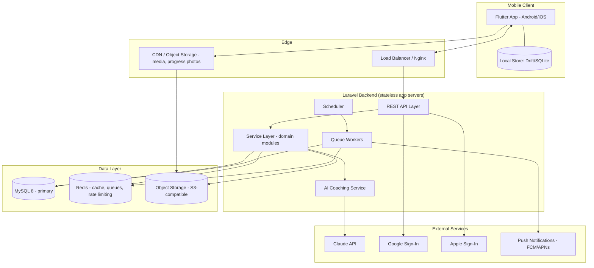
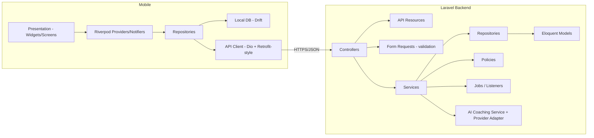
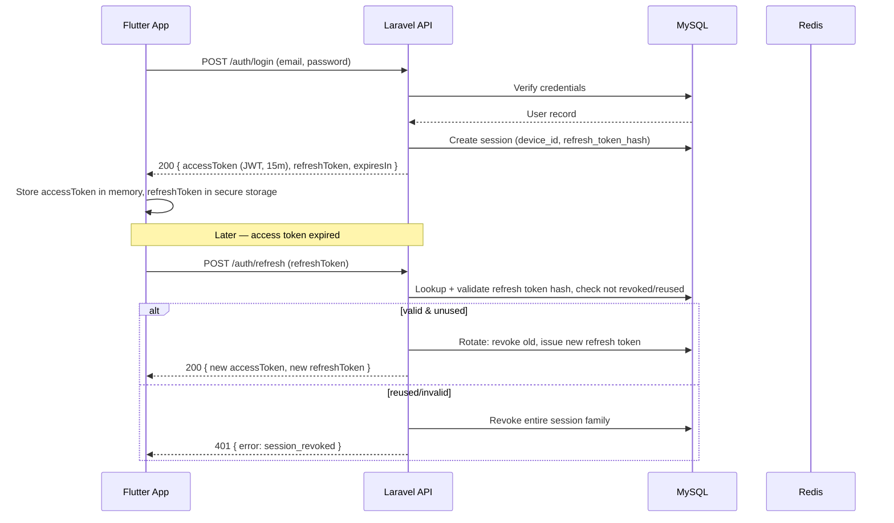
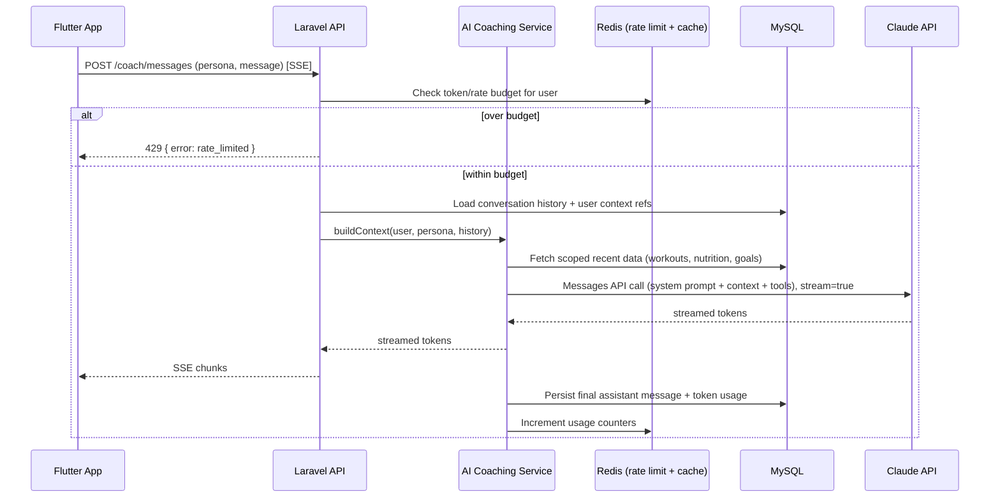
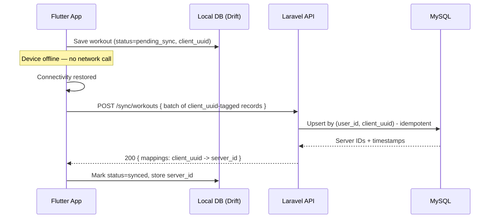
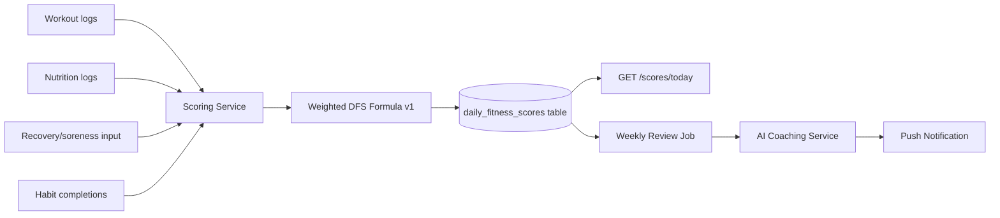
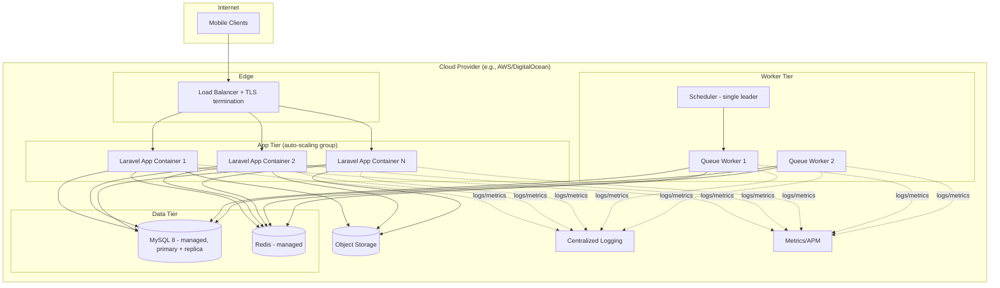

# System Architecture Document

**Product:** Aesthetic Coach
**Related documents:** [SRS](02-srs.md) · [Database Design](04-database-design.md) · [API Specification](05-api-specification.md) · [Backend Architecture](07-backend-architecture.md) · [AI Coaching Engine](09-ai-coaching-engine.md) · [Deployment Guide](12-deployment-guide.md)

---

## 1. High-Level Architecture

Aesthetic Coach is a **modular monolith** backend (Laravel) behind a REST API, serving a **Flutter mobile client**, with an **AI Coaching Engine** implemented as an internal service layer that calls the Claude API. The monolith is deliberately not split into microservices at MVP: team size, data-consistency needs (one MySQL database, many cross-domain reads for the Daily Fitness Score and AI context), and current scale targets favor a well-modularized single deployable, with queue workers scaled independently.

## 2. Component Diagram

Module boundaries (Laravel `app/Modules/*`) map directly to bounded contexts: `Auth`, `Workouts`, `Nutrition`, `BodyMetrics`, `Habits`, `Goals`, `Scoring`, `Coaching`, `Notifications`. See [Backend Architecture § Folder Structure](07-backend-architecture.md#1-folder-structure) for folder-level detail.

## 3. Sequence Diagrams

### 3.1 Authentication (login + token refresh)

### 3.2 AI Coach Chat (streaming)

### 3.3 Offline Workout Sync

## 4. Data Flow: Daily Fitness Score

The DFS is computed by a deterministic scheduled job (not an LLM call) for cost and reproducibility; the AI layer consumes the score as **input** for reviews rather than producing it. See [AI Coaching Engine § Recommendation Engine](09-ai-coaching-engine.md#5-recommendation-engine).

## 5. Service Interactions

| Caller | Callee | Protocol | Notes |
|---|---|---|---|
| Flutter app | Laravel API | HTTPS/JSON (REST), SSE for AI streaming | Single base URL, versioned `/api/v1` |
| Laravel API | MySQL 8 | Eloquent/PDO | Primary + read replica (Phase 2) |
| Laravel API | Redis | Predis/phpredis | Cache, queue driver, rate limiting, idempotency keys |
| Laravel Queue Workers | Claude API | HTTPS | Async jobs: weekly review generation, batch template generation |
| Laravel API (sync path) | Claude API | HTTPS (streamed) | Real-time chat — invoked directly from request, not queued, to preserve streaming |
| Laravel API | Object Storage (S3-compatible) | HTTPS, pre-signed URLs | Progress photos, exported data |
| Laravel API | FCM/APNs | HTTPS | Push notification dispatch via queue |
| Laravel API | Google/Apple OAuth | HTTPS | Identity token verification |

## 6. Deployment Architecture

Full environment-by-environment detail (dev/staging/production, Docker Compose, Nginx config) is in the [Deployment Guide](12-deployment-guide.md).

## 7. Scalability Strategy

| Concern | Strategy |
|---|---|
| Stateless app tier | JWT auth means no server-side session state; any app instance can serve any request → horizontal auto-scaling behind the load balancer |
| Database growth | Indexing strategy per [Database Design](04-database-design.md#4-indexing-strategy); read replica introduced in Phase 2 for analytics/reporting queries; partitioning candidate: `workout_logs`, `nutrition_logs` by `user_id` range or date if a single table exceeds tens of millions of rows |
| Hot data | Redis cache for exercise library, user profile summary, DFS-of-the-day; cache invalidated on write via model observers |
| AI cost/latency | Token budgets per user/day, prompt caching for stable system prompts (see [AI Coaching Engine § Cost Optimization](09-ai-coaching-engine.md#8-cost-optimization)), async queueing for non-real-time AI jobs (weekly review) |
| Background load | Queue workers scale independently from the web tier; separate queues for `default`, `ai-heavy`, `notifications` so AI latency doesn't starve notification delivery |
| Media | Progress photos and exported files served via pre-signed URLs directly from object storage / CDN, never proxied through the app tier |
| Future microservice extraction | Module boundaries (`app/Modules/*`) are designed so the AI Coaching module or Notifications module could be extracted into a separate service later without a data-model rewrite, if scale demands it |

## 8. Security Architecture

Full checklist in [Production Hardening](14-production-hardening.md). Architectural decisions:

- **AuthN:** JWT access tokens (15 min TTL, stateless, signed RS256) + opaque refresh tokens (30-day sliding, stored hashed in `auth_refresh_tokens`, rotated on every use, single-use with reuse-detection that revokes the session family). Google/Apple sign-in verified server-side via provider public keys/tokeninfo endpoints, never trusting client-asserted identity.
- **AuthZ:** Laravel Policies per resource (`WorkoutPolicy`, `GoalPolicy`, …); every resource access is scoped to `auth()->id()` at the query level, not just the policy level, to prevent IDOR.
- **Transport:** TLS 1.2+ everywhere; HSTS enabled; certificate via Let's Encrypt/ACM (see [Deployment Guide § SSL](12-deployment-guide.md#6-ssl)).
- **Secrets:** No secrets in source control; environment-injected via the deployment platform's secret store (see [Production Hardening § Encryption & Secrets Management](14-production-hardening.md#3-encryption--secrets-management)).
- **AI boundary:** The mobile client never holds a Claude API key; all AI calls are proxied and authorized server-side, with per-user rate limiting in Redis to prevent cost-abuse.
- **Data isolation:** Every domain table is `user_id`-scoped with a foreign key and composite index; no cross-user query path exists in the repository layer.
- **Input validation:** All mutation endpoints validated via Laravel Form Requests before reaching the service layer (see [Backend Architecture § Middleware](07-backend-architecture.md#3-middleware)).

## 9. Architectural Decision Records (summary)

| Decision | Choice | Rationale | Reconsider if |
|---|---|---|---|
| ADR-1 | Modular monolith over microservices at MVP | Single team, single DB consistency needs, faster iteration | Team > ~15 engineers or a module's scaling profile diverges sharply |
| ADR-2 | Riverpod over BLoC/Provider/GetX for mobile state | Compile-time safety, testability, code-gen ergonomics, no BuildContext coupling — see [Mobile Architecture § State Management](08-mobile-architecture.md#1-state-management) | N/A — revisit only if Flutter ecosystem shifts significantly |
| ADR-3 | Custom JWT+refresh-token auth over Laravel Sanctum alone | Sanctum's SPA/token model doesn't natively give rotating refresh tokens + reuse detection needed for mobile multi-device requirements | If a vetted package emerges that covers this exactly |
| ADR-4 | Claude API called synchronously (not queued) for chat, queued for reviews | Chat needs low-latency streaming to the client; reviews are scheduled/batch | If streaming-over-queue (websocket relay) becomes necessary at scale |
| ADR-5 | MySQL 8 over Postgres | Stakeholder has existing MySQL production experience | Not expected to change |
| ADR-6 | Offline-first mobile with local SQLite (Drift) + sync | Workout logging must work in gyms with poor connectivity (NFR-5) | N/A |
