# Database Design

**Product:** Aesthetic Coach
**Engine:** MySQL 8.0 (InnoDB, `utf8mb4`)
**Related documents:** [System Architecture](03-system-architecture.md) · [Backend Architecture](07-backend-architecture.md) · [API Specification](05-api-specification.md)

---

## 1. Naming Conventions

| Rule | Convention |
|---|---|
| Table names | `snake_case`, plural (`workouts`, `body_measurements`) |
| Column names | `snake_case` |
| Primary key | `id` — `BIGINT UNSIGNED AUTO_INCREMENT` |
| Foreign key | `<singular_referenced_table>_id`, e.g. `user_id`, `workout_id` |
| Timestamps | `created_at`, `updated_at` (Laravel-managed); soft deletes use `deleted_at` |
| Booleans | prefixed `is_`/`has_` (`is_active`, `has_verified_email`) |
| Enums | represented as MySQL `ENUM` or `VARCHAR` + application-level enum class (see [Backend Architecture](07-backend-architecture.md#8-coding-standards)) — `ENUM` chosen for fixed, rarely-changing sets |
| Client-generated idempotency key | `client_uuid CHAR(36)`, unique per `(user_id, client_uuid)`, used by offline-first sync tables |
| Money/cost | `DECIMAL`, never `FLOAT` |
| Macros/weights | `DECIMAL(6,2)` — never `FLOAT`, to avoid rounding drift over years of logs |

## 2. Entity-Relationship Diagram

```mermaid
erDiagram
    USERS ||--o{ OAUTH_IDENTITIES : has
    USERS ||--o{ DEVICES : owns
    DEVICES ||--o{ AUTH_REFRESH_TOKENS : issues
    USERS ||--o{ AUTH_REFRESH_TOKENS : owns
    USERS ||--o{ WORKOUTS : logs
    USERS ||--o{ WORKOUT_TEMPLATES : creates
    WORKOUT_TEMPLATES ||--o{ TEMPLATE_EXERCISES : contains
    EXERCISES ||--o{ TEMPLATE_EXERCISES : referenced_by
    WORKOUTS ||--o{ WORKOUT_EXERCISES : contains
    EXERCISES ||--o{ WORKOUT_EXERCISES : referenced_by
    WORKOUT_EXERCISES ||--o{ WORKOUT_SETS : contains
    USERS ||--o{ MEALS : logs
    MEALS ||--o{ MEAL_ITEMS : contains
    FOODS ||--o{ MEAL_ITEMS : referenced_by
    USERS ||--o{ WATER_LOGS : logs
    USERS ||--o{ BODY_MEASUREMENTS : logs
    USERS ||--o{ PROGRESS_PHOTOS : uploads
    USERS ||--o{ HABITS : creates
    HABITS ||--o{ HABIT_LOGS : has
    USERS ||--o{ GOALS : sets
    USERS ||--o{ DAILY_FITNESS_SCORES : has
    USERS ||--o{ COACH_CONVERSATIONS : starts
    COACH_CONVERSATIONS ||--o{ COACH_MESSAGES : contains
    USERS ||--o{ AI_USAGE_LOGS : accrues
    USERS ||--o{ NOTIFICATIONS : receives
    USERS ||--o{ NOTIFICATION_PREFERENCES : configures

    USERS {
        bigint id PK
        varchar name
        varchar email UK
        timestamp email_verified_at
        varchar password_hash
        varchar timezone
        enum unit_preference
        date date_of_birth
        enum sex
        decimal height_cm
        json dietary_restrictions
        timestamp deleted_at
    }
    WORKOUTS {
        bigint id PK
        bigint user_id FK
        bigint template_id FK
        char client_uuid UK
        varchar name
        timestamp started_at
        timestamp completed_at
        enum status
    }
    WORKOUT_EXERCISES {
        bigint id PK
        bigint workout_id FK
        bigint exercise_id FK
        int order
    }
    WORKOUT_SETS {
        bigint id PK
        bigint workout_exercise_id FK
        int set_number
        decimal weight_kg
        int reps
        decimal rpe
        bool is_warmup
        bool is_pr
    }
    EXERCISES {
        bigint id PK
        varchar name
        varchar slug UK
        varchar primary_muscle_group
        json secondary_muscle_groups
        varchar equipment
        enum difficulty
        text instructions
        varchar video_url
        bool is_custom
        bigint created_by_user_id FK
    }
    MEALS {
        bigint id PK
        bigint user_id FK
        char client_uuid UK
        timestamp logged_at
        enum meal_type
    }
    MEAL_ITEMS {
        bigint id PK
        bigint meal_id FK
        bigint food_id FK
        decimal quantity
        decimal calories
        decimal protein_g
        decimal carbs_g
        decimal fat_g
    }
    FOODS {
        bigint id PK
        varchar name
        varchar brand
        decimal serving_size
        varchar serving_unit
        decimal calories
        decimal protein_g
        decimal carbs_g
        decimal fat_g
        bool is_custom
        varchar barcode
    }
    DAILY_FITNESS_SCORES {
        bigint id PK
        bigint user_id FK
        date score_date
        tinyint score
        decimal training_component
        decimal nutrition_component
        decimal recovery_component
        decimal habit_component
        varchar formula_version
        json explanation_json
    }
    COACH_CONVERSATIONS {
        bigint id PK
        bigint user_id FK
        enum persona
        varchar title
        timestamp archived_at
    }
    COACH_MESSAGES {
        bigint id PK
        bigint conversation_id FK
        enum role
        text content
        int tokens_input
        int tokens_output
        varchar model
        int latency_ms
    }
```

*(Diagram omits low-cardinality lookup/config tables — `oauth_identities`, `devices`, `auth_refresh_tokens`, `water_logs`, `body_measurements`, `progress_photos`, `habits`, `habit_logs`, `goals`, `ai_usage_logs`, `notifications`, `notification_preferences`, `workout_templates`, `template_exercises` — for readability; full column definitions for every table are in § 3.)*

## 3. Table-by-Table Documentation

### 3.1 Identity & Auth

**`users`**

| Column | Type | Notes |
|---|---|---|
| id | BIGINT UNSIGNED PK | |
| name | VARCHAR(120) | |
| email | VARCHAR(190) UNIQUE | |
| email_verified_at | TIMESTAMP NULL | |
| password_hash | VARCHAR(255) NULL | null for OAuth-only accounts |
| timezone | VARCHAR(64) | IANA tz, default `UTC` |
| unit_preference | ENUM('metric','imperial') | default `metric` |
| date_of_birth | DATE NULL | |
| sex | ENUM('male','female','unspecified') NULL | used only for DFS/nutrition baseline calculations |
| height_cm | DECIMAL(5,2) NULL | |
| dietary_restrictions | JSON NULL | array of tags, e.g. `["vegetarian","gluten_free"]` |
| created_at, updated_at | TIMESTAMP | |
| deleted_at | TIMESTAMP NULL | soft delete (BR-6) |

**`oauth_identities`** — `id`, `user_id` FK, `provider` ENUM('google','apple'), `provider_user_id` VARCHAR(255), `created_at`. `UNIQUE(provider, provider_user_id)`.

**`devices`** — `id`, `user_id` FK, `platform` ENUM('ios','android'), `device_name` VARCHAR(120), `push_token` VARCHAR(255) NULL, `app_version` VARCHAR(20), `last_active_at` TIMESTAMP, `created_at`.

**`auth_refresh_tokens`** — `id`, `user_id` FK, `device_id` FK, `token_hash` CHAR(64) (SHA-256 of token), `family_id` CHAR(36) (rotation chain id, BR-3), `revoked_at` TIMESTAMP NULL, `expires_at` TIMESTAMP, `created_at`. Index: `(token_hash)` unique, `(user_id, device_id)`.

**`password_reset_tokens`** — `email` VARCHAR(190), `token_hash` CHAR(64), `expires_at` TIMESTAMP. PK `(email)`.

### 3.2 Exercise Library & Workouts

**`exercises`** — `id`, `name`, `slug` UNIQUE, `primary_muscle_group` VARCHAR(60), `secondary_muscle_groups` JSON, `equipment` VARCHAR(60), `difficulty` ENUM('beginner','intermediate','advanced'), `instructions` TEXT, `video_url` VARCHAR(255) NULL, `is_custom` BOOL default false, `created_by_user_id` FK NULL (set only when `is_custom`).

**`workout_templates`** — `id`, `user_id` FK NULL (null = system/preset), `name`, `goal` VARCHAR(60) NULL, `source` ENUM('user','ai','preset'), `created_at`.

**`template_exercises`** — `id`, `template_id` FK, `exercise_id` FK, `order` SMALLINT, `target_sets` SMALLINT, `target_reps` VARCHAR(20) (supports ranges e.g. `"8-12"`), `target_rpe` DECIMAL(3,1) NULL, `rest_seconds` SMALLINT.

**`workouts`** — `id`, `user_id` FK, `template_id` FK NULL, `client_uuid` CHAR(36), `name` VARCHAR(120), `started_at` TIMESTAMP, `completed_at` TIMESTAMP NULL, `status` ENUM('in_progress','completed'), `notes` TEXT NULL, `created_at`, `updated_at`. `UNIQUE(user_id, client_uuid)`.

**`workout_exercises`** — `id`, `workout_id` FK, `exercise_id` FK, `order` SMALLINT, `notes` VARCHAR(255) NULL.

**`workout_sets`** — `id`, `workout_exercise_id` FK, `set_number` SMALLINT, `weight_kg` DECIMAL(6,2) NULL, `reps` SMALLINT NULL, `rpe` DECIMAL(3,1) NULL, `is_warmup` BOOL default false, `is_pr` BOOL default false, `completed_at` TIMESTAMP NULL.

### 3.3 Nutrition

**`foods`** — `id`, `name`, `brand` VARCHAR(120) NULL, `serving_size` DECIMAL(6,2), `serving_unit` VARCHAR(20), `calories` DECIMAL(6,2), `protein_g` DECIMAL(6,2), `carbs_g` DECIMAL(6,2), `fat_g` DECIMAL(6,2), `is_custom` BOOL, `created_by_user_id` FK NULL, `barcode` VARCHAR(64) NULL INDEX.

**`meals`** — `id`, `user_id` FK, `client_uuid` CHAR(36), `logged_at` TIMESTAMP, `meal_type` ENUM('breakfast','lunch','dinner','snack'). `UNIQUE(user_id, client_uuid)`.

**`meal_items`** — `id`, `meal_id` FK, `food_id` FK, `quantity` DECIMAL(6,2), plus **snapshotted** `calories`, `protein_g`, `carbs_g`, `fat_g` (copied at log time so later edits to `foods` don't rewrite history).

**`water_logs`** — `id`, `user_id` FK, `logged_date` DATE, `amount_ml` INT. `UNIQUE(user_id, logged_date)` with amount accumulated via upsert.

### 3.4 Body Metrics

**`body_measurements`** — `id`, `user_id` FK, `measured_at` TIMESTAMP, `weight_kg` DECIMAL(5,2) NULL, `body_fat_pct` DECIMAL(4,2) NULL, `chest_cm`, `waist_cm`, `hip_cm`, `arm_cm`, `thigh_cm` (all DECIMAL(5,2) NULL), `notes` VARCHAR(255) NULL.

**`progress_photos`** — `id`, `user_id` FK, `taken_at` TIMESTAMP, `storage_path` VARCHAR(255), `angle` ENUM('front','side','back').

### 3.5 Habits & Goals

**`habits`** — `id`, `user_id` FK, `name` VARCHAR(120), `frequency_type` ENUM('daily','weekly_n'), `frequency_target` SMALLINT (e.g. `3` for "3x/week"), `is_active` BOOL default true, `source` ENUM('user','suggested'), `created_at`.

**`habit_logs`** — `id`, `habit_id` FK, `log_date` DATE, `completed_at` TIMESTAMP. `UNIQUE(habit_id, log_date)`.

**`goals`** — `id`, `user_id` FK, `type` ENUM('strength','body_composition','habit','event'), `title` VARCHAR(150), `target_metric` VARCHAR(60) NULL (e.g. `bench_press_1rm`, `weight_kg`), `target_value` DECIMAL(8,2) NULL, `target_date` DATE NULL, `status` ENUM('active','achieved','abandoned') default `active`, `created_at`.

### 3.6 Scoring & AI

**`daily_fitness_scores`** — `id`, `user_id` FK, `score_date` DATE, `score` TINYINT UNSIGNED, `training_component`, `nutrition_component`, `recovery_component`, `habit_component` (all DECIMAL(5,2)), `formula_version` VARCHAR(10), `explanation_json` JSON. `UNIQUE(user_id, score_date)`.

**`coach_conversations`** — `id`, `user_id` FK, `persona` ENUM('personal_trainer','nutrition_coach','recovery_coach','motivation_coach','habit_coach'), `title` VARCHAR(120) NULL, `created_at`, `archived_at` TIMESTAMP NULL.

**`coach_messages`** — `id`, `conversation_id` FK, `role` ENUM('user','assistant','system'), `content` MEDIUMTEXT, `tokens_input` INT NULL, `tokens_output` INT NULL, `model` VARCHAR(60) NULL, `latency_ms` INT NULL, `created_at`.

**`ai_usage_logs`** — `id`, `user_id` FK, `date` DATE, `tokens_input` INT, `tokens_output` INT, `request_count` INT, `estimated_cost_usd` DECIMAL(8,4). `UNIQUE(user_id, date)` — upserted per request, read by the rate limiter (see [AI Coaching Engine § Rate Limiting](09-ai-coaching-engine.md#9-rate-limiting)).

**`coach_user_notes`** — `id`, `user_id` FK, `persona` ENUM (same set as `coach_conversations.persona`), `note` VARCHAR(280), `source` ENUM('user','ai'), `created_at`. Capped at a small count per `(user_id, persona)` at the application layer (oldest evicted first) — durable coaching memory surfaced into context assembly (see [AI Coaching Engine § User Memory Strategy](09-ai-coaching-engine.md#4-user-memory-strategy)).

### 3.7 Notifications

**`notifications`** — `id`, `user_id` FK, `category` VARCHAR(40), `title` VARCHAR(150), `body` VARCHAR(500), `data` JSON NULL, `read_at` TIMESTAMP NULL, `sent_at` TIMESTAMP NULL, `created_at`.

**`notification_preferences`** — `id`, `user_id` FK, `category` VARCHAR(40), `channel_push` BOOL default true, `channel_email` BOOL default false. `UNIQUE(user_id, category)`.

## 4. Indexing Strategy

| Table | Index | Purpose |
|---|---|---|
| `workouts` | `(user_id, started_at DESC)` | history list, most common query |
| `workouts` | `UNIQUE(user_id, client_uuid)` | offline sync idempotency |
| `workout_sets` | `(workout_exercise_id, set_number)` | ordered set retrieval |
| `meals` | `(user_id, logged_at)` | daily/weekly nutrition aggregation |
| `body_measurements` | `(user_id, measured_at DESC)` | trend charts |
| `habit_logs` | `UNIQUE(habit_id, log_date)` | streak computation, upsert target |
| `daily_fitness_scores` | `UNIQUE(user_id, score_date)` | one score per user per day, fast "today" lookup |
| `coach_messages` | `(conversation_id, created_at)` | ordered conversation replay |
| `auth_refresh_tokens` | `UNIQUE(token_hash)`, `(user_id, device_id)` | O(1) token verification, session listing |
| `exercises` | `UNIQUE(slug)`, FULLTEXT`(name)` | library search |
| `foods` | `(barcode)`, FULLTEXT`(name, brand)` | food search / scan |
| `ai_usage_logs` | `UNIQUE(user_id, date)` | daily budget check, single-row upsert |

**General rules:** every foreign key gets an index (InnoDB creates this automatically); every `user_id`-scoped table that's queried by date range gets a composite `(user_id, <date_column>)` index rather than two separate indexes, since MySQL cannot combine two single-column indexes as efficiently as one composite for this access pattern.

## 5. Partitioning Considerations

Not applied at MVP scale. Documented as a Phase 2+ trigger: if `workout_sets` or `meal_items` exceed ~50M rows, consider `RANGE` partitioning by `YEAR(created_at)` on `workout_sets`/`workout_exercises` (via a denormalized `created_at` column) to keep hot-partition scans fast and to make archival (§ 7) a partition-drop instead of a `DELETE`. This is a reversible, additive change and is intentionally deferred rather than pre-built, per the non-goal of premature complexity.

## 6. Migration Strategy

- Laravel migrations are the single source of truth for schema; **no manual DDL against production**.
- One migration per logical change (create table / add column / add index), never one giant "initial schema" migration edited after merge — see [Backend Architecture § Coding Standards](07-backend-architecture.md#8-coding-standards).
- Reference/seed data (default `exercises`, common `foods`) ships via Laravel **seeders**, idempotent (`updateOrCreate` keyed on `slug`/`barcode`), run in CI against a throwaway DB and in production via the deploy pipeline's post-deploy step (see [CI/CD Pipeline](11-cicd-pipeline.md) and [Deployment Guide](12-deployment-guide.md)).
- Backwards-compatible migration pattern for zero-downtime deploys: **expand → migrate code → contract**. Never rename/drop a column in the same deploy that stops writing to it.
- All migrations reviewed for lock behavior on large tables (`workouts`, `workout_sets`) before merge; use `ALGORITHM=INPLACE` where MySQL 8 supports it, and schedule any table-rewriting migration during low-traffic windows.

## 7. Backup & Restore Strategy

| Aspect | Approach |
|---|---|
| Automated backups | Managed MySQL 8 daily full snapshot + binary log (binlog) shipping for point-in-time recovery (target RPO ≤ 5 minutes) |
| Retention | 7 daily, 4 weekly, 6 monthly snapshots |
| Restore testing | Quarterly restore drill into a staging instance, verified against a checksum/row-count script (see [Production Hardening § Backup Verification](14-production-hardening.md#7-backup-verification)) |
| Pre-deploy safety | Automatic snapshot before any migration that alters/drops a column, taken by the deploy pipeline |
| Cross-region copy | Snapshots replicated to a second region/bucket for disaster recovery (see [Production Hardening § Disaster Recovery](14-production-hardening.md#8-disaster-recovery)) |

## 8. Data Archival Approach

- **Hot data:** last 18 months of `workouts`, `meals`, `workout_sets`, `meal_items` stay in the primary tables (covers all product features: trends, PRs, DFS history).
- **Cold data:** older rows are exported to object storage as compressed Parquet/CSV per user-year (for eventual analytics/export use) and removed from the primary tables only after partitioning (§ 5) is in place — archival is a Phase 2+ operational concern, not an MVP requirement, since MVP row counts don't warrant it.
- **User-requested export/delete (NFR-8, BR-6):** independent of the above — always available on demand via a queued export job that reads current + archived data and produces a JSON bundle delivered via a pre-signed URL.

## 9. Query Optimization Notes

- Daily Fitness Score computation reads a bounded window (today ± N days) per user, never a full-table scan — enforced by the composite indexes in § 4.
- Nutrition daily totals are computed on read (`SUM` over `meal_items` for the day) at MVP scale; if this becomes hot, promote to a maintained `daily_nutrition_summaries` rollup table updated via model observer (documented here as the first optimization to reach for, not built preemptively).
- AI context assembly (see [AI Coaching Engine § Context Management](09-ai-coaching-engine.md#3-context-management)) always queries via the same indexed, `user_id`-scoped repositories used by the REST endpoints — no separate unindexed reporting path.

## 10. Phased Implementation — Architecture Validation

**Confirmed: no schema redesign and no migration-strategy changes are required to support the two-phase release plan in [Phased Release Strategy](PHASED_RELEASE_STRATEGY.md).** This section documents that confirmation explicitly, per that strategy's instruction to validate rather than assume it.

### Why no redesign is needed

- **Every table Phase 1 needs already exists in § 3** — `users`, `oauth_identities`, `devices`, `auth_refresh_tokens`, `exercises`, `workout_templates`, `template_exercises`, `workouts`, `workout_exercises`, `workout_sets`, `foods`, `meals`, `meal_items`, `water_logs`, `body_measurements`, `progress_photos`, `habits`, `habit_logs`, `goals`, `daily_fitness_scores`, `notifications`, `notification_preferences`. Phase 1 implementation work is 100% covered by the schema as already specified.
- **`coach_conversations`, `coach_messages`, `coach_user_notes`, and `ai_usage_logs` (§ 3.6) were already designed persona-agnostic and provider-agnostic** — a `persona` enum column and a `provider`-neutral `AiProviderInterface` boundary ([AI Coaching Engine § 6](09-ai-coaching-engine.md#6-model-abstraction-layer)) mean Phase 2 personas (Nutrition Coach, Recovery Coach, Habit Coach, etc.) are new **enum values and rows**, not new tables or columns. This is the schema-level reason the phased AI rollout ([PHASE2_SCOPE.md](PHASE2_SCOPE.md)) requires no rework.
- **`ai_usage_logs` and the rate-limiting design already anticipated tiered/phased usage** — [AI Coaching Engine § 9](09-ai-coaching-engine.md#9-rate-limiting) was written to support per-user daily token budgets "tuned per subscription tier if/when monetization tiers exist," which is exactly the Phase 1 Subscription Foundation → Phase 2 monetization path this strategy follows.

### What Phase 2 adds (purely additive, not required for Phase 1)

Per [PHASE2_SCOPE.md § Architecture Impact](PHASE2_SCOPE.md#architecture-impact), Phase 2 introduces a small number of **new, additive tables** — none require altering or dropping any Phase 1 column, and none block Phase 1 launch:

| New table (Phase 2) | Purpose | Referenced from |
|---|---|---|
| `recovery_metrics` | Wearable-sourced sleep/HRV data | [Wearable Integrations § Database Tables](features/wearable-integrations.md#database-tables) |
| `wearable_connections` | Per-user OAuth connection state per provider | [Wearable Integrations § Database Tables](features/wearable-integrations.md#database-tables) |
| `subscriptions` | Entitlement/billing state | [Subscriptions § Database Tables](features/subscriptions.md#database-tables) — **note:** the table is scaffolded in **Phase 1** (see [PHASE1_SCOPE.md § Subscription Foundation](PHASE1_SCOPE.md#subscription-foundation)); only the billing-provider integration that populates it in earnest is Phase 2+ |
| `achievements`, `user_achievements` | Achievement catalog and earned records | [Achievements § Database Tables](features/achievements.md#database-tables) — ships in **Phase 1** per [PHASE1_SCOPE.md](PHASE1_SCOPE.md#feature-matrix), listed here because the table itself was still pending at the time [Achievements](features/achievements.md) was originally documented |
| `challenges`, `challenge_participants` (working names) | Community/Challenges data model | [Challenges § Database Tables](features/challenges.md#database-tables) — explicitly **not yet specified**; requires the dedicated design pass called out in [Development Roadmap § Phase 2 · Sprint 5](16-development-roadmap.md#phase-2--sprint-5--wearable-integrations-community-challenges--leaderboards) before a real schema is written |

Every addition above follows the existing expand/contract migration discipline in [§ 6 Migration Strategy](#6-migration-strategy) unchanged — new tables and nullable new columns only, added when their owning feature is actually implemented, never speculatively ahead of need.

### Conclusion

The schema in this document was already normalized, indexed, and structured around stable domain boundaries (auth, tracking, AI coaching, notifications) independent of any release-phase decision. The two-phase strategy is a **sequencing decision about when rows get written and which API routes are publicly exposed**, not a decision that touches table structure. No action item results from this validation beyond the additive Phase 2 tables listed above, each of which will be specified in full (with the same rigor as § 3) at the point its owning feature is actually implemented.
