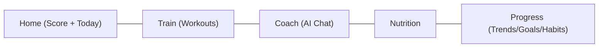

# UI/UX Design System

**Product:** Aesthetic Coach
**Related documents:** [PRD](01-prd.md) · [Mobile Architecture](08-mobile-architecture.md)

---

## 1. Design Philosophy

Three principles govern every screen:

1. **Coach-first, not log-first.** The home screen leads with the Daily Fitness Score and the AI coach's current recommendation — not an empty log waiting to be filled. Logging is fast and secondary; interpretation is primary.
2. **One glance, one number, one action.** Every screen should answer "how am I doing" in one glance (a score, a ring, a trend arrow) and offer exactly one clear next action, not a wall of options.
3. **Calm intelligence, not gamified noise.** Futuristic and data-rich, but restrained — dark, focused surfaces; motion and color reserved for meaningful state changes (a new PR, a completed streak), not decoration.

**Visual identity:** a dark-first "performance HUD" aesthetic (inspired by sports-watch and cockpit UI) with a light theme that carries the same restraint rather than becoming a generic white app.

## 2. Design Tokens

Tokens are the single source of truth, defined once and consumed by Flutter `ThemeData`/`ColorScheme` (see [Mobile Architecture § Folder Organization](08-mobile-architecture.md#2-folder-organization)) — never hardcoded hex values in widgets.

```json
{
  "color": {
    "brand": { "primary": "#5B8DFF", "primaryDark": "#3D6BDB" },
    "accent": { "energy": "#00E0A4", "warning": "#FFB020", "danger": "#FF5C5C" },
    "neutral": {
      "0": "#0B0D12", "10": "#14171F", "20": "#1C2029", "30": "#2A2F3B",
      "50": "#5A6178", "70": "#9AA1B4", "90": "#E4E7EF", "100": "#FAFBFD"
    }
  },
  "radius": { "sm": 8, "md": 14, "lg": 20, "pill": 999 },
  "spacing": [0, 4, 8, 12, 16, 20, 24, 32, 40, 56],
  "elevation": { "0": "none", "1": "0 1px 2px rgba(0,0,0,.24)", "2": "0 4px 12px rgba(0,0,0,.32)" },
  "motion": { "fast": "120ms", "base": "200ms", "slow": "320ms", "easing": "cubic-bezier(0.2,0,0,1)" }
}
```

### 2.1 Color System

| Token | Light mode | Dark mode | Usage |
|---|---|---|---|
| `background.primary` | `neutral.100` (#FAFBFD) | `neutral.0` (#0B0D12) | App background |
| `surface.card` | `#FFFFFF` | `neutral.10` (#14171F) | Cards, sheets |
| `surface.raised` | `#FFFFFF` w/ elevation.1 | `neutral.20` (#1C2029) | Modals, nav bar |
| `text.primary` | `neutral.0` | `neutral.100` | Headings, key values |
| `text.secondary` | `neutral.50` | `neutral.70` | Labels, captions |
| `brand.primary` | `#3D6BDB` | `#5B8DFF` | Primary actions, active nav, links |
| `accent.energy` | `#00B385` | `#00E0A4` | Positive trend, PR, streak, score-up |
| `accent.warning` | `#B36A00` | `#FFB020` | Recovery caution, missed target |
| `accent.danger` | `#D93F3F` | `#FF5C5C` | Destructive actions, overtraining alert |

Contrast validated to WCAG 2.1 AA (≥ 4.5:1 for body text, ≥ 3:1 for large text/icons) in both themes — see § 8.

**Semantic score colors** (Daily Fitness Score ring): 0–39 `danger`, 40–69 `warning`, 70–100 `energy`. Never conveyed by color alone — always paired with the numeric score and a label ("Recovering", "On Track", "Peak").

### 2.2 Typography

Typeface: **Inter** (variable font) — neutral, highly legible at small sizes, excellent numeral tabular-figure support (critical for weight/rep numbers that update frequently).

| Style | Size / Line height | Weight | Usage |
|---|---|---|---|
| `display` | 34 / 40 | 700 | Daily Fitness Score number |
| `h1` | 26 / 32 | 700 | Screen titles |
| `h2` | 20 / 26 | 600 | Section headers |
| `body` | 16 / 22 | 400 | Default body text |
| `bodyStrong` | 16 / 22 | 600 | Emphasized inline values |
| `caption` | 13 / 18 | 400 | Secondary labels, timestamps |
| `numeralTabular` | inherits size | 600, tabular-nums | Weights, reps, macros, timers |

### 2.3 Spacing & Layout

8pt base grid (`spacing` scale above, in dp): screen horizontal margin `20`, card padding `16`, vertical rhythm between sections `24`. Touch targets minimum `48x48dp` (exceeds WCAG's 44pt minimum) given gym-use context (sweaty hands, one-handed use, sometimes wearing gloves).

### 2.4 Iconography

Single icon family (Phosphor Icons or Lucide — stroke-based, 1.5–2px stroke weight, consistent corner radius) at fixed sizes `16/20/24/32`. No mixed icon styles. Filled variant reserved for active/selected navigation states only.

## 3. Core Components

| Component | Notes |
|---|---|
| **Score Ring** | Circular progress showing DFS 0–100, animated on change, semantic color per § 2.1 |
| **Stat Tile** | Value + label + trend delta (↑/↓ + %), used for macros, weight, streak count |
| **Set Row** | Inline-editable weight/reps/RPE row with large tap targets, swipe-to-mark-warmup |
| **Coach Message Bubble** | Distinguishes user vs. AI persona (persona avatar + name), supports streaming token-by-token render, markdown-lite (bold, lists) |
| **Persona Switcher** | Horizontal chip selector for AI coaching personas, disabled/"Coming soon" state for Future personas |
| **Progress Chart** | Line/area chart for weight, lift PRs, DFS trend; consistent axis styling; see the `dataviz` visualization guidance for chart-specific color/contrast rules when implementing |
| **Streak Badge** | Flame/pill showing current streak count, muted when at-risk (no log today) |
| **Empty State** | Illustration + one-sentence explanation + single CTA — never a bare "No data" |
| **Bottom Sheet Logger** | Primary pattern for quick-add (log set, log meal, log weight) — minimizes navigation depth |
| **Offline Banner** | Non-blocking top banner when device is offline and actions are queued (ties to [Mobile Architecture § Offline-First Strategy](08-mobile-architecture.md#4-offline-first-strategy)) |

## 4. Navigation

Bottom tab bar, 5 destinations, matching the product's mental model rather than the data model:



- **Home:** DFS ring, today's plan (workout/meal targets), coach's top recommendation, streak status.
- **Train:** workout history, start-workout flow, exercise library.
- **Coach:** persona switcher + chat, weekly review card.
- **Nutrition:** daily macro summary, meal log, food search.
- **Progress:** body metrics, goals, habits, historical DFS trend — the "everything else" analytics home.

Sub-flows (logging a set, viewing an exercise detail, editing profile) use modal/bottom-sheet or pushed routes, never a second-level tab bar (keeps navigation shallow, per go-based routing in [Mobile Architecture § Navigation](08-mobile-architecture.md#3-navigation)).

## 5. Dark Mode & Light Mode

Dark is the **default and primary-designed theme** (matches the "performance HUD" identity and typical gym/early-morning usage context); light mode is a first-class equal, not an inverted afterthought — both are designed against the same token set in § 2.1 and validated for contrast independently. Theme follows system setting by default, overridable in profile settings; selection persists locally.

## 6. Responsive Behavior

MVP targets phones only (per [PRD § Non-goals](01-prd.md#32-non-goals-explicitly-out-of-scope-for-this-product) scope), but layouts use flexible constraints (`LayoutBuilder`/`MediaQuery` breakpoints, not fixed pixel positioning) so a Phase 2+ tablet or foldable layout is additive:

| Breakpoint | Width | Behavior |
|---|---|---|
| Compact | < 600dp | Single column (MVP default) |
| Medium | 600–840dp | Two-pane where applicable (e.g., exercise list + detail) — Future |
| Expanded | > 840dp | Reserved for a Future web/tablet companion |

## 7. Motion

Motion communicates state change, not decoration: score-ring fill animates over `motion.base` (200ms) with `easing`; a new PR triggers a single restrained micro-celebration (scale + energy-color flash, ≤ 400ms, no confetti-spam); streaming AI text renders token-by-token at a natural reading cadence rather than an artificial typewriter delay. All animations respect the OS "reduce motion" accessibility setting (§ 8).

## 8. Accessibility

- Contrast: all text/background pairs meet WCAG 2.1 AA (4.5:1 body, 3:1 large text/icons) in both themes — enforced by a token-level contrast check in the design tool before tokens are handed to engineering.
- Touch targets: minimum 48x48dp (§ 2.3).
- Dynamic type: text scales with OS font-size settings up to 200% without truncation (verified via widget tests — see [Testing Strategy § Widget Testing](10-testing-strategy.md#4-widget-testing)).
- Screen readers: every interactive element has a semantic label (`Semantics` widget in Flutter); charts expose a text-summary alternative (e.g., "Weight trend: down 1.2kg over 30 days") for VoiceOver/TalkBack.
- Color is never the sole signal (§ 2.1) — paired with icon/label/shape.
- Reduce-motion: animations degrade to instant/opacity-only transitions when the OS accessibility flag is set.
- Color-blind safe palette: semantic score colors (§ 2.1) validated for deuteranopia/protanopia distinguishability, backed by the shape/label redundancy above.

## 9. Content & Tone Guidelines

- AI coach copy is direct, encouraging, and specific ("Add 2.5kg to your bench today — you've hit 8 reps at this weight twice" beats "Great job, keep going!").
- Never shame missed days; streak-risk copy is neutral and forward-looking ("Log today to keep your 12-day streak" not "You're about to lose your streak!").
- Medical/injury-adjacent AI responses always carry a calm, non-alarming professional-referral note per [AI Coaching Engine § Safety Guardrails](09-ai-coaching-engine.md#7-safety-guardrails) — tone guidance for that copy lives there, not duplicated here.
