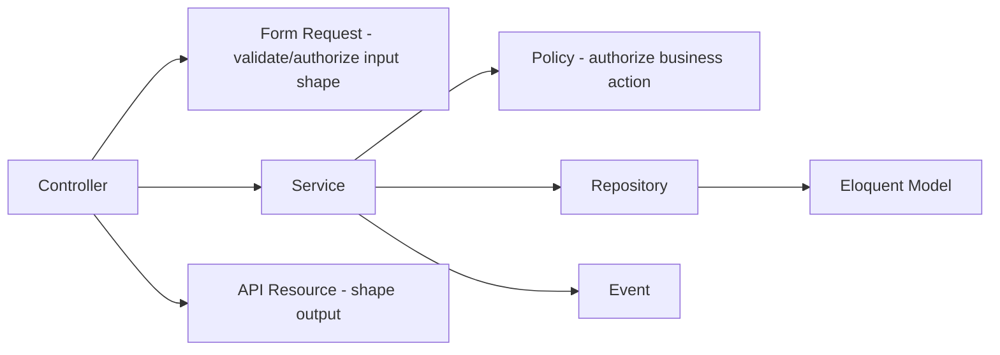

# Backend Architecture

**Product:** Aesthetic Coach
**Stack:** Laravel (latest stable), PHP 8.3+, MySQL 8, Redis
**Related documents:** [System Architecture](03-system-architecture.md) · [Database Design](04-database-design.md) · [API Specification](05-api-specification.md) · [AI Coaching Engine](09-ai-coaching-engine.md) · [Testing Strategy](10-testing-strategy.md)

---

## 1. Folder Structure

Domain modules live under `app/Modules/*` rather than Laravel's default flat `app/Http`, `app/Models` split — this keeps a bounded context's controller, service, models, policies, and jobs together, matching the component boundaries in [System Architecture § 2](03-system-architecture.md#2-component-diagram).

```
app/
  Modules/
    Auth/
      Http/Controllers/{AuthController,SessionController}.php
      Http/Requests/{RegisterRequest,LoginRequest,...}.php
      Http/Resources/{UserResource,SessionResource}.php
      Services/{AuthService,TokenService,OAuthVerificationService}.php
      Models/{User,OauthIdentity,Device,AuthRefreshToken}.php
      Policies/UserPolicy.php
      Events/{UserRegistered,SessionRevoked}.php
      Listeners/SendVerificationEmail.php
    Workouts/
      Http/Controllers/{WorkoutController,TemplateController,ExerciseController,SyncController}.php
      Http/Requests/...
      Http/Resources/...
      Services/{WorkoutService,PrDetectionService,TemplateGenerationService}.php
      Repositories/{WorkoutRepository,ExerciseRepository}.php
      Models/{Workout,WorkoutExercise,WorkoutSet,Exercise,WorkoutTemplate,TemplateExercise}.php
      Policies/WorkoutPolicy.php
    Nutrition/
      ...
    BodyMetrics/
      ...
    Habits/
      ...
    Goals/
      ...
    Scoring/
      Services/DailyFitnessScoreService.php
      Jobs/ComputeDailyFitnessScoreJob.php
      Models/DailyFitnessScore.php
    Coaching/
      Http/Controllers/{ConversationController,MessageController}.php
      Services/{AiCoachingService,ContextBuilderService,PersonaRegistry}.php
      Providers/{AiProviderInterface,ClaudeProvider.php}
      Jobs/{GenerateWeeklyReviewJob.php}
      Models/{CoachConversation,CoachMessage,AiUsageLog}.php
      Policies/ConversationPolicy.php
    Notifications/
      Services/NotificationDispatchService.php
      Jobs/SendPushNotificationJob.php
      Models/{Notification,NotificationPreference}.php
  Shared/
    Http/Middleware/{ForceJsonResponse,RequestIdMiddleware,RateLimitAi.php}
    Support/{ApiResponse,Money,DateRange}.php
    Contracts/{Repository.php}
  Providers/
    {AppServiceProvider,EventServiceProvider,ModuleServiceProvider}.php
routes/
  api_v1.php
config/
  ai.php, sanctum.php(unused-removed), services.php
database/
  migrations/, seeders/, factories/
tests/
  Unit/, Feature/, Pest.php
```

Each module's `ServiceProvider` (auto-discovered via `ModuleServiceProvider`) registers its own routes, policies, and event listeners — new modules (e.g., a Phase 2 `Community` module) plug in without touching unrelated code.

## 2. Layering & Responsibilities



- **Controllers** are thin: validate via Form Request, call one Service method, return a Resource. No business logic in controllers.
- **Form Requests** own input validation and route-level authorization (`authorize()` checks ownership/role before the service even runs).
- **Services** own business logic and orchestrate repositories, policies, events, and (for `Coaching`) the AI provider.
- **Repositories** wrap Eloquent queries for modules with non-trivial query complexity (`Workouts`, `Nutrition`, `Coaching`) — used where query reuse or testability benefits outweigh the indirection; simple CRUD modules (`Habits`, `Goals`) query Eloquent directly from the Service to avoid pointless pass-through classes (per the project's anti-over-engineering principle).
- **Policies** encode authorization rules (`WorkoutPolicy::view($user, $workout)` → `$workout->user_id === $user->id`), invoked both explicitly in services and via Laravel's `Gate`/`can` in Form Requests.
- **API Resources** control the exact camelCase JSON shape returned to the client, decoupling DB column names from the API contract (see [API Specification § Conventions](05-api-specification.md#2-conventions)).
- **Events/Listeners** decouple side effects (e.g., `WorkoutCompleted` → listeners recompute streak-relevant state, queue PR notification) from the core write path.

## 3. Middleware

| Middleware | Purpose |
|---|---|
| `RequestIdMiddleware` | Generates/propagates `X-Request-Id`, attaches to log context (see [Monitoring & Logging](13-monitoring-logging.md)) |
| `Authenticate` (custom JWT guard) | Validates access token signature + expiry, resolves `auth()->user()` |
| `EnsureEmailVerified` | Blocks AI coaching endpoints for unverified accounts (BR-2) |
| `ThrottleRequests` (per-route config) | General API rate limiting (§ API Spec 7) |
| `RateLimitAi` | Token-budget-aware limiter for `/coach/*`, backed by Redis (see [AI Coaching Engine § Rate Limiting](09-ai-coaching-engine.md#9-rate-limiting)) |
| `ForceJsonResponse` | Ensures consistent error envelope even for framework-level exceptions |
| `LogApiAccess` | Structured access log per request (method, path, status, duration, user id) |

## 4. Queues

Three named queues on Redis, so AI latency and notification delivery never block each other or ordinary background work:

| Queue | Jobs | Concurrency |
|---|---|---|
| `default` | Data export, image processing (progress photos), PR-detection side effects | Standard worker pool |
| `ai-heavy` | `GenerateWeeklyReviewJob`, `GenerateAiTemplateJob` | Smaller, dedicated pool (bounded by Claude API rate limits — see [AI Coaching Engine § Rate Limiting](09-ai-coaching-engine.md#9-rate-limiting)) |
| `notifications` | `SendPushNotificationJob`, `SendEmailJob` | High concurrency, low per-job cost |

Real-time AI chat (`POST /coach/conversations/{id}/messages`) is **not** queued — it's called synchronously within the request to preserve SSE streaming to the client (ADR-4, [System Architecture](03-system-architecture.md#9-architectural-decision-records-summary)). All jobs are idempotent (safe to retry) and use Laravel's `ShouldBeUnique` where a duplicate dispatch would cause duplicate side effects (e.g., one `ComputeDailyFitnessScoreJob` per `user_id`+`date`).

## 5. Events

| Event | Emitted by | Listeners |
|---|---|---|
| `UserRegistered` | `AuthService` | `SendVerificationEmail`, `InitializeDefaultHabits` |
| `WorkoutCompleted` | `WorkoutService` | `DetectPersonalRecords`, `QueueDailyScoreRecompute` |
| `MealLogged` | `NutritionService` | `QueueDailyScoreRecompute` |
| `HabitLogged` | `HabitService` | `UpdateStreak`, `QueueDailyScoreRecompute` |
| `DailyFitnessScoreComputed` | `DailyFitnessScoreService` | `CheckStreakRiskNotification` |
| `AiUsageRecorded` | `AiCoachingService` | `UpdateUsageBudgetCache` |
| `SessionRevoked` | `TokenService` | `NotifyUserOfNewDeviceOrRevocation` |

## 6. Scheduled Tasks (`routes/console.php` / Scheduler)

| Schedule | Task |
|---|---|
| Daily, per-user local midnight (batched hourly by timezone bucket) | `ComputeDailyFitnessScoreJob` |
| Weekly, Sunday evening per-user local time | `GenerateWeeklyReviewJob` |
| Daily 03:00 UTC | Purge expired/revoked refresh tokens older than 60 days |
| Daily 03:15 UTC | Hard-delete accounts past the 30-day deletion grace period (BR-6) |
| Hourly | Reconcile `ai_usage_logs` aggregates, alert on anomalous spend (see [Monitoring & Logging](13-monitoring-logging.md)) |
| Nightly | Database backup verification checksum job (see [Production Hardening § Backup Verification](14-production-hardening.md#7-backup-verification)) |

Timezone-bucketed scheduling (rather than one global midnight run) avoids a thundering-herd job spike and keeps each user's DFS/weekly-review timing meaningful to them.

## 7. Notifications

Laravel Notifications with two channels wired in MVP: `push` (FCM/APNs via a custom channel) and `database` (in-app notification list, `notifications` table — see [Database Design § 3.7](04-database-design.md#37-notifications)). Email channel reserved for auth-critical notices only (verification, password reset) to avoid competing with push for engagement notifications. Every notification class checks `NotificationPreference` before dispatch (FR-802).

## 8. Coding Standards

- **PSR-12** formatting, enforced via Laravel Pint in CI (see [CI/CD Pipeline](11-cicd-pipeline.md)).
- **Static analysis:** PHPStan/Larastan at level 6+, no suppressed errors merged without a documented reason.
- **Enums:** native PHP 8.1+ backed enums (`WorkoutStatus::Completed`) mapped to DB `ENUM`/`VARCHAR` columns via Eloquent casts — never magic strings in application code.
- **DTOs over arrays** at service boundaries where a payload has more than ~3 fields, to get IDE/static-analysis safety.
- **No business logic in migrations or model boot methods** beyond simple default-setting; side effects belong in Services/Listeners.
- **Every mutating endpoint has a Form Request** — no inline `$request->validate()` in controllers.
- **Every module ships its own Feature tests** colocated by module (see [Testing Strategy](10-testing-strategy.md)) — a module isn't done until its tests are.
- **API contract is generated, not hand-written** — route + Form Request + Resource annotations drive the OpenAPI spec (see [API Specification § 8](05-api-specification.md#8-openapi-specification)); the spec is a build artifact, not a second source of truth to keep in sync manually.
- **Dependency injection** via constructor injection and Laravel's container; no service-locator (`app()->make()`) calls inside business logic, only in bootstrapping code.
