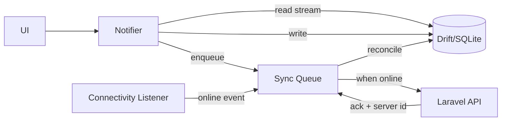

# Mobile Architecture

**Product:** Aesthetic Coach
**Stack:** Flutter (latest stable), Dart 3.x, Riverpod, Drift, go_router
**Related documents:** [System Architecture](03-system-architecture.md) · [API Specification](05-api-specification.md) · [UI/UX Design System](06-ui-ux-design-system.md)

---

## 1. State Management

### Recommendation: **Riverpod** (`flutter_riverpod` + `riverpod_generator`, `AsyncNotifier`/`Notifier`)

| Option | Why not chosen |
|---|---|
| `Provider` (plain) | No compile-time safety on provider types; easy to misuse `BuildContext`-scoped lookups; effectively superseded by Riverpod from the same author lineage |
| BLoC | Excellent discipline but heavier boilerplate (events/states/mappers) for CRUD-heavy screens that dominate this app (workout logging, nutrition logging); better suited to apps with more complex event-sourcing-style flows than this one has |
| GetX | Convenient but weak compile-time safety, service-locator-style globals encourage tight coupling, smaller/less consistent maintenance track record for a production app of this scope |
| **Riverpod** | Compile-time-safe (no `BuildContext` needed to read providers), first-class async support (`AsyncValue` maps directly to loading/data/error UI states our screens constantly need), testable in isolation without widget pumping, code-gen (`@riverpod`) keeps boilerplate low, and it composes cleanly with the offline-first + sync architecture (§ 4) via `Notifier` classes that own both local-cache reads and remote-sync triggers |

**Pattern:** each feature exposes `Notifier`/`AsyncNotifier` classes in `application/`, consumed by widgets via `ConsumerWidget`/`HookConsumerWidget`. Screens never call repositories directly — always through a provider, keeping widgets declarative and testable via `ProviderContainer` overrides (see [Testing Strategy § Widget Testing](10-testing-strategy.md#4-widget-testing)).

## 2. Folder Organization

Feature-first, not layer-first, so a feature's UI/state/data stay colocated (mirrors the backend's module-first structure in [Backend Architecture § 1](07-backend-architecture.md#1-folder-structure)):

```
lib/
  app/
    app.dart                # MaterialApp.router, theme wiring
    router.dart              # go_router configuration
    theme/                   # design tokens from UI/UX Design System
  core/
    network/                 # Dio client, interceptors (auth, retry, logging)
    storage/                 # Drift database, secure storage wrapper
    sync/                    # SyncEngine, SyncQueue (see § 4)
    error/                   # Failure types, error mapping
    di/                      # Riverpod provider overrides / bootstrapping
  features/
    auth/
      data/                  # AuthRepository (remote + local), DTOs
      application/           # AuthNotifier (Riverpod)
      presentation/          # LoginScreen, RegisterScreen, widgets/
    workouts/
      data/                  # WorkoutRepository, local Drift tables, API client
      application/           # WorkoutListNotifier, ActiveWorkoutNotifier
      presentation/          # screens/, widgets/
    nutrition/
      ...
    body_metrics/
      ...
    habits/
      ...
    goals/
      ...
    coach/
      data/                  # ConversationRepository, SSE stream handling
      application/           # ConversationNotifier
      presentation/          # ChatScreen, PersonaSwitcher
    home/
    progress/
  shared/
    widgets/                 # ScoreRing, StatTile, SetRow, etc. (design system components)
    utils/
test/
  unit/
  widget/
  integration/
```

## 3. Navigation

`go_router` with a declarative route tree matching the bottom-nav IA in [UI/UX Design System § 4](06-ui-ux-design-system.md#4-navigation): a `StatefulShellRoute` for the 5 primary tabs (each preserving its own navigation stack), with modal/full-screen routes (workout logging flow, exercise detail, settings) pushed on top. Deep links (from push notifications — e.g., "your weekly review is ready") resolve to specific routes via a typed route-name registry, avoiding stringly-typed navigation.

## 4. Offline-First Strategy

Core principle: **the local database is the source of truth for the UI; the network is a sync target, not a read path.** Every screen renders from Drift (via a Riverpod stream provider), never directly from an in-flight HTTP response.



- **Writes** (log workout, log meal, mark habit) commit to Drift immediately with `client_uuid` and a `pending_sync` flag, so the UI updates instantly regardless of connectivity (satisfies NFR-5 / FR-205).
- **Sync Queue** is a persisted (Drift-backed, not in-memory) FIFO of outbound mutations, processed by a `SyncEngine` triggered on connectivity-restored events and on a periodic background timer while the app is foregrounded.
- **Reads** for reference data (exercise library, food database) are cached locally with a TTL and background-refreshed; the app is fully browsable offline using last-known data.
- **AI features degrade explicitly:** the Coach tab shows a clear "reconnect to chat with your coach" state rather than a spinner that never resolves — AI cannot function offline by nature (see [PRD § Risks](01-prd.md#10-risks--assumptions)).

## 5. Local Storage

**Drift** (typed SQL layer over SQLite) chosen over `sqflite` directly or `Hive`/`Isar`: relational data (workouts → exercises → sets) benefits from real joins and migrations-as-code, and Drift's generated, type-safe query API matches the project's "compile-time safety over runtime surprises" preference (consistent with the Riverpod rationale in § 1). Schema mirrors the server schema's shape for the tables that need offline support (`workouts`, `workout_exercises`, `workout_sets`, `meals`, `meal_items`, `habits`, `habit_logs`) but is **not** a 1:1 mirror of [Database Design](04-database-design.md) — reference/library tables (`exercises`, `foods`) are stored as a denormalized local cache, not full relational copies. Secrets (refresh token) use `flutter_secure_storage` (Keychain/Keystore-backed), never Drift.

## 6. Synchronization

| Aspect | Approach |
|---|---|
| Conflict resolution | Server is authoritative once a record syncs; `client_uuid` upsert (see [API Specification § 6.4](05-api-specification.md#64-workouts)) makes retries idempotent. Since workout/meal logs are effectively append-only and single-device-authored-per-record, last-write-wins on the rare edit-after-sync case is sufficient for MVP — true multi-device concurrent-edit merging is a Future concern if usage patterns demand it |
| Batch sync | `POST /sync/workouts` and equivalent batch endpoints accept multiple queued mutations per request to minimize round trips after extended offline periods |
| Partial failure | Each item in a sync batch reports its own success/failure; failed items stay queued and retry with exponential backoff, successful items clear immediately — one bad record never blocks the rest of the queue |
| Background sync | Uses platform background-fetch capabilities (`workmanager`/`BGTaskScheduler`) to flush the queue even if the app isn't foregrounded, respecting OS battery constraints |

## 7. Error Handling

- **Typed failures**, not raw exceptions surfaced to the UI: repository/network layers map errors into a `Failure` sealed class (`NetworkFailure`, `ValidationFailure`, `AuthFailure`, `ServerFailure`) mirroring the [API Specification § 4](05-api-specification.md#4-error-response-format) error codes.
- Riverpod `AsyncValue.error` carries the typed `Failure`; presentation layer maps each `Failure` subtype to a consistent UI treatment (inline field errors for `ValidationFailure`, retry banner for `NetworkFailure`, forced re-login for `AuthFailure` on `session_revoked`).
- Uncaught errors are captured globally (`PlatformDispatcher.instance.onError` + Flutter's `FlutterError.onError`) and reported to crash reporting (see [Monitoring & Logging § Crash Reporting](13-monitoring-logging.md#6-crash-reporting)) — never silently swallowed.

## 8. Dependency Injection

Riverpod **is** the DI mechanism — no separate service locator (`get_it`) layered on top, avoiding two competing DI systems. `Provider`/`Provider.family` definitions in `core/di/` wire concrete implementations (`DioApiClient`, `DriftDatabase`, `SecureTokenStorage`) behind repository interfaces, so tests override providers with fakes via `ProviderContainer(overrides: [...])` without any runtime reflection or service registration step.

## 9. Networking Layer

- `Dio` HTTP client with interceptors: `AuthInterceptor` (attaches access token, triggers the refresh flow from [System Architecture § 3.1](03-system-architecture.md#31-authentication-login--token-refresh) transparently on 401, queues concurrent requests during a refresh), `LoggingInterceptor` (dev-only), `RequestIdInterceptor` (mirrors backend correlation IDs).
- AI chat uses a dedicated SSE client (`dio` with `ResponseType.stream` parsing `text/event-stream`, per [API Specification § 6.10](05-api-specification.md#610-ai-coaching)) rather than the standard JSON request path.

## 10. Build & Environment Configuration

Flavor-based configuration (`dev`, `staging`, `production`) via Dart-define / `flutter_flavorizr`, each pointing at the corresponding API base URL from [Deployment Guide](12-deployment-guide.md). No environment branching logic inside application code beyond the injected base URL and feature flags.
