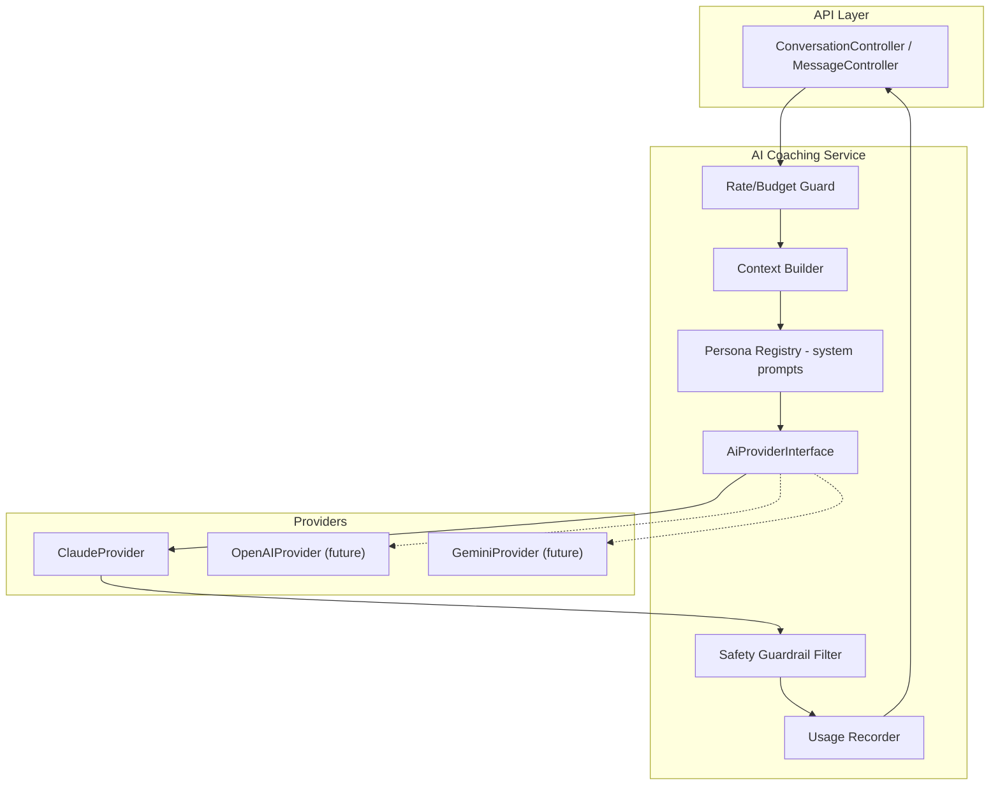
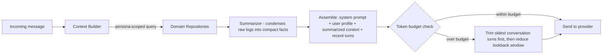

# AI Coaching Engine

**Product:** Aesthetic Coach
**Primary provider:** Claude API (Anthropic)
**Related documents:** [System Architecture](03-system-architecture.md) · [Database Design](04-database-design.md) · [API Specification](05-api-specification.md) · [Backend Architecture](07-backend-architecture.md) · [Production Hardening](14-production-hardening.md) · [Phased Release Strategy](PHASED_RELEASE_STRATEGY.md) — see [§ 11 Phased Rollout](#11-phased-rollout) for which capabilities activate in which phase

---

## 1. AI Architecture

The AI Coaching Engine is a Laravel module (`app/Modules/Coaching`, see [Backend Architecture § 1](07-backend-architecture.md#1-folder-structure)) — **not** a separate microservice at MVP — that sits between the API layer and the Claude API, owning prompt construction, context assembly, guardrails, and usage accounting. The mobile client never talks to Claude directly (see [System Architecture § Security Architecture](03-system-architecture.md#8-security-architecture)).



Every AI interaction — real-time chat, weekly review generation, adaptive template generation — flows through this same pipeline: **budget check → context assembly → persona-scoped prompt → provider call → guardrail pass on output → usage recording → persistence.** This single pipeline (rather than one-off integrations per feature) is what makes adding a new persona or coaching feature a configuration change, not a new subsystem (§ 10).

## 2. Prompt Management

- System prompts are **versioned templates**, not inline strings — stored under `resources/ai-prompts/{persona}/v{n}.md` with a small template-variable syntax (`{{user.firstName}}`, `{{context.recentWorkoutsSummary}}`), rendered by `PersonaRegistry`.
- Each persona's prompt template is reviewed like code (PR review, see [CI/CD Pipeline](11-cicd-pipeline.md)) and includes: role definition, scope boundaries, tone guidance (from [UI/UX Design System § Content & Tone Guidelines](06-ui-ux-design-system.md#9-content--tone-guidelines)), output-format constraints, and the safety guardrail clause (§ 7).
- Prompt version is recorded on every `coach_messages` row (`model` column also stores prompt version, e.g. `claude-sonnet-5:trainer-v3`) so past conversations remain explainable even after the prompt template evolves — mirrors the DFS formula-versioning discipline (BR-8).
- **Stable prefix design:** the system prompt and rarely-changing context (user profile, goals, persona instructions) are structured to appear first and remain byte-identical across turns within a conversation, enabling Claude's prompt caching (§ 8).

## 3. Context Management

Context assembly is **scoped per persona** — each persona only receives the data relevant to its role, both to control token cost and to avoid the model reasoning outside its lane:

| Persona | Context included |
|---|---|
| Personal Trainer | Last 4 weeks of workouts (summarized, not raw sets), current active template, goals of type `strength`, self-reported soreness/recovery notes, equipment availability |
| Nutrition Coach | Last 7 days of nutrition summaries, macro/calorie targets, dietary restrictions, goals of type `body_composition` |
| Weekly Review (batch) | Full week across all domains: training load, nutrition adherence, habit streaks, DFS trend |
| Recovery / Motivation / Habit coaches **[Future]** | Recovery/HRV data, habit streak history respectively |



- **Raw data is never dumped into the prompt.** A `Summarizer` step converts, e.g., 28 days of `workout_sets` into compact structured facts ("Bench Press: 3 sessions, top set 70kg×6, trending up") — this keeps token cost predictable and roughly constant regardless of how much history a power-user has accumulated.
- **Conversation history window:** last 20 turns kept verbatim in-context; older turns are dropped from the live prompt (full history remains queryable in `coach_messages` for the user, just not re-sent to the model every turn) — a Phase 2 candidate is rolling conversation summarization if usage data shows long-running conversations are common.

## 4. User Memory Strategy

Two tiers, deliberately not a vector-DB/RAG system at MVP (the data is structured and small enough that direct SQL summarization is simpler, cheaper, and more reliable than embedding search — RAG is called out below as the Future upgrade path if unstructured memory becomes necessary):

1. **Structured memory (MVP):** the user's actual tracked data (workouts, nutrition, goals, DFS history) *is* the memory. It's always current, queried fresh per request via the Context Builder (§ 3) — no separate "memory store" to keep in sync or go stale.
2. **Durable coaching notes (MVP):** a small `coach_user_notes` table (persona-scoped key facts the AI or user has explicitly established, e.g., "prefers home workouts on Fridays," "avoids barbell squats due to prior injury") — capped at a small count per persona, surfaced into every relevant conversation's context. Written either by explicit user action ("remember that...") or by the model via a constrained tool call (`save_coaching_note`), never silently inferred and injected without being visible to the user in their profile.
3. **Future:** if conversation volume grows to where structured summarization + notes isn't enough (e.g., users referencing free-form past conversations months later), introduce a retrieval layer (embeddings over past `coach_messages`) — architected as an additive `MemoryRetrieverInterface` the Context Builder can call, not a redesign.

## 5. Recommendation Engine

Two distinct mechanisms, intentionally separated so the deterministic one stays cheap, fast, and auditable, and the generative one is reserved for what actually needs language reasoning:

1. **Daily Fitness Score (deterministic, no LLM call):** computed by `DailyFitnessScoreService` as a weighted formula over four components, each 0–100 before weighting:

   `score = round(0.35*training + 0.25*nutrition + 0.20*recovery + 0.20*habit)`

   - `training`: rolling training-load consistency vs. the user's active template (session completion rate + volume trend).
   - `nutrition`: macro/calorie adherence vs. target over the trailing 3 days.
   - `recovery`: self-reported soreness/sleep input (MVP; wearable HRV replaces/augments this in Phase 2).
   - `habit`: active habit completion rate.
   - Weights and formula are versioned (`formula_version`, BR-8); the plain-language explanation shown in-app (FR-703) is template-generated from the component breakdown, **not** a separate LLM call, keeping the score fast and free to compute at scale.

2. **Generative recommendations (LLM-driven):** adaptive workout template generation, meal suggestions, and the weekly review use the pipeline in § 1, with the Daily Fitness Score and its components passed in as **input context** — the AI interprets and narrates the score, it never computes it.

## 6. Model Abstraction Layer

```php
interface AiProviderInterface
{
    public function complete(AiRequest $request): AiResponse;      // non-streaming (reviews, templates)
    public function stream(AiRequest $request): Generator;          // streaming (chat)
}
```

- `AiRequest` is a provider-agnostic value object (system prompt, messages, max tokens, temperature, tool definitions); `ClaudeProvider` maps it onto the Claude Messages API (model id, `system`, `messages[]`, streaming SSE).
- `PersonaRegistry` and `ContextBuilder` are entirely provider-agnostic — they never reference Claude-specific types, so a Phase 2 `OpenAiProvider`/`GeminiProvider` (implementing the same interface) is a config change (`config/ai.php: 'default' => 'claude'`) plus a mapping class, not a rewrite of the coaching logic. Tool/function-calling schema is defined once in a provider-neutral shape and translated per provider (Claude tool-use JSON schema today).
- Provider selection is even resolvable **per persona** if a future need arises (e.g., a cheaper model for lightweight personas), since `PersonaRegistry` config carries a `provider` key already defaulted to `claude`.

## 7. Safety Guardrails

- **System-prompt-level boundaries:** every persona's prompt explicitly scopes it to wellness/coaching guidance and instructs it to decline diagnosing injuries/medical conditions, prescribing supplements/medication, or giving guidance for disordered-eating-adjacent requests — redirecting to a professional instead (BR-9).
- **Output guardrail filter:** a lightweight post-processing check (keyword/pattern-based, not another LLM call, for latency and cost) flags responses touching medical/injury/disordered-eating topics and ensures the required referral disclaimer is present, appending it if the model omitted it.
- **Escalation copy** follows the calm, non-alarming tone defined in [UI/UX Design System § Content & Tone Guidelines](06-ui-ux-design-system.md#9-content--tone-guidelines) — never clinical or alarmist.
- **Abuse/prompt-injection resistance:** user-provided free text is always sent as a `user`-role message, never concatenated into the system prompt; tool-call outputs from application data are similarly wrapped and never treated as instructions.
- **Human-in-the-loop for at-risk signals [Future]:** repeated conversation patterns suggestive of disordered eating or self-harm risk are flagged for a defined support-resource response and logged for product/trust-and-safety review — scoped as Phase 2 once real usage data informs the detection approach, rather than guessed at upfront.

## 8. Cost Optimization

| Technique | Detail |
|---|---|
| Prompt caching | Stable prompt prefix (system prompt + user profile + persona instructions, § 2) structured to be cacheable across turns/requests per Claude's prompt caching support, cutting repeated-context token cost for multi-turn conversations |
| Context summarization | § 3 — bounded, roughly-constant-size context regardless of user history depth |
| Deterministic scoring off the LLM path | § 5 — the highest-frequency "recommendation" (DFS) costs zero AI tokens |
| Async batching for non-real-time work | Weekly reviews generated via queued jobs (`ai-heavy` queue, [Backend Architecture § 4](07-backend-architecture.md#4-queues)) during off-peak hours where feasible, rather than on-demand |
| Model-tier routing | Lighter-weight tasks (e.g., a short exercise-explanation lookup) can route to a smaller/cheaper model tier via the same `AiProviderInterface`; conversational coaching uses the primary tier |
| Token budgets | Per-user daily token cap (§ 9) is itself a cost control, not just an abuse control |
| Usage observability | Every request's `tokens_input`/`tokens_output`/estimated cost is recorded (`ai_usage_logs`, `coach_messages`) and rolled up for dashboards (see [Monitoring & Logging](13-monitoring-logging.md)) so cost-per-active-user is always visible, not discovered at the monthly bill |

## 9. Rate Limiting

Two layers, both enforced server-side in `RateLimitAi` middleware ([Backend Architecture § 3](07-backend-architecture.md#3-middleware)) backed by Redis counters:

1. **Request-rate limiting:** short-window burst control (e.g., 10 messages/minute) to prevent runaway client loops.
2. **Token-budget limiting:** a daily token budget per user (tuned per subscription tier if/when monetization tiers exist), tracked via the `ai_usage_logs` upsert-per-day row (see [Database Design § 3.6](04-database-design.md#36-scoring--ai)). Nearing/exceeding budget returns `429 rate_limited` with `details.resetAt` (see [API Specification § 7](05-api-specification.md#7-rate-limiting)), and the mobile UI communicates this as a clear "daily coaching limit reached, resets at X" state rather than a generic error.

## 10. Future Extensibility

The architecture is designed so the following are **additive**, not architectural rewrites:

- **New personas** (Recovery, Motivation, Habit coaches): add a prompt template + `PersonaRegistry` entry + persona-specific context-builder query; pipeline (§ 1) and UI pattern (persona switcher, [UI/UX Design System § 3](06-ui-ux-design-system.md#3-core-components)) already support N personas.
- **New providers** (OpenAI, Gemini): implement `AiProviderInterface` (§ 6); no changes to Context Builder, Persona Registry, or Guardrail layers.
- **Tool use / function calling:** `AiRequest`'s tool-definition shape already exists for the `save_coaching_note` tool (§ 4); additional tools (e.g., "log this meal from what I just told you," "create this workout template") follow the same pattern — model proposes a structured call, service layer validates and executes it through the same Services used by the REST API (never a separate write path).
- **Wearable-informed recovery coaching:** once wearable sync lands (Phase 2, [PRD § 5](01-prd.md#51-core-tracking)), it's simply a new context source feeding the existing Recovery persona and the `recovery` component of the DFS formula — no pipeline change.
- **Multi-modal input** (e.g., a photo of a meal): `AiRequest` message content is already structured to support content blocks beyond plain text, matching Claude's multi-modal message format, so this is a client + context-builder addition rather than a new pipeline.

## 11. Phased Rollout

**This section classifies *when* each capability described above activates under [Phased Release Strategy](PHASED_RELEASE_STRATEGY.md). It does not change the architecture in § 1–10** — every capability below runs through the exact same pipeline (budget check → context assembly → persona prompt → provider call → guardrail → usage recording, § 1); phasing is a matter of which personas are enabled in `PersonaRegistry` config and which mobile UI surfaces are shipped, not a different code path per phase.

| Phase | Capability | Mechanism (unchanged from § 1–10) |
|---|---|---|
| **Phase 1** | Workout Generator | `POST /templates/ai-generate` — single structured-output call against the `personal_trainer` persona (§ 5, § 6) |
| **Phase 1** | Exercise Recommendations / Exercise Explanation | Lightweight single-turn call, optionally routed to a smaller model tier (§ 8) |
| **Phase 1** | Progress Summary | `GenerateWeeklyReviewJob` (§ 5), batch-generated, delivered as a card/notification — not a conversational thread |
| **Phase 1** | Motivation (simple nudges) | Tone embedded in notification copy and the Progress Summary output, per [UI/UX Design System § 9](06-ui-ux-design-system.md#9-content--tone-guidelines) — not a dedicated persona or pipeline call |
| **Phase 2** | Conversational Coach | `personal_trainer` persona's chat mode, `POST /coach/conversations/{id}/messages` opened to general availability ([API Specification § 9](05-api-specification.md#9-phase-allocation)) |
| **Phase 2** | Nutrition Coach, Recovery Coach, Habit Coach | New `PersonaRegistry` entries per § 10's "New personas" pattern — Recovery Coach additionally gated on wearable data existing |
| **Phase 2** | Long-Term Memory | The `MemoryRetrieverInterface` retrieval-layer upgrade named in § 4, built once real Phase 2 conversation volume justifies it |
| **Phase 2** | Predictive Coaching | Progress Analysis capability (§ 5-adjacent), data-depth-gated on accumulated Phase 1+2 history |

Full capability-by-capability rationale (why each waits for Phase 2, and exactly what Phase 1 data each depends on) lives in [PHASE2_SCOPE.md](PHASE2_SCOPE.md) — this table is a pointer into that document's classification, not a duplicate of it. The underlying prompt content for every capability above is in the [AI Prompt Library](ai/README.md), which carries the same phase classification per file.
