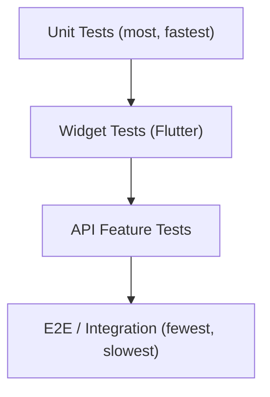

# Testing Strategy

**Product:** Aesthetic Coach
**Related documents:** [SRS](02-srs.md) · [Backend Architecture](07-backend-architecture.md) · [Mobile Architecture](08-mobile-architecture.md) · [AI Coaching Engine](09-ai-coaching-engine.md) · [CI/CD Pipeline](11-cicd-pipeline.md)

---

## 1. Testing Philosophy

Every `FR-xxx` in the [SRS](02-srs.md#4-functional-requirements) maps to at least one automated test before it ships. Tests hit real dependencies where feasible (real MySQL in CI, not mocked query builders) so passing tests mean something — mirroring the project's stance against mock-heavy tests that pass while production breaks.

## 2. Test Pyramid

| Layer | Backend tooling | Mobile tooling | Target coverage focus |
|---|---|---|---|
| Unit | Pest/PHPUnit | Dart `test` package | Services, formulas (DFS calc), utility logic, Riverpod notifiers in isolation |
| Widget/Component | — | `flutter_test` + `golden_toolkit` | Individual widgets, screen states (loading/data/error), design-system components |
| Integration/Feature | Pest Feature tests (real MySQL, `RefreshDatabase`) | `integration_test` package | Full request/response cycles, offline sync flows |
| E2E | Postman/Newman or Pest against staging | Patrol / `integration_test` on real devices via Firebase Test Lab | Critical user journeys end-to-end |

## 3. Unit Testing

**Backend:** every Service class has unit tests with real (not mocked) lightweight collaborators where possible; only true external boundaries (Claude API, push providers, OAuth providers) are faked, via interfaces already required by [Backend Architecture § 2](07-backend-architecture.md#2-layering--responsibilities) and [AI Coaching Engine § 6](09-ai-coaching-engine.md#6-model-abstraction-layer). The `DailyFitnessScoreService` formula (BR-8) has an exhaustive table-driven test suite covering component boundary values (0, 100, missing-data defaults).

**Mobile:** `Notifier`/`AsyncNotifier` classes tested via `ProviderContainer` with repository providers overridden by fakes — no widget pump required, per the testability rationale for Riverpod in [Mobile Architecture § 1](08-mobile-architecture.md#1-state-management).

## 4. Widget Testing

Every shared design-system component ([UI/UX Design System § 3](06-ui-ux-design-system.md#3-core-components)) has golden tests across light/dark theme and at least one accessibility variant (200% text scale) to catch layout breakage per [UI/UX Design System § Accessibility](06-ui-ux-design-system.md#8-accessibility). Screen-level widget tests cover loading/data/empty/error `AsyncValue` states for each primary screen (Home, Train, Coach, Nutrition, Progress).

## 5. API Testing

Pest Feature tests per module, run against a real (ephemeral, per-test-transaction) MySQL database — not SQLite-in-memory, to catch MySQL-specific behavior (collation, `ENUM` constraints, JSON column handling) early rather than in staging. Every endpoint in [API Specification § 6](05-api-specification.md#6-endpoint-reference) has tests for: happy path, validation failure (422), unauthorized/unauthenticated (401/403), not-found/cross-user-isolation (404 — verifying IDOR protection per [System Architecture § Security Architecture](03-system-architecture.md#8-security-architecture)), and idempotency (`clientUuid` replay) where applicable.

AI endpoints are tested against a **recorded-response fake provider** (`FakeClaudeProvider` implementing `AiProviderInterface`) with fixture responses for deterministic, fast, zero-cost CI runs; a small, separate, manually-triggered "AI smoke suite" hits the real Claude API against a handful of fixed prompts to catch provider-side drift (see [CI/CD Pipeline § 4](11-cicd-pipeline.md#4-automated-testing-ci-gates)).

## 6. Offline Sync Testing

Given the offline-first requirement (NFR-5), sync logic is tested explicitly for: write-while-offline then sync-on-reconnect, partial-batch failure and retry (per [Mobile Architecture § Synchronization](08-mobile-architecture.md#6-synchronization)), and duplicate-submission idempotency via `client_uuid` on both the mobile (`integration_test` with a simulated connectivity toggle) and backend (Pest test replaying the same `clientUuid` payload twice, asserting a single row).

## 7. Performance Testing

| Target | Method |
|---|---|
| API p95 < 300ms (NFR-1) | k6 or Apache Bench load scripts against staging, run in CI nightly and before major releases |
| AI first-token latency < 2s p95 (NFR-2) | Synthetic streaming-latency probe against the real Claude API on a schedule, alerting on regression (see [Monitoring & Logging](13-monitoring-logging.md)) |
| Mobile cold start < 2.5s | Flutter DevTools timeline profiling on a representative mid-tier Android device, tracked per release |
| DB query regression | `EXPLAIN`-backed slow-query assertions on the highest-traffic queries (workout list, nutrition summary, DFS lookup) as part of the Database module's test suite |

## 8. Load Testing

Pre-launch and pre-major-release load tests simulate realistic mixed traffic (browse/log-heavy with a smaller proportion of AI chat calls, matching expected usage ratios from [PRD § Success Metrics](01-prd.md#8-success-metrics)) against a staging environment sized like production, validating the horizontal-scaling assumptions in [System Architecture § Scalability Strategy](03-system-architecture.md#7-scalability-strategy). AI-heavy endpoints are load-tested against the `FakeClaudeProvider` (§ 5) to isolate infrastructure limits from third-party provider limits, which are validated separately against Anthropic's documented rate limits for the account tier in use.

## 9. Security Testing

Covered in detail by [Production Hardening](14-production-hardening.md); testing-strategy-specific pieces:
- Automated dependency vulnerability scanning (`composer audit`, `flutter pub outdated`/`dart pub audit`) in CI on every PR.
- Static analysis security rules (Larastan security-focused rulesets) alongside the standard PHPStan pass ([Backend Architecture § Coding Standards](07-backend-architecture.md#8-coding-standards)).
- Authorization/IDOR-specific Feature tests (§ 5) treated as security tests, not just functional ones — every resource-scoped endpoint has an explicit "user A cannot access user B's resource" test.
- Annual (minimum) third-party penetration test before major surface-area changes ship broadly.

## 10. Test Automation & CI Gates

All test layers except the manual AI smoke suite (§ 5) and full device-lab E2E run on every pull request (see [CI/CD Pipeline § Automated Testing](11-cicd-pipeline.md#4-automated-testing-ci-gates)). Merge is blocked on: unit + widget + API Feature tests passing, static analysis clean, and no new dependency vulnerabilities above the configured severity threshold. E2E device-lab runs and load tests run on a schedule and before release tags, not on every commit, to keep PR feedback fast.
