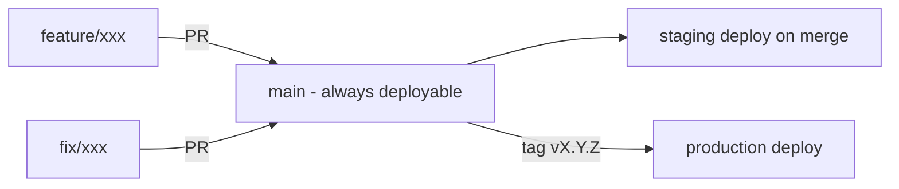
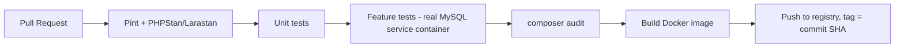
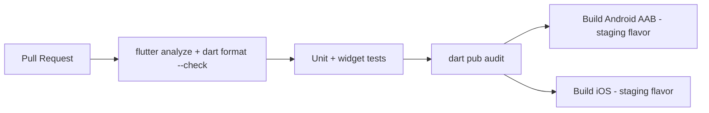

# CI/CD Pipeline

**Product:** Aesthetic Coach
**Tooling:** GitHub Actions, Docker, Fastlane (mobile release automation)
**Related documents:** [Testing Strategy](10-testing-strategy.md) · [Deployment Guide](12-deployment-guide.md) · [Backend Architecture](07-backend-architecture.md)

---

## 1. Git Workflow & Branching Strategy

**Trunk-based with short-lived feature branches:**

- `main` is always deployable and auto-deploys to **staging** on every merge.
- Feature branches: `feature/<short-desc>`, `fix/<short-desc>`, `chore/<short-desc>` — branched from `main`, short-lived (target < 3 days open).
- **Production deploys are tag-triggered** (`vX.Y.Z`), not automatic on merge — giving an explicit, reviewable release step (§ 5).
- No long-lived `develop` branch — avoided deliberately to prevent drift/merge-hell between two long-lived branches; `main` + feature branches + release tags is sufficient at this team scale (revisit only if release cadence or team size changes significantly, per the modular-monolith reconsideration triggers in [System Architecture § ADRs](03-system-architecture.md#9-architectural-decision-records-summary)).

## 2. Pull Request Guidelines

- Every PR must: pass all required CI checks (§ 4), include tests for new behavior (per [Testing Strategy](10-testing-strategy.md)), and link the `FR-xxx`/`NFR-xxx` or issue it addresses.
- PR description template: **What/Why**, **Testing performed**, **Screenshots (mobile UI changes)**, **Rollback plan (if risky)**.
- Minimum one approving review; two for changes touching auth, payments (Future), or database migrations.
- Migrations reviewed explicitly for lock behavior and backward compatibility (expand/contract pattern, [Database Design § Migration Strategy](04-database-design.md#6-migration-strategy)).
- Squash-merge to keep `main` history one commit per logical change.

## 3. Build Pipeline

### 3.1 Backend (Laravel)

### 3.2 Mobile (Flutter)

Both pipelines run on every PR against `main`; CI must be green before merge is allowed (branch protection rule).

## 4. Automated Testing (CI gates)

Per [Testing Strategy § Test Automation & CI Gates](10-testing-strategy.md#10-test-automation--ci-gates):

| Gate | Blocking on PR? | Frequency |
|---|---|---|
| Lint/static analysis | Yes | Every PR |
| Unit + widget tests | Yes | Every PR |
| API Feature tests (real MySQL) | Yes | Every PR |
| Dependency vulnerability scan | Yes (severity ≥ high) | Every PR |
| Offline sync integration tests | Yes | Every PR |
| E2E device-lab tests | No | Nightly + pre-release tag |
| Load tests (k6) | No | Nightly + pre-release tag |
| Manual AI smoke suite (real Claude API) | No | Pre-release tag, manually triggered |

## 5. Release Management & Versioning

- **Semantic versioning** `MAJOR.MINOR.PATCH` for both backend and mobile releases, kept in lockstep at the API-contract level (mobile `MINOR` bump required whenever it depends on a new non-breaking API addition; `MAJOR` bump on either side requires the coordinated `/api/v2` process from [API Specification § 1](05-api-specification.md#1-versioning-strategy)).
- **Backend release:** merge to `main` → auto-deploy to staging → smoke test → tag `vX.Y.Z` → manual approval gate → deploy to production (rolling, zero-downtime — see [Deployment Guide](12-deployment-guide.md)).
- **Mobile release:** tag triggers Fastlane lanes building signed Android App Bundle and iOS archive, uploading to Play Console internal track / TestFlight automatically; promotion to production track is a manual step (store review lead time makes this inherently non-instant, and gives a final human gate before public release).
- **Changelog:** generated from squashed PR titles (Conventional Commits-style prefixes: `feat:`, `fix:`, `chore:`) since the previous tag.
- **Rollback:** backend rolls back by redeploying the previous image tag (see [Deployment Guide § Rollback Procedures](12-deployment-guide.md#10-rollback-procedures)); mobile cannot be "rolled back" post-store-release, so risky mobile releases favor feature flags (§ 6) over relying on rollback.

## 6. Feature Flags

Server-driven feature flags (simple `feature_flags` config/table, evaluated per-user, exposed via `GET /me` capabilities block) gate risky or partially-rolled-out features (e.g., a new AI persona in § [AI Coaching Engine § Future Extensibility](09-ai-coaching-engine.md#10-future-extensibility)) so mobile releases — which can't be hotfixed instantly — stay low-risk even between store review cycles.

## 7. Environments Summary

| Environment | Trigger | Purpose |
|---|---|---|
| Dev | Local / ephemeral PR preview (backend only, via Docker Compose) | Individual development |
| Staging | Auto-deploy on merge to `main` | Integration testing, QA, nightly E2E/load tests, TestFlight/Play internal track |
| Production | Manual-approved deploy on release tag | Live traffic |

Full environment configuration detail is in the [Deployment Guide](12-deployment-guide.md).
