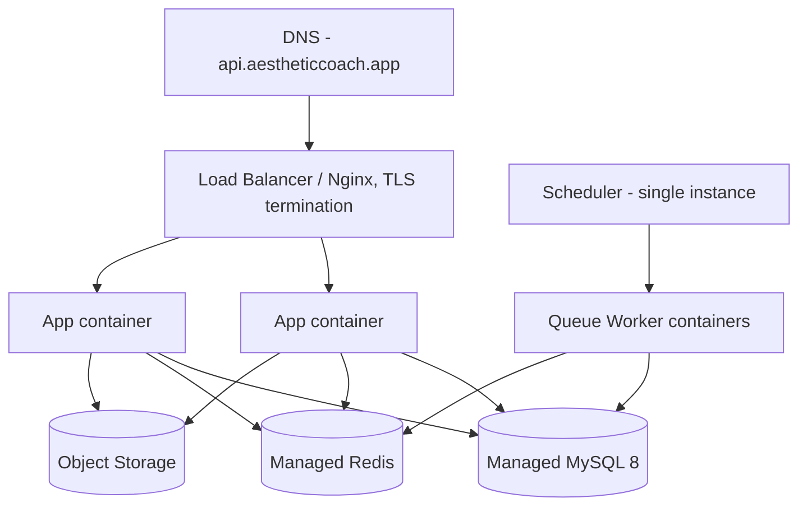

# Deployment Guide

**Product:** Aesthetic Coach
**Related documents:** [System Architecture](03-system-architecture.md) · [CI/CD Pipeline](11-cicd-pipeline.md) · [Monitoring & Logging](13-monitoring-logging.md) · [Production Hardening](14-production-hardening.md)

---

## 1. Environments

| Environment | Infrastructure | Data | Access |
|---|---|---|---|
| **Development** | Local Docker Compose (app, MySQL 8, Redis, Mailhog) | Seeded fixture data | Individual developer machines |
| **Staging** | Same topology as production, smaller instance sizes | Anonymized/synthetic data, periodically refreshed | Internal team + TestFlight/Play internal testers |
| **Production** | Managed cloud infra (§ 3) | Real user data | Public |

## 2. Development Environment

`docker-compose.yml` at repo root brings up:

```yaml
services:
  app:
    build: ./backend
    volumes: ["./backend:/var/www/html"]
    ports: ["8000:8000"]
    depends_on: [mysql, redis]
    env_file: ./backend/.env
  mysql:
    image: mysql:8.0
    environment:
      MYSQL_DATABASE: aesthetic_coach
      MYSQL_ROOT_PASSWORD: "${DB_ROOT_PASSWORD}"
    volumes: ["mysql_data:/var/lib/mysql"]
    ports: ["3306:3306"]
  redis:
    image: redis:7-alpine
    ports: ["6379:6379"]
  mailhog:
    image: mailhog/mailhog
    ports: ["8025:8025"]
volumes:
  mysql_data:
```

Flutter runs natively against `http://localhost:8000/api/v1` via the `dev` flavor ([Mobile Architecture § Build & Environment Configuration](08-mobile-architecture.md#10-build--environment-configuration)). `.env.example` is committed; real `.env` is git-ignored (see [Production Hardening § Encryption & Secrets Management](14-production-hardening.md#3-encryption--secrets-management)).

## 3. Staging & Production Infrastructure



Mirrors [System Architecture § Deployment Architecture](03-system-architecture.md#6-deployment-architecture). Provisioned via infrastructure-as-code (Terraform) so staging and production are defined from the same modules with size/count parameters differing — preventing environment drift.

## 4. Docker

- **Backend image:** multi-stage Dockerfile — `composer install --no-dev` in a build stage, final stage runs PHP-FPM + the app on a slim PHP 8.3 base image; `php artisan config:cache`/`route:cache`/`event:cache` baked at build time, not run-time, for fast cold starts.
- **Immutable images:** every image is tagged with the commit SHA (§ [CI/CD Pipeline § 3.1](11-cicd-pipeline.md#31-backend-laravel)); deploys reference a specific tag, never `:latest`, so a deploy is always reproducible and reviewable.
- **Queue workers and scheduler** use the same image as the app container with a different container command (`php artisan queue:work` / `php artisan schedule:work`), keeping build artifacts identical across roles.

## 5. Nginx

Nginx sits in front of PHP-FPM (or the app container directly fronts Nginx depending on the chosen host — either way Nginx owns TLS termination, gzip, and static asset headers):

```nginx
server {
    listen 443 ssl http2;
    server_name api.aestheticcoach.app;

    ssl_certificate     /etc/ssl/certs/aestheticcoach.pem;
    ssl_certificate_key /etc/ssl/private/aestheticcoach.key;
    ssl_protocols TLSv1.2 TLSv1.3;

    add_header Strict-Transport-Security "max-age=63072000; includeSubDomains" always;

    location / {
        proxy_pass http://app_upstream;
        proxy_set_header Host $host;
        proxy_set_header X-Real-IP $remote_addr;
        proxy_set_header X-Forwarded-For $proxy_add_x_forwarded_for;
        proxy_set_header X-Forwarded-Proto $scheme;
    }

    location ~ ^/api/v1/coach/conversations/.*/messages$ {
        proxy_pass http://app_upstream;
        proxy_buffering off;         # required for SSE streaming
        proxy_read_timeout 120s;
        proxy_set_header Connection '';
        chunked_transfer_encoding on;
    }
}
```

The AI chat streaming route explicitly disables proxy buffering — a common cause of "streaming" that actually arrives in one chunk if missed (relevant to [System Architecture § 3.2](03-system-architecture.md#32-ai-coach-chat-streaming)).

## 6. SSL

- Certificates via Let's Encrypt (auto-renewed via `certbot` cron/ACME client) or the cloud provider's managed certificate service (ACM) if using an AWS ALB — either way, **no manually-tracked expiry dates**; renewal is automated and monitored (an expiring-cert alert is configured regardless, see [Monitoring & Logging § Alerting](13-monitoring-logging.md#8-alerting)).
- TLS 1.2 minimum, 1.3 preferred; HSTS enabled with a 2-year max-age once the domain is confirmed stable.

## 7. Environment Variables

Managed via the deployment platform's secret store (see [Production Hardening § Encryption & Secrets Management](14-production-hardening.md#3-encryption--secrets-management)), injected at container start — never baked into images. Key categories: `DB_*`, `REDIS_*`, `APP_KEY`, `JWT_PRIVATE_KEY`/`JWT_PUBLIC_KEY`, `ANTHROPIC_API_KEY`, `GOOGLE_OAUTH_*`, `APPLE_OAUTH_*`, `FCM_*`/`APNS_*`, `S3_*`. `.env.example` documents every required key with a placeholder/description, kept in sync via a CI check that fails if a config key is referenced in code but missing from `.env.example`.

## 8. Database Migrations on Deploy

Deploy pipeline runs `php artisan migrate --force` as a pre-traffic step (before the new app version starts receiving requests), following the expand/contract pattern from [Database Design § Migration Strategy](04-database-design.md#6-migration-strategy) so the *previous* app version continues working correctly against the *new* schema during a rolling deploy.

## 9. Backups

Automated per [Database Design § Backup & Restore Strategy](04-database-design.md#7-backup--restore-strategy); an additional pre-migration snapshot is triggered automatically by the deploy pipeline whenever a migration in the release alters or drops a column.

## 10. Rollback Procedures

| Scenario | Rollback action |
|---|---|
| Bad app release, no destructive migration | Redeploy previous image tag; near-instant |
| Bad app release, additive migration only (new nullable column/table) | Redeploy previous image tag; new column simply unused — safe by construction of the expand/contract pattern |
| Bad app release, destructive migration already ran | Restore from the automatic pre-migration snapshot (§ 9) into a recovery instance, or apply a compensating "down" migration if the change is trivially reversible; destructive migrations are reviewed with this scenario explicitly in mind (§ [CI/CD Pipeline § 2](11-cicd-pipeline.md#2-pull-request-guidelines)) |
| Bad mobile release | Cannot truly roll back a published store release — mitigate via feature flags ([CI/CD Pipeline § 6](11-cicd-pipeline.md#6-feature-flags)) and, if severe, a forced-minimum-version check server-side that prompts affected users to update |

Every rollback is a rehearsed, documented runbook step, not an improvised action — see [Production Hardening § Disaster Recovery](14-production-hardening.md#8-disaster-recovery) for the broader DR plan this fits into.
