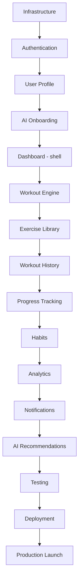

# Implementation Order

**Product:** Aesthetic Coach — Phase 1 (Intelligent Fitness Platform)
**Purpose:** the primary development guide — the module-by-module build order, at a finer grain than the sprint groupings in [Development Roadmap](16-development-roadmap.md), with explicit inputs/outputs/dependencies per module.
**Related documents:** [Development Roadmap](16-development-roadmap.md) (authoritative for sprint/time grouping) · [PHASE1_SCOPE.md](PHASE1_SCOPE.md) (authoritative for feature scope) · [TASK_BREAKDOWN.md](TASK_BREAKDOWN.md) (hour-scale tasks within each module) · [MODULE_DEPENDENCIES.md](MODULE_DEPENDENCIES.md) (dependency graph)

## Table of Contents
- [Note on Sequencing](#note-on-sequencing)
- [Overall Development Order](#overall-development-order)
- [Module Detail](#module-detail)
- [Parallel Development Opportunities](#parallel-development-opportunities)

## Note on Sequencing

This document orders modules by **logical dependency** — what has to exist before the next thing can be built and meaningfully tested. It is not a second, competing schedule: [Development Roadmap § Phase 1](16-development-roadmap.md#phase-1--intelligent-fitness-platform-mvp) remains authoritative for which sprint each module lands in. Two deliberate nuances worth stating up front so the two documents don't read as contradictory:

- **Dashboard (module 5) ships as a shell first, not a finished screen.** Its navigation scaffold and empty/loading states are built early because every other tab is hosted inside the same bottom-navigation shell — but its data-rich cards (Score Ring, AI recommendation) are populated incrementally as Workout Engine, Progress Tracking, and AI Recommendations land, exactly as [PHASE1_SCOPE.md § Dashboard](PHASE1_SCOPE.md#dashboard) already specifies ("Sprint 4 scaffold / Sprint 5 finalize").
- **Workout Engine (module 6) and Exercise Library (module 7) are built together in practice**, listed as separate modules here only because they're separable concerns (workout logging logic vs. exercise catalog/search). Workout Engine cannot be meaningfully tested without at least seed exercise data existing — see each module's Dependencies field below, and [Development Roadmap § Phase 1 · Sprint 3](16-development-roadmap.md#phase-1--sprint-3--workout-engine--exercise-library), which already treats them as one sprint.

## Overall Development Order

## Module Detail

### 1. Infrastructure

- **Objectives:** stand up the repositories, local dev environment, CI/CD pipeline, and staging environment every later module depends on.
- **Inputs:** none.
- **Outputs:** Laravel + Flutter project scaffolds; Docker Compose dev environment; green CI pipeline; provisioned staging environment.
- **Dependencies:** none (first module).
- **Required documents:** [Backend Architecture § 1](07-backend-architecture.md#1-folder-structure), [Mobile Architecture § 2](08-mobile-architecture.md#2-folder-organization), [Deployment Guide § 2](12-deployment-guide.md#2-development-environment), [CI/CD Pipeline](11-cicd-pipeline.md).
- **Estimated complexity:** L.
- **Definition of Done:** both scaffolds build and run locally; CI runs lint + a trivial test on every PR; staging environment is reachable.
- **Exit criteria:** a "hello world" health-check endpoint deploys through the full pipeline to staging successfully.

### 2. Authentication

- **Objectives:** full auth system — registration, login, OAuth, token lifecycle, session management.
- **Inputs:** Infrastructure (module 1).
- **Outputs:** working `POST /auth/*` endpoints; Flutter login/signup screens; secure token storage and transparent refresh.
- **Dependencies:** Infrastructure.
- **Required documents:** [Authentication feature](features/authentication.md), [System Architecture § 3.1 & § 8](03-system-architecture.md#31-authentication-login--token-refresh), [Database Design § 3.1](04-database-design.md#31-identity--auth), [API Examples — Auth](api-examples/auth.md), [ADR-0005](adr/0005-jwt-refresh-token-auth.md).
- **Estimated complexity:** L.
- **Definition of Done:** every acceptance criterion in [Authentication § Acceptance Criteria](features/authentication.md#acceptance-criteria) passes; refresh-token rotation/reuse-detection has dedicated tests, not just happy-path coverage.
- **Exit criteria:** a user can register, verify email, log in, refresh a session, and log out end-to-end on a real device against staging.

### 3. User Profile

- **Objectives:** profile data model and edit flow.
- **Inputs:** Authentication.
- **Outputs:** `GET/PATCH /me`; Flutter Profile screen.
- **Dependencies:** Authentication.
- **Required documents:** [Profile feature](features/profile.md), [Screens — Profile](screens/profile.md).
- **Estimated complexity:** S.
- **Definition of Done:** [Profile § Acceptance Criteria](features/profile.md#acceptance-criteria) passes; profile edits are confirmed to propagate into AI context assembly (verified once module 13 exists — flag as a deferred check, not a blocker here).
- **Exit criteria:** a user can view and edit every profile field specified in the feature doc.

### 4. AI Onboarding

- **Objectives:** the guided first-run flow ending in a first AI-generated workout, per its Phase 1 simplification.
- **Inputs:** Authentication, User Profile.
- **Outputs:** onboarding screens; a seeded `goals` row; a placeholder/feature-flagged AI-generation call (real generation wires in once module 13 exists).
- **Dependencies:** Authentication, User Profile. **Soft dependency** (feature-flagged until ready): Workout Engine (module 6) and AI Recommendations (module 13) for the live generation call.
- **Required documents:** [Onboarding feature](features/onboarding.md) (see its Release Phase note on the simplified AI step), [PHASE1_SCOPE.md § AI Onboarding](PHASE1_SCOPE.md#ai-onboarding).
- **Estimated complexity:** M.
- **Definition of Done:** full flow navigable end-to-end; AI step behind a flag until its dependencies land.
- **Exit criteria:** a new user reaches Home having completed every onboarding step, with the AI step producing a real result once flagged on.

### 5. Dashboard (shell)

- **Objectives:** the Home tab navigation shell and card layout — see [Note on Sequencing](#note-on-sequencing) for why this is a shell, not a finished screen, at this point.
- **Inputs:** Authentication (for the bottom-nav shell to have something to protect).
- **Outputs:** 5-tab bottom navigation; Dashboard screen with skeleton/empty states for every card.
- **Dependencies:** Authentication.
- **Required documents:** [Dashboard feature](features/dashboard.md), [Screens — Dashboard](screens/dashboard.md), [UI/UX Design System § 4](06-ui-ux-design-system.md#4-navigation).
- **Estimated complexity:** M.
- **Definition of Done:** navigation works across all 5 tabs; every Dashboard card renders a correct empty/loading state.
- **Exit criteria:** the app's primary navigation shell is complete and every other module's screen has a home to be routed into.

### 6. Workout Engine

- **Objectives:** the core logging domain — the largest, highest-risk module in Phase 1.
- **Inputs:** Authentication; at least seed exercise data (see [Note on Sequencing](#note-on-sequencing)).
- **Outputs:** workout logging (online and offline), PR detection, templates; offline-first Drift schema and Sync Engine foundation.
- **Dependencies:** Authentication; Exercise Library seed data (module 7, built alongside).
- **Required documents:** [Workout Tracking feature](features/workout-tracking.md), [Mobile Architecture § 4–6](08-mobile-architecture.md#4-offline-first-strategy), [Screens — Workout](screens/workout.md).
- **Estimated complexity:** XL.
- **Definition of Done:** [Workout Tracking § Acceptance Criteria](features/workout-tracking.md#acceptance-criteria) passes, including the full offline Gherkin scenario in [SRS § 7](02-srs.md#7-acceptance-criteria-format).
- **Exit criteria:** a user can log a complete workout fully offline and have it sync correctly on reconnect, with PR detection working.

### 7. Exercise Library

- **Objectives:** searchable exercise catalog, seeded and custom.
- **Inputs:** none beyond Infrastructure (developed alongside Workout Engine, not strictly after it — see [Note on Sequencing](#note-on-sequencing)).
- **Outputs:** seeded exercise catalog; search/filter endpoints; custom exercise creation.
- **Dependencies:** Infrastructure (for seeding); no hard dependency on Workout Engine, though they're typically built in the same iteration.
- **Required documents:** [Exercise Library feature](features/exercise-library.md), [Database Seeding](database-seeding.md).
- **Estimated complexity:** M.
- **Definition of Done:** [Exercise Library § Acceptance Criteria](features/exercise-library.md#acceptance-criteria) passes; ~150 curated exercises seeded.
- **Exit criteria:** search returns correct results within the p95 target in the feature spec.

### 8. Workout History

- **Objectives:** the chronological/filterable log view and per-exercise history.
- **Inputs:** Workout Engine (needs logged workouts to display).
- **Outputs:** history list, workout detail, per-exercise history view.
- **Dependencies:** Workout Engine.
- **Required documents:** [Workout History feature](features/workout-history.md).
- **Estimated complexity:** M.
- **Definition of Done:** [Workout History § Acceptance Criteria](features/workout-history.md#acceptance-criteria) passes.
- **Exit criteria:** editing a past workout correctly re-runs PR detection.

### 9. Progress Tracking

- **Objectives:** the remaining tracking domains — body measurements, progress photos, nutrition, calorie targets, water intake, and goals.
- **Inputs:** Authentication.
- **Outputs:** all remaining tracking CRUD; trend-chart data endpoints.
- **Dependencies:** Authentication; reuses the offline-sync foundation from Workout Engine rather than rebuilding it.
- **Required documents:** [Body Measurements](features/body-measurements.md), [Progress Photos](features/progress-photos.md), [Nutrition](features/nutrition.md), [Calorie Tracker](features/calorie-tracker.md), [Water Intake](features/water-intake.md), [Goals](features/goals.md).
- **Estimated complexity:** XL (five sub-domains, each individually well-understood).
- **Definition of Done:** every linked feature's Acceptance Criteria passes.
- **Exit criteria:** a full week of tracked data across every domain can be logged and correctly summarized.

### 10. Habits

- **Objectives:** custom/suggested habit tracking with streaks.
- **Inputs:** Authentication.
- **Outputs:** habit CRUD, check-ins, streak computation.
- **Dependencies:** Authentication.
- **Required documents:** [Habits feature](features/habits.md).
- **Estimated complexity:** M.
- **Definition of Done:** [Habits § Acceptance Criteria](features/habits.md#acceptance-criteria) passes, including the streak-reset scheduled job.
- **Exit criteria:** streaks correctly increment and reset per BR-7.

### 11. Analytics

- **Objectives:** the Daily Fitness Score and trend visualization.
- **Inputs:** Workout Engine, Progress Tracking, Habits (all four DFS component inputs must exist).
- **Outputs:** DFS deterministic computation + scheduled job; Analytics/Progress screen trend charts.
- **Dependencies:** modules 6, 9, 10.
- **Required documents:** [AI Coaching Engine § 5](09-ai-coaching-engine.md#5-recommendation-engine), [Screens — Analytics](screens/analytics.md), [Components — Charts, Progress Ring](components/charts.md).
- **Estimated complexity:** M.
- **Definition of Done:** DFS formula is unit-tested table-driven across boundary values; charts render correctly for a full test cohort.
- **Exit criteria:** DFS computes correctly and consistently for every user in the seeded staging dataset.

### 12. Notifications

- **Objectives:** push + in-app notifications with category preferences.
- **Inputs:** every module that triggers a notification (Workout Engine for PRs, Habits for streak risk, Analytics for score-adjacent triggers).
- **Outputs:** FCM/APNs dispatch, in-app notification center, preference management.
- **Dependencies:** modules 6, 10, 11 (as trigger sources); Authentication for device registration.
- **Required documents:** [Notifications feature](features/notifications.md), [Backend Architecture § 7](07-backend-architecture.md#7-notifications).
- **Estimated complexity:** M.
- **Definition of Done:** [Notifications § Acceptance Criteria](features/notifications.md#acceptance-criteria) passes; preferences enforced server-side, verified by test.
- **Exit criteria:** a triggering event (e.g., a PR) reliably produces a push notification respecting the user's category preference.

### 13. AI Recommendations

- **Objectives:** activate Phase 1's AI surface — the point where the product starts feeling intelligent.
- **Inputs:** Exercise Library, Workout Engine (for generation context), Progress Tracking/Habits/Analytics (for Progress Summary context).
- **Outputs:** `AiProviderInterface`/`ClaudeProvider`; structured workout generation; single-turn exercise explanation; Progress Summary (Weekly Review) job; token budget/rate limiting.
- **Dependencies:** modules 6, 7, 9, 10, 11.
- **Required documents:** [AI Coaching Engine](09-ai-coaching-engine.md), [AI Prompt — Workout Coach](ai/workout-coach.md), [AI Prompt — Weekly Review](ai/weekly-review.md), [PHASE1_SCOPE.md § AI Workout Recommendations](PHASE1_SCOPE.md#ai-workout-recommendations).
- **Estimated complexity:** XL — highest product risk in Phase 1.
- **Definition of Done:** generation is exercise-library-grounded with a tested invalid-output retry/fallback path; budgets and guardrails are live from the first real call, not added after.
- **Exit criteria:** onboarding's deferred AI step (module 4) goes live end-to-end using this module's generation endpoint.

### 14. Testing

- **Objectives:** harden the feature-complete build before real users see it.
- **Inputs:** every prior module, feature-complete.
- **Outputs:** full test-layer pass (load, E2E, AI smoke suite); security checklist complete; monitoring dashboards live.
- **Dependencies:** modules 1–13.
- **Required documents:** [Testing Strategy](10-testing-strategy.md), [Production Hardening § 1](14-production-hardening.md#1-security-checklist), [Monitoring & Logging § 8–9](13-monitoring-logging.md#8-alerting).
- **Estimated complexity:** L.
- **Definition of Done:** every checklist item in [RELEASE_CHECKLIST.md](RELEASE_CHECKLIST.md) that applies pre-deployment is checked off.
- **Exit criteria:** zero open critical/high security findings; load test meets NFR-1/NFR-2 targets.

### 15. Deployment

- **Objectives:** production environment live, validated, and rollback-tested.
- **Inputs:** Testing (module 14) complete.
- **Outputs:** production infrastructure provisioned; successful rollback drill performed.
- **Dependencies:** module 14.
- **Required documents:** [Deployment Guide](12-deployment-guide.md), [Release Management](release-management.md).
- **Estimated complexity:** L.
- **Definition of Done:** a full deploy-and-rollback cycle has been rehearsed successfully in staging/production.
- **Exit criteria:** production environment passes the same health checks staging does.

### 16. Production Launch

- **Objectives:** ship `v1.0.0` publicly and open Phase 2 planning.
- **Inputs:** Deployment (module 15) complete.
- **Outputs:** live app store listings; `v1.0.0` tagged and released; feedback collection live; Phase 2 kickoff decision made.
- **Dependencies:** module 15.
- **Required documents:** [RELEASE_CHECKLIST.md](RELEASE_CHECKLIST.md), [User Documentation](15-user-documentation.md), [Phased Release Strategy § Exit Criteria](PHASED_RELEASE_STRATEGY.md#exit-criteria-for-each-phase).
- **Estimated complexity:** M.
- **Definition of Done:** app is live and approved in both stores.
- **Exit criteria:** Phase 1 exit criteria are formally reviewed and Phase 2 kickoff is either approved or explicitly deferred — never automatic.

## Parallel Development Opportunities

The order above is a **dependency** order, not a strict one-engineer-at-a-time schedule. With more than one engineer/session available, the following can run concurrently:

| Can run in parallel with... | Why |
|---|---|
| Exercise Library (7) ↔ Workout Engine (6) | Exercise catalog work and workout-logging logic are separable; only seed data (not the full catalog feature) is a hard blocker |
| Any backend module ↔ its Flutter screens, once the API contract is frozen | The API is already fully specified in [API Specification](05-api-specification.md) and [API Contract Examples](api-examples/) — mobile work can proceed against the documented contract without waiting for the backend implementation to exist, using mock responses matching those examples |
| Progress Tracking (9) sub-domains (Body Measurements, Progress Photos, Nutrition, Water Intake, Goals) | Each is an independent CRUD domain with no cross-dependency on the others |
| Notifications (12) infrastructure (FCM/APNs setup, preference model) ↔ Analytics (11) | Independent domains; only the specific *trigger* wiring (e.g., "DFS drop triggers a notification") needs both to exist |
| Component Library implementation (design tokens → Flutter widgets) | Can start immediately after Infrastructure (module 1), in parallel with everything else, since [UI/UX Design System](06-ui-ux-design-system.md) and [Component Library](components/) are fully specified independent of backend sequencing |
| Testing (14) | Continuous in practice, not a single block at the end — per-module test-writing happens alongside each module (see [Development Roadmap § Cross-Phase Notes](16-development-roadmap.md#cross-phase-notes)); module 14 is the *hardening and gap-closing* pass, not the first time tests are written |

See [MODULE_DEPENDENCIES.md](MODULE_DEPENDENCIES.md) for the full dependency graph, critical path, and bottleneck analysis.
