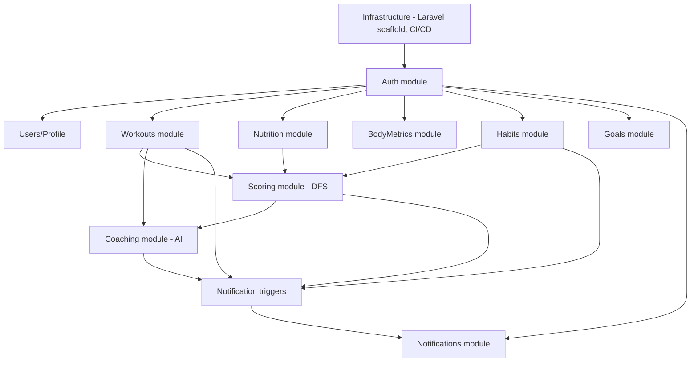
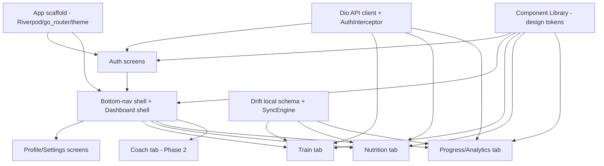
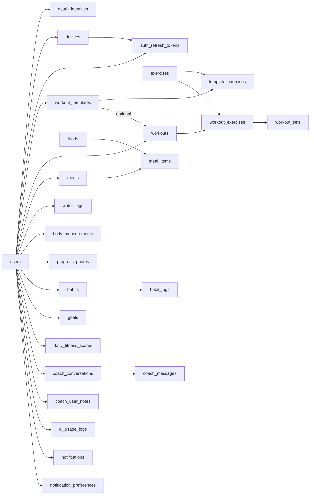
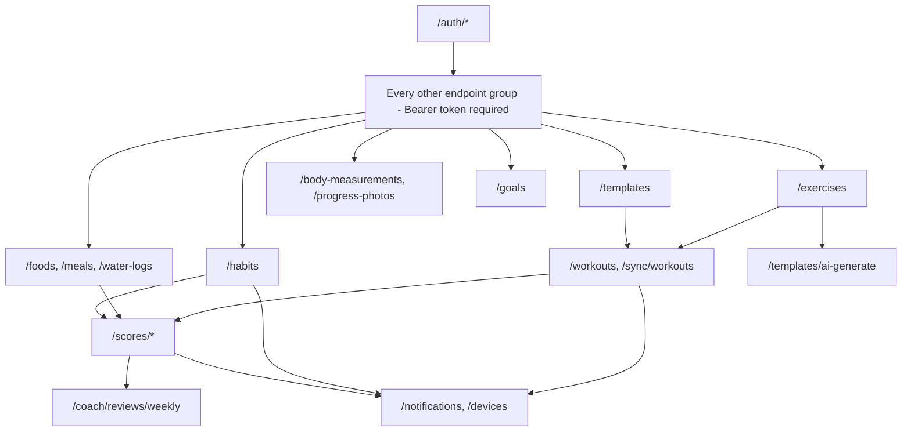
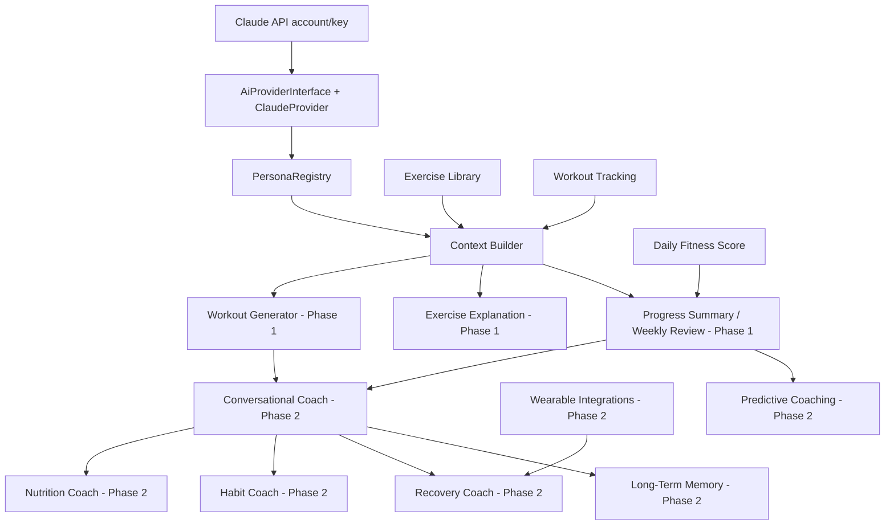

# Module Dependencies

**Product:** Aesthetic Coach — Phase 1 (Intelligent Fitness Platform)
**Purpose:** the dependency graph underlying [IMPLEMENTATION_ORDER.md](IMPLEMENTATION_ORDER.md) and [TASK_BREAKDOWN.md](TASK_BREAKDOWN.md) — what blocks what, across backend, mobile, database, API, and AI layers, plus critical path and bottleneck analysis.
**Related documents:** [IMPLEMENTATION_ORDER.md](IMPLEMENTATION_ORDER.md) · [System Architecture](03-system-architecture.md) · [Database Design](04-database-design.md)

## Table of Contents
- [Backend Module Dependencies](#backend-module-dependencies)
- [Flutter Module Dependencies](#flutter-module-dependencies)
- [Database Dependencies](#database-dependencies)
- [API Dependencies](#api-dependencies)
- [AI Dependencies](#ai-dependencies)
- [Critical Path](#critical-path)
- [Parallel Development Opportunities](#parallel-development-opportunities)
- [Bottlenecks](#bottlenecks)

## Backend Module Dependencies

Laravel module dependency graph, per [Backend Architecture § 1](07-backend-architecture.md#1-folder-structure):

**Reading this graph:** `Auth` is the single hard dependency for every other domain module (every table is `user_id`-scoped, per [System Architecture § Security Architecture](03-system-architecture.md#8-security-architecture)). `Scoring` (Daily Fitness Score) depends on `Workouts`, `Nutrition`, and `Habits` because its formula reads all three. `Coaching` (AI) depends on `Workouts` and `Scoring` for context assembly. `Notifications` is a downstream consumer of events from every domain module, not a blocking dependency for them.

## Flutter Module Dependencies

**Reading this graph:** the `Drift local schema + SyncEngine` built for Workout Tracking (Sprint 3) is *reused*, not rebuilt, by Nutrition and Progress tracking (Sprint 4) — this is the single most important reuse relationship in the mobile codebase, per [Mobile Architecture § 4](08-mobile-architecture.md#4-offline-first-strategy). `Component Library` has no backend dependency at all and can start immediately after `Scaffold`.

## Database Dependencies

All Phase 1 tables already exist in [Database Design § 3](04-database-design.md#3-table-by-table-documentation) — this graph shows creation order (foreign-key dependency), not a gap to fill:

`exercises` and `foods` are reference tables seeded independently of any user-scoped table (see [Database Seeding](database-seeding.md)) — they have no incoming dependency from `users` and can be seeded in parallel with Sprint 1's auth work.

## API Dependencies

Endpoint groups by their functional prerequisite, per [API Specification § 6](05-api-specification.md#6-endpoint-reference):

Full per-endpoint phase tagging (which of these are live in Phase 1 vs. gated to Phase 2) is in [API Specification § 9 Phase Allocation](05-api-specification.md#9-phase-allocation) — this graph shows build-order dependency, that section shows release-time availability; the two are related but not identical (e.g., `/coach/conversations*` exists in the route table from Phase 1 for internal use but isn't publicly available until Phase 2).

## AI Dependencies

Full capability-level rationale is in [PHASE2_SCOPE.md](PHASE2_SCOPE.md) and [AI Coaching Engine § 11](09-ai-coaching-engine.md#11-phased-rollout) — this graph is the technical-dependency view of the same classification.

## Critical Path

The longest dependency chain through Phase 1 — delays here delay everything downstream:

```mermaid
flowchart LR
    Infra[Infrastructure] --> Auth[Authentication]
    Auth --> ExerciseSeed[Exercise seed data]
    ExerciseSeed --> WorkoutEngine[Workout Engine + Offline Sync]
    WorkoutEngine --> Tracking[Progress Tracking + Habits]
    Tracking --> DFS[Daily Fitness Score]
    DFS --> AIRec[AI Recommendations]
    AIRec --> Testing[Testing/Hardening]
    Testing --> Deploy[Deployment]
    Deploy --> Launch[Production Launch]

    style WorkoutEngine fill:#ff6b6b,color:#fff
    style AIRec fill:#ff6b6b,color:#fff
```

**Critical path length:** Infrastructure → Authentication → Exercise Seed → **Workout Engine (offline sync)** → Progress Tracking/Habits → Daily Fitness Score → **AI Recommendations** → Testing → Deployment → Launch. The two highlighted nodes (Workout Engine's offline sync, AI Recommendations) are the modules [Development Roadmap § Cross-Phase Notes](16-development-roadmap.md#cross-phase-notes) already flags as the highest-technical-risk work in Phase 1 — they sit on the critical path *and* carry the most execution risk, which is why they deserve the most deliberate, unhurried treatment rather than being compressed to protect the schedule.

## Parallel Development Opportunities

Restates and extends [IMPLEMENTATION_ORDER.md § Parallel Development Opportunities](IMPLEMENTATION_ORDER.md#parallel-development-opportunities) from the dependency-graph view:

| Parallel track | Why it's safe | When it can start |
|---|---|---|
| Component Library (Flutter design-system widgets) | No backend dependency at all | Immediately after Infrastructure |
| Exercise Library seeding | No dependency on Auth being *finished*, only on migrations existing | Alongside Authentication (Sprint 1–3) |
| Body Measurements, Progress Photos, Water Intake, Goals (within Sprint 4) | Independent CRUD domains, no cross-dependency | Once Authentication is done, in any order relative to each other |
| Notifications infrastructure (FCM/APNs setup) | Independent of which domain triggers a notification | Alongside Sprint 3–4, ahead of Sprint 5's trigger-wiring |
| Mobile screens for a given backend module | API contract is already fully specified ([API Specification](05-api-specification.md), [API Contract Examples](api-examples/)) | As soon as a module's endpoints are documented — which is already true for all of Phase 1 — using mocked responses ahead of backend completion |
| Monitoring/CI-CD hardening | Independent of feature work | Continuously from Sprint 1 onward, not held for Sprint 6 |

## Bottlenecks

Points where multiple downstream modules wait on one upstream module — worth staffing/prioritizing accordingly:

| Bottleneck | Blocks | Why it's a bottleneck |
|---|---|---|
| **Authentication (Sprint 1)** | Every other domain module | Every table is `user_id`-scoped; nothing else can be meaningfully tested without a real auth session |
| **Offline Sync foundation (Sprint 3)** | Nutrition, Progress Tracking, Habits (Sprint 4) all *reuse* rather than rebuild it | If the Sprint 3 `SyncEngine` design needs rework, that rework blocks four downstream domains at once, not one |
| **Exercise Library seed data (Sprint 3)** | Workout Engine, AI Workout Generation (Sprint 5) | Both need real exercise rows to log against or generate from |
| **Daily Fitness Score (Sprint 5)** | Dashboard finalization, Progress Summary/Weekly Review, Notifications triggers | Three separate downstream consumers of one formula |
| **`AiProviderInterface` (Sprint 5)** | Every AI capability in both phases | The single integration point for Claude — a Claude API account/key/rate-limit issue here blocks all AI work project-wide, not just Phase 1's narrow slice |

Mitigation for all five: exactly the sequencing already reflected in [IMPLEMENTATION_ORDER.md](IMPLEMENTATION_ORDER.md) and [Development Roadmap](16-development-roadmap.md) — build the bottleneck module first within its sprint, test it thoroughly before building on top of it, and resist the urge to start downstream work against an unstable version of it.
