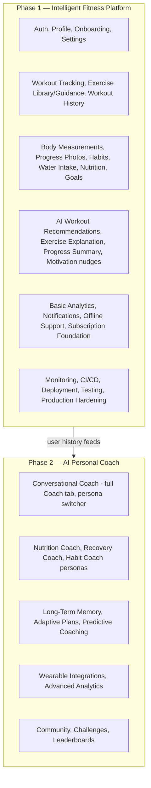

# Phased Release Strategy

**Product:** Aesthetic Coach
**Status:** Active — this is the master reference for release planning, superseding the single-MVP framing in [PRD § 9](01-prd.md#9-mvp-vs-future-phases) with a two-phase public release strategy.
**Related documents:** [PRD](01-prd.md) · [SRS](02-srs.md) · [PHASE1_SCOPE.md](PHASE1_SCOPE.md) · [PHASE2_SCOPE.md](PHASE2_SCOPE.md) · [Development Roadmap](16-development-roadmap.md) · [AI Coaching Engine](09-ai-coaching-engine.md) · [MASTER_IMPLEMENTATION_PLAN.md](../MASTER_IMPLEMENTATION_PLAN.md)

## Table of Contents
- [Product Vision](#product-vision)
- [Why Two Phases](#why-two-phases)
- [Business Justification](#business-justification)
- [Technical Justification](#technical-justification)
- [Benefits](#benefits)
- [Risks](#risks)
- [Success Metrics](#success-metrics)
- [Deployment Strategy](#deployment-strategy)
- [Timeline](#timeline)
- [Feature Allocation](#feature-allocation)
- [Dependencies](#dependencies)
- [Exit Criteria for Each Phase](#exit-criteria-for-each-phase)
- [Relationship to Existing Documentation](#relationship-to-existing-documentation)

---

## Product Vision

Aesthetic Coach ships in two deliberate public-facing releases, not one big-bang launch:

- **Phase 1 — Intelligent Fitness Platform:** a polished, production-ready fitness tracking app with targeted, single-purpose AI utilities (workout generation, exercise guidance, progress summaries, motivational nudges). This is the version that goes live in app stores.
- **Phase 2 — AI Personal Coach:** the same app evolves in place into a full conversational AI coaching platform — multi-persona chat, long-term memory, predictive coaching, adaptive plans — built on the real training, nutrition, and habit history Phase 1 users have already generated.

The underlying architecture, database schema, API design, Flutter app, and Laravel backend documented across this repository were **already designed to support both phases from day one** ([System Architecture § ADRs](03-system-architecture.md#9-architectural-decision-records-summary), [AI Coaching Engine § 10](09-ai-coaching-engine.md#10-future-extensibility)). This document does not change that architecture — it sequences *when* each already-designed capability is switched on.

## Why Two Phases

A single-release "build everything, launch once" plan carries two compounding risks this strategy avoids:

1. **The AI Coaching Engine's highest-value capability — a coach that reasons over real user history — has no real history to reason over on day one.** Shipping the full conversational, multi-persona coach at launch means it debuts at its weakest, not its strongest. Phase 1 spends its launch window collecting exactly the workout, nutrition, and habit history the Phase 2 coach needs to be genuinely useful, directly fulfilling the brief's instruction that "the coaching engine should leverage user history collected during Phase 1."
2. **Scope discipline protects the launch date.** [Development Roadmap § Phase 5](16-development-roadmap.md#phase-1--sprint-5--ai-recommendations-analytics--notifications) already flagged full AI coaching as the single highest-product-risk, highest-effort phase in the original build plan. Deferring the open-ended conversational surface (and everything downstream of it — Recovery Coach, Habit Coach, predictive coaching, wearables, community) to a second release lets Phase 1 ship a smaller, fully-testable, fully-hardened surface area on a predictable timeline.

## Business Justification

- **Faster time-to-market:** a leaner Phase 1 scope (core tracking + targeted AI utilities) reaches app stores meaningfully sooner than a full-conversational-coach launch would.
- **Lower launch risk:** Phase 1's AI surface is small, deterministic-adjacent, and cheap to QA exhaustively (see [PHASE1_SCOPE.md](PHASE1_SCOPE.md) acceptance criteria) — nothing in the critical launch path depends on open-ended LLM conversation quality.
- **Real usage data informs Phase 2 investment:** which personas users actually want, how much they engage with AI features, and what the Daily Fitness Score formula needs tuned ([AI Coaching Engine § 5](09-ai-coaching-engine.md#5-recommendation-engine)) are all empirical questions Phase 1 answers before Phase 2 engineering effort is committed.
- **Monetization groundwork without a premature pricing decision:** Subscription Foundation ships in Phase 1 as technical scaffolding only (see [PHASE1_SCOPE.md § Subscription Foundation](PHASE1_SCOPE.md#subscription-foundation)) — [Subscriptions feature](features/subscriptions.md) still correctly flags that no pricing/tiering decision has been made by Product; this strategy doesn't force that decision, it just avoids a schema surprise later.

## Technical Justification

- **No architectural rework required** — see [Architecture Validation](#relationship-to-existing-documentation) below and the confirmation now recorded in [Database Design § 10](04-database-design.md#10-phased-implementation--architecture-validation).
- **The AI Coaching Engine was already provider- and persona-abstracted** ([AI Coaching Engine § 1 & § 6](09-ai-coaching-engine.md#1-ai-architecture)) specifically so that adding personas is a configuration and prompt-template change, not a rewrite — this is the exact mechanism that makes staged AI rollout possible without touching the pipeline.
- **Offline-first mobile architecture and the modular monolith backend** ([ADR-0007](adr/0007-offline-first-architecture.md), [ADR-0009](adr/0009-modular-monolith.md)) are phase-agnostic by construction: Phase 2 modules (Coaching persona expansion, Wearables) plug into the same module boundaries Phase 1 already establishes.
- **Database schema needs zero redesign and zero new migrations to begin Phase 1** — every table Phase 1 needs already exists in [Database Design](04-database-design.md); Phase 2 additions (e.g., `recovery_metrics`, `wearable_connections`) are purely additive per the existing expand/contract migration discipline ([Database Design § Migration Strategy](04-database-design.md#6-migration-strategy)).

## Benefits

| Benefit | How it's realized |
|---|---|
| Faster, lower-risk first launch | Phase 1 scope is bounded to [PHASE1_SCOPE.md](PHASE1_SCOPE.md)'s 24 categories, all already fully specified in existing docs |
| A coach that's actually good when it matters | Phase 2's conversational engine launches with weeks/months of real per-user training and nutrition history already in the database |
| No architectural debt from rushing AI coaching | The full persona/memory/predictive stack gets its own dedicated build phase instead of being compressed into the initial launch timeline |
| Clean monetization path | Subscription Foundation (Phase 1) → full tiering (Phase 2+) without a retrofit |
| Team focus | Phase 1 team isn't simultaneously debugging offline sync *and* tuning LLM prompt quality — see [Development Roadmap](16-development-roadmap.md) sprint sequencing |

## Risks

| Risk | Mitigation |
|---|---|
| Phase 1 users perceive the app as "just a tracker" without the AI differentiator the PRD envisions | Phase 1's AI Workout Recommendations, Exercise Guidance, and AI-generated Progress Summaries ([PHASE1_SCOPE.md](PHASE1_SCOPE.md)) are real, working AI features, not stubs — the product still feels intelligent, just not yet conversational |
| Phase 2 is delayed or deprioritized after Phase 1 launch, leaving the product permanently under-differentiated | [Exit Criteria for Each Phase](#exit-criteria-for-each-phase) makes Phase 2 kickoff conditional on Phase 1 launch success, not optional — it's the explicit next milestone, tracked in [MASTER_IMPLEMENTATION_PLAN.md](../MASTER_IMPLEMENTATION_PLAN.md) |
| Splitting AI Coach capability across two phases confuses users about what "the AI coach" does at any given time | Phase 1's AI surfaces are presented as discrete utilities (a "Generate Workout" action, an "Ask about this exercise" prompt, a Weekly Progress card) rather than as a chat interface with visibly limited capability — the full Coach tab UI ([AI Coach screen](screens/ai-coach.md)) doesn't ship until Phase 2, avoiding a "half-working chatbot" impression |
| Re-labeling MVP scope after the fact introduces inconsistency across 100+ existing documents | Addressed directly by this migration: every feature spec gets a Release Phase metadata block ([Task 7](#feature-allocation)), the API spec is annotated per-endpoint, and this document is the single source of truth new contributors read first |
| Database changes needed for Phase 2 (wearables, recovery metrics) aren't planned for during Phase 1 schema work | Explicitly not a risk — see [Database Design § 10](04-database-design.md#10-phased-implementation--architecture-validation), which confirms Phase 2 additions are purely additive and require no Phase 1 schema rework |

## Success Metrics

Phase 1 and Phase 2 each have their own launch gate, both anchored to the existing metrics baseline in [PRD § 8](01-prd.md#8-success-metrics):

| Metric | Phase 1 Target | Phase 2 Target |
|---|---|---|
| D1 retention | ≥ 40% | Maintain or improve vs. Phase 1 baseline |
| D30 retention | ≥ 20% | ≥ 25% (conversational coaching expected to lift retention) |
| Weekly active logging rate | ≥ 4 days/week among retained users | Maintain |
| AI feature interaction rate | ≥ 50% of WAU use at least one Phase 1 AI utility weekly | ≥ 60% of WAU interact with the conversational coach weekly (original PRD target) |
| Crash-free sessions | ≥ 99.5% | ≥ 99.5% |
| Store rating | ≥ 4.3 (initial release tolerance) | ≥ 4.5 (original PRD target) |
| AI cost per active user | Tracked, no fixed target (small AI surface) | Within budget model established in [AI Coaching Engine § 8](09-ai-coaching-engine.md#8-cost-optimization), validated against real Phase 1 usage data |

## Deployment Strategy

Both phases use the exact deployment machinery already documented — this strategy does not introduce a new environment topology:

- **Phase 1 launch** follows [Deployment Guide](12-deployment-guide.md) and [Release Management](release-management.md) exactly: staging validation → tagged release → app store submission → production. Phase 1 *is* the `v1.0.0` release.
- **Phase 2 rollout** ships as incremental minor/major versions (`v1.x` → `v2.0.0` for the full conversational coach) on top of the same production infrastructure — no parallel environment, no data migration between "Phase 1 prod" and "Phase 2 prod," since it's the same system gaining capability. New Phase 2 endpoints are deployed dark (feature-flagged, [CI/CD Pipeline § 6](11-cicd-pipeline.md#6-feature-flags)) ahead of their public unveiling, consistent with [API Specification § 9 Phase Allocation](05-api-specification.md#9-phase-allocation) phase markers.
- Phase 2 AI personas roll out progressively (persona-by-persona, per [PHASE2_SCOPE.md](PHASE2_SCOPE.md) sprint sequencing) behind feature flags, not as one simultaneous switch-flip — limiting blast radius if any single persona's prompt quality needs post-launch tuning.

## Timeline

High-level duration estimates (relative effort, not calendar-committed dates — calendar dates depend on team size, set at planning time):

| Phase | Estimated Duration | Basis |
|---|---|---|
| **Phase 1** | **7 sprints** (~14 weeks at a 2-week sprint cadence, team-size dependent) | [Development Roadmap § Phase 1](16-development-roadmap.md#phase-1--intelligent-fitness-platform-mvp) sprint breakdown |
| **Phase 2** | **6 sprints** (~12 weeks at a 2-week sprint cadence, team-size dependent), beginning only after Phase 1's exit criteria are met | [Development Roadmap § Phase 2](16-development-roadmap.md#phase-2--ai-personal-coach) sprint breakdown |

These are **effort-based estimates** consistent with the complexity ratings already used throughout [Development Roadmap](16-development-roadmap.md) (S/M/L/XL), not fixed-price commitments — see [MASTER_IMPLEMENTATION_PLAN.md](../MASTER_IMPLEMENTATION_PLAN.md) for the live sprint tracker.

## Feature Allocation

Full detail lives in [PHASE1_SCOPE.md](PHASE1_SCOPE.md) and [PHASE2_SCOPE.md](PHASE2_SCOPE.md); summary:

## Dependencies

- Phase 2's Conversational Coach, Nutrition Coach, and Habit Coach personas all depend on Phase 1 having been live long enough to accumulate meaningful per-user training/nutrition/habit history — see each capability's "Dependency on Phase 1 Data" entry in [PHASE2_SCOPE.md](PHASE2_SCOPE.md).
- Recovery Coach additionally depends on Wearable Integrations shipping first within Phase 2 ([Wearable Integrations feature](features/wearable-integrations.md), [Future Integrations](future-integrations.md)).
- Predictive Coaching depends on both accumulated Phase 1 history *and* the Weekly Progress Summary infrastructure ([AI Prompt — Weekly Review](ai/weekly-review.md)) already running in production from Phase 1.
- Subscription Foundation (Phase 1) is a dependency for any future full monetization work, whenever Product makes that pricing decision — see [Subscriptions feature § Business Rules](features/subscriptions.md#business-rules).
- No Phase 2 capability blocks Phase 1 launch — dependencies run strictly Phase 1 → Phase 2, never the reverse, by design.

## Exit Criteria for Each Phase

### Phase 1 Exit Criteria (must all be true before Phase 2 work begins)
- [ ] All Phase 1 features in [PHASE1_SCOPE.md](PHASE1_SCOPE.md) are shipped and meet their individual acceptance criteria
- [ ] Production Hardening checklist ([Production Hardening § 1](14-production-hardening.md#1-security-checklist)) fully passed
- [ ] App is live in both app stores, past initial review
- [ ] Crash-free sessions ≥ 99.5% sustained for at least 2 weeks post-launch
- [ ] D1/D30 retention and AI interaction rate tracked against [Success Metrics](#success-metrics) targets for at least one full reporting cycle
- [ ] A meaningful cohort of users has ≥ 4 weeks of continuous tracked history (the minimum data depth [AI Coaching Engine § 3](09-ai-coaching-engine.md#3-context-management)'s context summarization was designed around)
- [ ] Phase 2 kickoff explicitly approved based on the above — not automatic

### Phase 2 Exit Criteria (product considered feature-complete for this strategy)
- [ ] All Phase 2 capabilities in [PHASE2_SCOPE.md](PHASE2_SCOPE.md) shipped, feature-flag-graduated to general availability
- [ ] AI cost-per-active-user validated against the budget model in [AI Coaching Engine § 8](09-ai-coaching-engine.md#8-cost-optimization) using real (not projected) usage
- [ ] Guardrail/safety review passed for every activated persona ([AI Coaching Engine § 7](09-ai-coaching-engine.md#7-safety-guardrails))
- [ ] AI interaction rate and D30 retention targets in [Success Metrics](#success-metrics) met

## Relationship to Existing Documentation

This document does not replace or contradict any existing architecture document — it sequences them. Specifically:

- **System Architecture, Database Design, API Specification, Backend Architecture, Mobile Architecture, AI Coaching Engine, UI/UX Design System** are unchanged in substance. Where phase-relevant, they now carry small annotations (endpoint phase tags, a database validation statement, feature-spec metadata blocks) — never redesigns.
- **[Development Roadmap](16-development-roadmap.md)** has been restructured from an implementation-order phase list (old Phase 0–8) into this strategy's Phase 1 / Phase 2 sprint structure — see that document's own note on the change.
- Every existing "MVP" / "Future" label across the doc set maps onto this strategy as: **MVP → Phase 1**, and **Future → Phase 2 or beyond**, with the specific reallocations (e.g., Nutrition Coach moving from original-MVP to Phase 2, Community/Challenges moving from Phase-3-Future to Phase 2) documented explicitly in [PHASE1_SCOPE.md](PHASE1_SCOPE.md) and [PHASE2_SCOPE.md](PHASE2_SCOPE.md) rather than left implicit.
