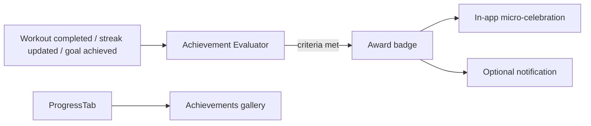

# Feature: Achievements

**Related documents:** [PRD § 5.4](../01-prd.md#54-engagement) · [Habits](habits.md) · [Workout Tracking](workout-tracking.md) (PR detection) · [Goals](goals.md) · [Notifications](notifications.md)

## Release Phase

| Field | Value |
|---|---|
| **Status** | Phase 1 (stretch) |
| **Priority** | Low |
| **Estimated Sprint** | [Phase 1 · Sprint 6](../16-development-roadmap.md#phase-1--sprint-6--testing-performance--security) |
| **Dependencies** | [Habits](habits.md), [Workout Tracking](workout-tracking.md) (PR detection), [Goals](goals.md) |

See [PHASE1_SCOPE.md](../PHASE1_SCOPE.md#feature-matrix) for the rationale behind including this as a Phase 1 stretch item.

## Table of Contents
- [Overview](#overview)
- [Purpose](#purpose)
- [User Stories](#user-stories)
- [Functional Requirements](#functional-requirements)
- [Non-Functional Requirements](#non-functional-requirements)
- [UI Flow](#ui-flow)
- [Screen List](#screen-list)
- [Business Rules](#business-rules)
- [Validation Rules](#validation-rules)
- [APIs](#apis)
- [Database Tables](#database-tables)
- [Edge Cases](#edge-cases)
- [Error Handling](#error-handling)
- [Offline Behavior](#offline-behavior)
- [Acceptance Criteria](#acceptance-criteria)
- [Future Improvements](#future-improvements)

## Overview
Streaks, milestones, and achievement badges — the restrained, non-gamey engagement layer scoped as MVP in [PRD § 5.4](../01-prd.md#54-engagement), deliberately distinct from the Future social/competitive layer covered in [Challenges](challenges.md).

**Assumption:** the original PRD names this capability at a feature-list level ("streaks, milestones, achievement badges") without a dedicated data model. This document defines that model for the first time, consistent with the restrained, non-shaming tone established in [UI/UX Design System § 9](../06-ui-ux-design-system.md#9-content--tone-guidelines) — badges celebrate, they never rank or compare users against each other (that's explicitly [Challenges](challenges.md), Future).

## Purpose
Reinforce consistency (not just intensity) as a source of pride, using milestones already implicit in tracked data (streak lengths, PR counts, total workouts) rather than inventing busywork achievements.

## User Stories
- As a user, I want recognition when I hit a meaningful milestone (7-day streak, 10th workout, a new PR).
- As a user, I want to see my earned badges in one place.
- As a user, I don't want achievements to feel like pressure or punishment for missing a day.

## Functional Requirements
| ID | Requirement |
|---|---|
| F-ACH-01 | System evaluates achievement criteria on relevant write events (workout completed, habit streak updated, goal achieved) and awards badges idempotently |
| F-ACH-02 | Achievements gallery showing earned and next-available badges |
| F-ACH-03 | Achievement unlock triggers a restrained in-app celebration (per [UI/UX Design System § 7](../06-ui-ux-design-system.md#7-motion)) and an optional notification |

## Non-Functional Requirements
Achievement evaluation is deterministic and rule-based (no AI call) — consistent with the project's principle of keeping frequent, deterministic computations off the AI cost path ([AI Coaching Engine § 5](../09-ai-coaching-engine.md#5-recommendation-engine)).

## UI Flow


## Screen List
Achievements Gallery (within [Analytics](../screens/analytics.md)/Progress); unlock celebration is an overlay, not a dedicated screen.

## Business Rules
Badge criteria examples: 7/30/100-day streaks (any active habit or overall app-use streak), first workout, 10/50/100 total workouts, first PR, goal achieved. Each badge is awarded at most once per criteria tier per user — evaluation is idempotent (re-running the evaluator never double-awards).

## Validation Rules
Not user-input-driven; the only "input" is the set of criteria definitions, which are application config, not user data — no field-level validation applies.

## APIs
`GET /achievements` (list earned + available, with progress toward the next tier). Not present in the current [API Specification](../05-api-specification.md) — flagged as an addition needed in that document when this feature is implemented (see Future Improvements / cross-doc note).

## Database Tables
Requires a new `achievements` (catalog) and `user_achievements` (earned, `UNIQUE(user_id, achievement_id)`) table pair — not yet present in [Database Design](../04-database-design.md); to be added there in the same PR that implements this feature, per the "update the source doc, don't drift" rule in [Development Roadmap § Cross-Phase Notes](../16-development-roadmap.md#cross-phase-notes).

## Edge Cases
- A single write event qualifies the user for multiple badges at once (e.g., completing a workout that both hits a 30-day streak and a 50th-workout milestone) → all qualifying badges awarded in the same evaluation pass, celebration UI queues them sequentially rather than overlapping.
- Badge criteria change in a future release → already-awarded badges are never revoked; new criteria only apply going forward.

## Error Handling
Achievement evaluation failure is logged but never blocks the triggering write (e.g., a workout save always succeeds even if badge evaluation errors) — achievements are a non-critical side effect, following the same event/listener decoupling pattern as [Backend Architecture § 5](../07-backend-architecture.md#5-events).

## Offline Behavior
Evaluation happens server-side on sync, not on-device — a badge earned by an offline-logged workout is awarded once that workout syncs, with the celebration shown on next app foreground rather than instantly.

## Acceptance Criteria
```gherkin
Feature: Streak milestone badge
  Scenario: User reaches a 7-day overall activity streak
    Given the user has logged a tracked action on 7 consecutive days
    When the streak-evaluation job runs
    Then the "7-Day Streak" badge is awarded exactly once
```

## Future Improvements
- Achievement sharing to the Future community feed ([Challenges](challenges.md)).
- User-visible "next milestone" progress bars beyond a binary earned/not-earned state.
