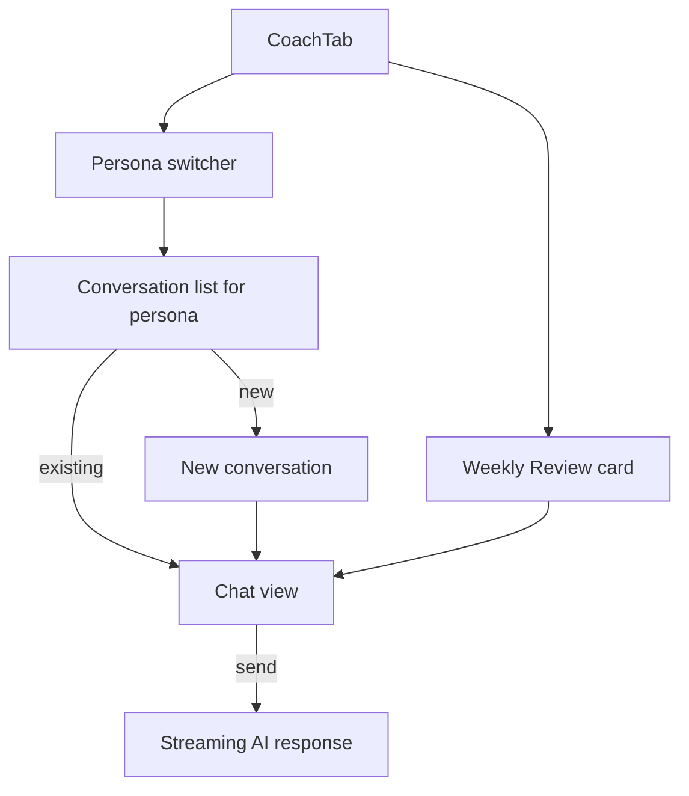

# Feature: AI Coach

**Related documents:** [AI Coaching Engine](../09-ai-coaching-engine.md) (architectural source of truth — this document is the feature/UI layer on top of it) · [SRS § 4.6](../02-srs.md#46-ai-coaching) · [API Specification § 6.10](../05-api-specification.md#610-ai-coaching) · [AI Prompt Library](../ai/README.md) · [Screens — AI Coach](../screens/ai-coach.md) · [Components — AI Chat Bubble](../components/ai-chat-bubble.md) · [PHASE2_SCOPE.md](../PHASE2_SCOPE.md)

## Release Phase

| Field | Value |
|---|---|
| **Status** | Phase 2 (full conversational Coach tab) — with one Phase 1 exception: FR-603 Weekly Review ships in **Phase 1** as a non-conversational Progress Summary card, not inside a chat thread |
| **Priority** | Critical (for Phase 2) |
| **Estimated Sprint** | [Phase 2 · Sprint 1](../16-development-roadmap.md#phase-2--sprint-1--conversational-coach-foundation) (Weekly Review portion: [Phase 1 · Sprint 5](../16-development-roadmap.md#phase-1--sprint-5--ai-recommendations-analytics--notifications)) |
| **Dependencies** | AI Coaching Engine pipeline and Claude API integration ([Phase 1 · Sprint 5](../16-development-roadmap.md#phase-1--sprint-5--ai-recommendations-analytics--notifications)), sufficient accumulated Phase 1 user history |

See [PHASE1_SCOPE.md § AI Onboarding](../PHASE1_SCOPE.md#ai-onboarding) and [PHASE2_SCOPE.md § AI Coach (Conversational)](../PHASE2_SCOPE.md#ai-coach-conversational) for the full split rationale — the structured generation (FR-206, in [Workout Tracking](workout-tracking.md)) and single-turn explanation (FR-604, in [Exercise Details](exercise-details.md)) capabilities referenced elsewhere in this document ship in Phase 1; the open-ended multi-turn chat interface documented in this file ships in Phase 2.

## Table of Contents
- [Overview](#overview)
- [Purpose](#purpose)
- [User Stories](#user-stories)
- [Functional Requirements](#functional-requirements)
- [Non-Functional Requirements](#non-functional-requirements)
- [UI Flow](#ui-flow)
- [Screen List](#screen-list)
- [Business Rules](#business-rules)
- [Validation Rules](#validation-rules)
- [APIs](#apis)
- [Database Tables](#database-tables)
- [Edge Cases](#edge-cases)
- [Error Handling](#error-handling)
- [Offline Behavior](#offline-behavior)
- [Acceptance Criteria](#acceptance-criteria)
- [Future Improvements](#future-improvements)

## Overview
The Coach tab: a persona-based conversational AI coach built on the pipeline in [AI Coaching Engine § 1](../09-ai-coaching-engine.md#1-ai-architecture). This document covers the **feature/UX** surface (screens, flows, edge cases as experienced by the user); the underlying architecture, prompt management, context assembly, guardrails, and cost controls are owned by [AI Coaching Engine](../09-ai-coaching-engine.md) and not repeated here.

## Purpose
Deliver the product's core differentiator: a coach that reasons over the user's actual tracked data and responds like a knowledgeable, encouraging human coach rather than a generic chatbot.

## User Stories
- As a user, I want to ask my coach a question and get a response grounded in my actual training/nutrition history.
- As a user, I want to switch between coaching personas depending on what I need help with.
- As a user, I want a weekly summary I don't have to ask for.
- As a user, I want to trust that my coach won't give me risky medical advice.

## Functional Requirements
Traces to [SRS FR-601–FR-604](../02-srs.md#46-ai-coaching) (FR-605–FR-607 are Future).

| ID | Summary | Status |
|---|---|---|
| FR-601 | Conversational chat, streaming, persisted history | MVP |
| FR-602 | Persona-scoped access to tracked data | MVP |
| FR-603 | Weekly Review | MVP |
| FR-604 | Explain an exercise on request | MVP |
| FR-605 | Monthly Review | Future |
| FR-606 | Recovery/Motivation/Habit personas | Future |
| FR-607 | Overtraining/injury-risk pattern flagging | Future |

## Non-Functional Requirements
First-token latency < 2s p95 (NFR-2); daily token budget enforced per user (NFR-12) — both owned by [AI Coaching Engine § 8–9](../09-ai-coaching-engine.md#8-cost-optimization).

## UI Flow


## Screen List
[AI Coach](../screens/ai-coach.md) (persona switcher + chat), Weekly Review detail (card expands in-place or pushes a detail view).

## Business Rules
BR-2 (unverified email blocks AI features), BR-9 (medical/injury-adjacent responses carry a referral disclaimer) — both enforced at the architecture layer ([AI Coaching Engine § 7](../09-ai-coaching-engine.md#7-safety-guardrails)) and surfaced here as visible UI states (e.g., a distinct disclaimer-styled message block, not plain chat text).

## Validation Rules
| Field | Rule |
|---|---|
| Chat message | 1–2000 chars |
| Persona | Must be one of the enum values in `coach_conversations.persona` ([Database Design § 3.6](../04-database-design.md#36-scoring--ai)); disabled personas show a "Coming soon" state, not a broken selection |

## APIs
`GET/POST /coach/conversations`, `GET/POST /coach/conversations/{id}/messages` (SSE streaming), `POST /coach/reviews/weekly` — [API Specification § 6.10](../05-api-specification.md#610-ai-coaching). Full request/response/error examples in [API Examples — AI Coaching](../api-examples/ai-coaching.md).

## Database Tables
`coach_conversations`, `coach_messages`, `coach_user_notes`, `ai_usage_logs` — [Database Design § 3.6](../04-database-design.md#36-scoring--ai).

## Edge Cases
- User sends a message, then backgrounds the app mid-stream → the response continues generating server-side and is fully persisted; reopening the conversation shows the complete message, not a truncated one (streaming is a client-display concern, not a generation-lifecycle one).
- User hits the daily token budget mid-conversation → the in-flight message still completes if already accepted; the *next* send attempt returns `429 rate_limited` with a clear in-app "resets at HH:MM" state, not a silent failure.
- User switches personas mid-topic → each persona has its own conversation thread (`coach_conversations` is persona-scoped); switching doesn't carry conversation context between personas, by design ([AI Coaching Engine § 3](../09-ai-coaching-engine.md#3-context-management)).
- Guardrail filter appends a disclaimer the model didn't originally include → rendered identically to model-generated text but is a deterministic, tested template ([AI Coaching Engine § 7](../09-ai-coaching-engine.md#7-safety-guardrails)) — the UI doesn't need to distinguish its origin.

## Error Handling
Provider errors (Claude API unavailable) show a "your coach is temporarily unavailable" state distinct from a rate-limit state, so users don't confuse a transient outage with hitting their daily budget. Standard error envelope for all non-streaming endpoints.

## Offline Behavior
AI features require connectivity by nature; the Coach tab explicitly communicates this (per [Mobile Architecture § 4](../08-mobile-architecture.md#4-offline-first-strategy)) rather than showing an indefinite spinner. Past conversation history remains readable offline from local cache.

## Acceptance Criteria
See the streaming sequence in [System Architecture § 3.2](../03-system-architecture.md#32-ai-coach-chat-streaming) and:
```gherkin
Feature: Persona-scoped context
  Scenario: Nutrition Coach does not receive workout data
    Given a user with logged workouts and meals
    When they message the Nutrition Coach persona
    Then the assembled context includes nutrition summaries
    And does not include raw workout set data
```

## Future Improvements
Recovery/Motivation/Habit personas, Monthly Review, progress prediction, injury-prevention pattern flagging — all scoped as additive in [AI Coaching Engine § 10](../09-ai-coaching-engine.md#10-future-extensibility).
