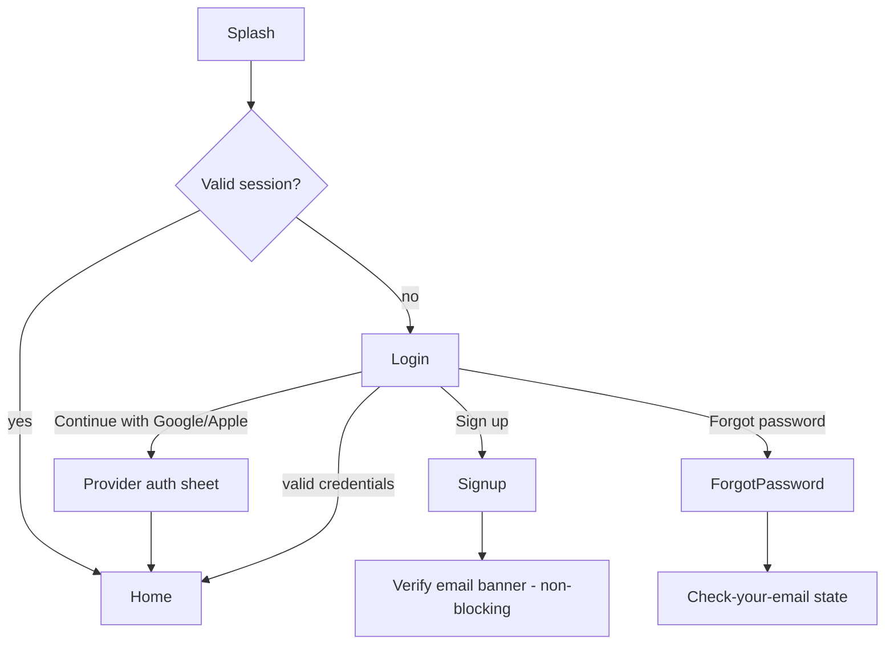

# Feature: Authentication

**Related documents:** [SRS § 4.1](../02-srs.md#41-authentication--account-management) · [System Architecture § 3.1 & § 8](../03-system-architecture.md#31-authentication-login--token-refresh) · [Database Design § 3.1](../04-database-design.md#31-identity--auth) · [API Specification § 3](../05-api-specification.md#3-authentication-flow) · [Backend Architecture — Auth module](../07-backend-architecture.md#1-folder-structure) · [API Examples — Auth](../api-examples/auth.md) · [ADR-0005](../adr/0005-jwt-refresh-token-auth.md)

## Release Phase

| Field | Value |
|---|---|
| **Status** | Phase 1 |
| **Priority** | Critical |
| **Estimated Sprint** | [Phase 1 · Sprint 1](../16-development-roadmap.md#phase-1--sprint-1--infrastructure-authentication--project-setup) |
| **Dependencies** | None — foundational, first feature built |

## Table of Contents
- [Overview](#overview)
- [Purpose](#purpose)
- [User Stories](#user-stories)
- [Functional Requirements](#functional-requirements)
- [Non-Functional Requirements](#non-functional-requirements)
- [UI Flow](#ui-flow)
- [Screen List](#screen-list)
- [Business Rules](#business-rules)
- [Validation Rules](#validation-rules)
- [APIs](#apis)
- [Database Tables](#database-tables)
- [Edge Cases](#edge-cases)
- [Error Handling](#error-handling)
- [Offline Behavior](#offline-behavior)
- [Acceptance Criteria](#acceptance-criteria)
- [Future Improvements](#future-improvements)

## Overview
Authentication is the entry gate to the app: email/password, Google Sign-In, and Apple Sign-In, backed by short-lived JWT access tokens and rotating refresh tokens, with multi-device session management. This document is the feature-level view of the auth capability already specified architecturally in [System Architecture § 3.1 & § 8](../03-system-architecture.md#31-authentication-login--token-refresh) and at the data level in [Database Design § 3.1](../04-database-design.md#31-identity--auth) — this doc does not redefine those contracts, it describes the user-facing feature built on top of them.

## Purpose
Let a user create and access their account securely, on any number of devices, with minimal friction, while giving them visibility and control over active sessions.

## User Stories
- As a new user, I want to sign up with email/password or a single tap via Google/Apple, so I can start using the app quickly.
- As a returning user, I want to stay logged in across app restarts without re-entering credentials.
- As a security-conscious user, I want to see and revoke sessions on devices I no longer use.
- As a user who forgot their password, I want to reset it via email without contacting support.

## Functional Requirements
Traces to [SRS FR-101–FR-109](../02-srs.md#41-authentication--account-management); no new requirements introduced here.

| ID | Summary |
|---|---|
| FR-101 | Email/password registration |
| FR-102 | Google Sign-In |
| FR-103 | Apple Sign-In |
| FR-104 | Email verification |
| FR-105 | Password reset |
| FR-106 | Session/device list + revoke |
| FR-107 | Logout (current device) |
| FR-108 | Account deletion |
| FR-109 | JWT access + rotating refresh token issuance |

## Non-Functional Requirements
- Access token TTL ≤ 15 min, refresh token 30-day sliding (BR-4).
- Auth endpoints rate-limited at 10 req/min per IP ([API Specification § 7](../05-api-specification.md#7-rate-limiting)).
- Credentials never logged (NFR-7).

## UI Flow


## Screen List
[Splash](../screens/splash.md) · [Login](../screens/login.md) · [Signup](../screens/signup.md) · Forgot Password · Reset Password · Session Management (part of [Settings](../screens/settings.md))

## Business Rules
BR-1 (password policy), BR-2 (unverified accounts blocked from AI features), BR-3 (refresh reuse-detection revokes session family), BR-4 (token TTLs), BR-5 (max 10 concurrent device sessions) — full text in [SRS § 6](../02-srs.md#6-business-rules).

## Validation Rules
| Field | Rule |
|---|---|
| Email | Valid format, unique, max 190 chars |
| Password | ≥ 10 chars, ≥ 1 letter + 1 number (BR-1) |
| Name | 1–120 chars, required |
| Device name | Auto-populated from device model, editable, max 120 chars. Submitted on register, login, and OAuth (optional -- server defaults to a generic name derived from platform if omitted) |
| Platform | Required on register, login, and OAuth. One of `ios`, `android` -- persisted on the created/matched `devices` row (Database Design section 3.1, 04-database-design.md) |

## APIs
See [API Specification § 3](../05-api-specification.md#3-authentication-flow) and full request/response examples in [API Examples — Auth](../api-examples/auth.md): `POST /auth/register`, `POST /auth/login`, `POST /auth/oauth/google`, `POST /auth/oauth/apple`, `POST /auth/refresh`, `POST /auth/logout`, `GET /auth/sessions`, `DELETE /auth/sessions/{deviceId}`, `POST /auth/password/forgot`, `POST /auth/password/reset`.

## Database Tables
`users`, `oauth_identities`, `devices`, `auth_refresh_tokens`, `password_reset_tokens` — full column definitions in [Database Design § 3.1](../04-database-design.md#31-identity--auth).

## Edge Cases
- User signs up with email, later attempts Google Sign-In using the same email → account is linked (matched by verified email) rather than creating a duplicate; user is informed which method was used.
- Refresh token reuse detected (stolen/replayed token) → entire session family revoked, all devices on that family force-logged-out (BR-3).
- User exceeds 10 concurrent sessions (BR-5) → oldest session silently revoked, new login proceeds; user sees revoked device drop from their session list next time they view it.
- Apple Sign-In private relay email used → treated as a normal unique email; if the user later signs in via a different method with their real email, accounts are **not** auto-merged (no reliable match) — flagged as a known limitation (see Future Improvements).
- Password reset requested for a non-existent email → generic "if this email exists, a reset link was sent" response (prevents user enumeration).

## Error Handling
Standard error envelope ([API Specification § 4](../05-api-specification.md#4-error-response-format)): `422 validation_failed` on bad input, `401 unauthenticated` on bad credentials, `401 session_revoked` on refresh-token reuse, `429 rate_limited` on brute-force attempts. Mobile maps each to the `Failure` types in [Mobile Architecture § Error Handling](../08-mobile-architecture.md#7-error-handling).

## Offline Behavior
Login/registration require connectivity (cannot be queued). An already-authenticated session continues to function offline using the cached access token until it expires; if the device is offline when the access token expires, the user is shown a "reconnect to continue" state rather than being force-logged-out — the refresh happens transparently once connectivity returns.

## Acceptance Criteria
```gherkin
Feature: Refresh token reuse detection
  Scenario: A rotated refresh token is replayed
    Given a user has refreshed their session, rotating refresh token A to token B
    When token A is submitted again to /auth/refresh
    Then the entire session family is revoked
    And the response is 401 session_revoked
    And all devices in that family require re-login
```

## Future Improvements
- Account linking UI for the Apple private-relay email edge case above.
- Biometric app-unlock (Face ID/fingerprint) as a local convenience layer on top of the existing session (not a replacement for server-side auth).
- Passkey support once platform support and product demand justify it.
