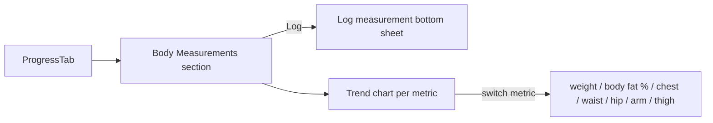

# Feature: Body Measurements

**Related documents:** [SRS § 4.4](../02-srs.md#44-body-measurements) · [Database Design § 3.4](../04-database-design.md#34-body-metrics) · [API Specification § 6.6](../05-api-specification.md#66-body-metrics) · [Progress Photos](progress-photos.md) · [Calorie Tracker](calorie-tracker.md)

## Release Phase

| Field | Value |
|---|---|
| **Status** | Phase 1 |
| **Priority** | High |
| **Estimated Sprint** | [Phase 1 · Sprint 4](../16-development-roadmap.md#phase-1--sprint-4--tracking-progress--habits) |
| **Dependencies** | Authentication |

## Table of Contents
- [Overview](#overview)
- [Purpose](#purpose)
- [User Stories](#user-stories)
- [Functional Requirements](#functional-requirements)
- [Non-Functional Requirements](#non-functional-requirements)
- [UI Flow](#ui-flow)
- [Screen List](#screen-list)
- [Business Rules](#business-rules)
- [Validation Rules](#validation-rules)
- [APIs](#apis)
- [Database Tables](#database-tables)
- [Edge Cases](#edge-cases)
- [Error Handling](#error-handling)
- [Offline Behavior](#offline-behavior)
- [Acceptance Criteria](#acceptance-criteria)
- [Future Improvements](#future-improvements)

## Overview
Weight and body-circumference tracking over time, feeding calorie-target calculations ([Calorie Tracker § F-CAL-01](calorie-tracker.md#functional-requirements)) and body-composition goal progress ([Goals](goals.md)).

## Purpose
Give users a trend-based, low-anxiety way to track physical change — trend charts over single data points, since day-to-day weight fluctuation is noisy.

## User Stories
- As a user, I want to log my weight and see a trend line, not just a single number.
- As a user pursuing body composition goals, I want to track circumference measurements alongside weight.

## Functional Requirements
Traces to [SRS FR-401](../02-srs.md#44-body-measurements).

| ID | Summary |
|---|---|
| FR-401 | Log weight/measurements over time, trend chart per metric |

## Non-Functional Requirements
Trend chart queries use the `(user_id, measured_at DESC)` index ([Database Design § 4](../04-database-design.md#4-indexing-strategy)) and support at least a 90-day range without perceptible lag.

## UI Flow


## Screen List
Body Measurements section within [Analytics](../screens/analytics.md)/Progress; Log Measurement (bottom sheet).

## Business Rules
A measurement entry doesn't require all fields — a user can log just weight without circumferences, or vice versa; each metric's trend chart independently uses only the entries where that field is non-null.

## Validation Rules
| Field | Rule |
|---|---|
| `weightKg` | 20–400 |
| `bodyFatPct` | 3–60 |
| Circumference fields | 10–300 cm |
| `measuredAt` | Cannot be in the future |

## APIs
`GET/POST /body-measurements`, `GET /body-measurements/trends?metric=&range=` — [API Specification § 6.6](../05-api-specification.md#66-body-metrics).

## Database Tables
`body_measurements` — [Database Design § 3.4](../04-database-design.md#34-body-metrics).

## Edge Cases
- User logs two weight entries on the same day → both retained (not upserted like `water_logs`) since intra-day measurement context (e.g., morning vs. evening) is meaningful; trend chart uses the latest entry per day for the daily point, full list shows all entries.
- Implausible jump between consecutive entries (e.g., -20kg in a day) → flagged with a "double check this entry" confirm, not silently accepted or blocked (consistent with the pattern in [Workout Tracking § Edge Cases](workout-tracking.md#edge-cases)).

## Error Handling
Standard error envelope; trend chart failure shows a retry state on the chart component only, not the whole screen.

## Offline Behavior
Fully offline-capable — logs queue and sync; trend charts render from local cache and update once new entries sync.

## Acceptance Criteria
```gherkin
Feature: Weight trend chart
  Scenario: User views a 90-day weight trend
    Given the user has logged weight at least weekly for 90 days
    When they open the weight trend chart with range=90d
    Then a line chart renders showing all entries in that window, oldest to newest
```

## Future Improvements
- Automatic smart-scale sync (see [Future Integrations](../future-integrations.md)).
- Body composition trend annotations tied to goal milestones.
