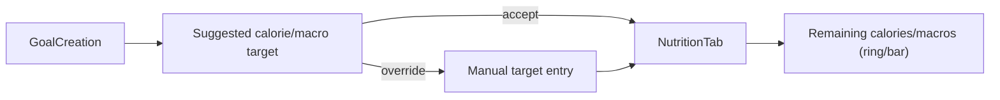

# Feature: Calorie Tracker

**Related documents:** [Nutrition](nutrition.md) · [SRS FR-303](../02-srs.md#43-nutrition-tracking) · [AI Coaching Engine § 5](../09-ai-coaching-engine.md#5-recommendation-engine) (DFS nutrition component) · [API Specification § 6.5](../05-api-specification.md#65-nutrition)

## Release Phase

| Field | Value |
|---|---|
| **Status** | Phase 1 |
| **Priority** | Medium |
| **Estimated Sprint** | [Phase 1 · Sprint 4](../16-development-roadmap.md#phase-1--sprint-4--tracking-progress--habits) |
| **Dependencies** | [Nutrition](nutrition.md), [Goals](goals.md) |

## Table of Contents
- [Overview](#overview)
- [Purpose](#purpose)
- [User Stories](#user-stories)
- [Functional Requirements](#functional-requirements)
- [Non-Functional Requirements](#non-functional-requirements)
- [UI Flow](#ui-flow)
- [Screen List](#screen-list)
- [Business Rules](#business-rules)
- [Validation Rules](#validation-rules)
- [APIs](#apis)
- [Database Tables](#database-tables)
- [Edge Cases](#edge-cases)
- [Error Handling](#error-handling)
- [Offline Behavior](#offline-behavior)
- [Acceptance Criteria](#acceptance-criteria)
- [Future Improvements](#future-improvements)

## Overview
The specific calorie/macro budgeting sub-feature of [Nutrition](nutrition.md): setting daily calorie/macro targets and visualizing progress against them throughout the day.

## Purpose
Give the user a single, glanceable answer to "how much do I have left today," derived from their goal type ([Goals](goals.md)) and profile stats.

## User Stories
- As a user with a body-composition goal, I want a suggested calorie/macro target rather than having to calculate one myself.
- As a user, I want to see remaining calories/macros update live as I log meals.
- As a user, I want to manually override my targets if I know better than the default suggestion.

## Functional Requirements
| ID | Requirement |
|---|---|
| F-CAL-01 | Suggest an initial daily calorie/macro target from profile stats + goal type at onboarding/goal-creation time |
| F-CAL-02 | Allow manual override of calorie/macro targets |
| FR-303 | Live daily totals vs. targets |

## Non-Functional Requirements
Target suggestion is a deterministic formula (Mifflin-St Jeor-style BMR estimate × activity factor × goal adjustment), not an LLM call — consistent with the project's principle of keeping deterministic calculations off the AI cost path ([AI Coaching Engine § 5](../09-ai-coaching-engine.md#5-recommendation-engine)).

## UI Flow


## Screen List
Target setup (part of [Goals](goals.md) creation flow), [Nutrition](../screens/nutrition.md) (progress display).

## Business Rules
Targets require height, weight (from [Body Measurements](body-measurements.md)), DOB, and sex to compute the suggestion; missing any of these falls back to a generic target band with a prompt to complete profile data for a personalized number.

## Validation Rules
| Field | Rule |
|---|---|
| `dailyCalorieTarget` | 1000–6000 kcal if manually overridden |
| Macro targets | Must sum to within 5% of calorie target when converted (protein/carbs ×4, fat ×9) |

## APIs
Target stored as part of the active `goals` row (`target_metric='daily_calories'` or similar) or a dedicated nutrition-target field — see `GET /nutrition/daily-summary` in [API Specification § 6.5](../05-api-specification.md#65-nutrition) for the read side.

## Database Tables
Reads `goals`, aggregates `meal_items` for the current day.

## Edge Cases
- User has no active body-composition goal → calorie tracker still functions using a generic maintenance-level default, clearly labeled as a default rather than a personalized target.
- User's logged intake wildly exceeds target (e.g., 3x) → UI shows the overage plainly without alarming/shaming color or copy, consistent with [UI/UX Design System § 9](../06-ui-ux-design-system.md#9-content--tone-guidelines).

## Error Handling
Target suggestion computation failure (missing data) degrades to the generic default rather than blocking nutrition logging entirely.

## Offline Behavior
Fully offline — target is cached locally, daily totals computed client-side from local Drift data, consistent with [Nutrition § Offline Behavior](nutrition.md#offline-behavior).

## Acceptance Criteria
```gherkin
Feature: Calorie target suggestion
  Scenario: User with complete profile creates a body-composition goal
    Given the user has height, weight, DOB, and sex on file
    When they create a body_composition goal
    Then a suggested daily calorie and macro target is computed and displayed
    And the user can accept or override it before saving
```

## Future Improvements
- Activity-level auto-adjustment based on logged workout volume (dynamic target rather than static).
- Macro-cycling support (different targets on training vs. rest days).
