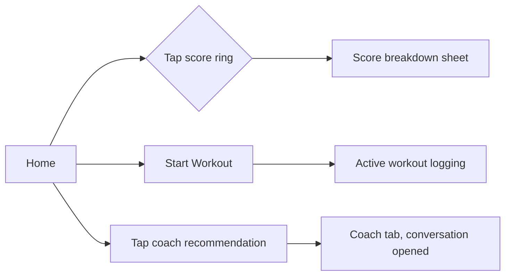

# Feature: Dashboard (Home)

**Related documents:** [UI/UX Design System § 3–4](../06-ui-ux-design-system.md#3-core-components) · [AI Coaching Engine § 5](../09-ai-coaching-engine.md#5-recommendation-engine) · [API Specification § 6.9](../05-api-specification.md#69-daily-fitness-score) · [Screens — Dashboard](../screens/dashboard.md) · [Components — Progress Ring](../components/progress-ring.md)

## Release Phase

| Field | Value |
|---|---|
| **Status** | Phase 1 |
| **Priority** | Critical |
| **Estimated Sprint** | [Phase 1 · Sprint 4](../16-development-roadmap.md#phase-1--sprint-4--tracking-progress--habits) (scaffold) / [Phase 1 · Sprint 5](../16-development-roadmap.md#phase-1--sprint-5--ai-recommendations-analytics--notifications) (AI card + DFS finalized) |
| **Dependencies** | Workout Tracking, Nutrition, Habits, Goals, Daily Fitness Score, AI Workout Recommendations |

## Table of Contents
- [Overview](#overview)
- [Purpose](#purpose)
- [User Stories](#user-stories)
- [Functional Requirements](#functional-requirements)
- [Non-Functional Requirements](#non-functional-requirements)
- [UI Flow](#ui-flow)
- [Screen List](#screen-list)
- [Business Rules](#business-rules)
- [Validation Rules](#validation-rules)
- [APIs](#apis)
- [Database Tables](#database-tables)
- [Edge Cases](#edge-cases)
- [Error Handling](#error-handling)
- [Offline Behavior](#offline-behavior)
- [Acceptance Criteria](#acceptance-criteria)
- [Future Improvements](#future-improvements)

## Overview
The Home tab — the first thing a returning user sees. Leads with the Daily Fitness Score, today's plan, the AI coach's top recommendation, and streak status, per the "coach-first, not log-first" principle in [UI/UX Design System § 1](../06-ui-ux-design-system.md#1-design-philosophy).

## Purpose
Answer "how am I doing and what should I do today" in one glance, with a single clear next action.

## User Stories
- As a user opening the app, I want to immediately see my score and today's plan without navigating.
- As a user who's behind on a habit or workout, I want a clear, non-shaming nudge toward the next action.
- As a user, I want to tap the score to understand exactly what drove it.

## Functional Requirements
| ID | Requirement |
|---|---|
| F-DASH-01 | Display today's Daily Fitness Score (FR-702) with component breakdown on tap (FR-703) |
| F-DASH-02 | Display today's planned workout (from active template) with a "start workout" CTA |
| F-DASH-03 | Display today's nutrition summary vs. targets |
| F-DASH-04 | Surface the AI coach's single top recommendation for today (derived from the same context used in [AI Coaching Engine § 3](../09-ai-coaching-engine.md#3-context-management), not a separate live AI call per Home load — see Implementation Notes) |
| F-DASH-05 | Display current streak status across active habits |

## Non-Functional Requirements
- Home must render from cached/local data in < 500ms even before network calls resolve (Drift-first read, per [Mobile Architecture § 4](../08-mobile-architecture.md#4-offline-first-strategy)).
- The "AI top recommendation" (F-DASH-04) is refreshed at most once per day (cached), not generated on every Home visit, for cost control ([AI Coaching Engine § Cost Optimization](../09-ai-coaching-engine.md#8-cost-optimization)).

## UI Flow


## Screen List
[Dashboard](../screens/dashboard.md) (Home tab), Score Detail bottom sheet.

## Business Rules
DFS formula/versioning per BR-8; recommendation card content follows the tone rules in [UI/UX Design System § 9](../06-ui-ux-design-system.md#9-content--tone-guidelines) (never shaming missed days).

## Validation Rules
Read-only screen — no user input beyond navigation taps.

## APIs
`GET /scores/today` ([API Specification § 6.9](../05-api-specification.md#69-daily-fitness-score)), `GET /templates` (active template), `GET /nutrition/daily-summary`, `GET /habits` (for streak status). The AI recommendation card is populated from the cached weekly-review/latest-conversation data, not a dedicated dashboard-AI endpoint — see [AI Coaching Engine § 1](../09-ai-coaching-engine.md#1-ai-architecture).

## Database Tables
Reads only: `daily_fitness_scores`, `workout_templates`, `meal_items` (via summary), `habits`, `habit_logs`.

## Edge Cases
- No score computed yet for today (job hasn't run, or user is brand new) → show yesterday's score with a "computing today's score" state, never a blank/zero score presented as real.
- No active template → CTA becomes "Generate a plan" (routes into AI template generation) instead of "Start workout".
- All habits already completed for the day → streak section shows a completed state, not an empty one.

## Error Handling
Each card degrades independently — a failed nutrition-summary fetch shows an inline retry on that card only, never blocks the score or workout cards from rendering.

## Offline Behavior
Fully readable offline from last-synced local data; the "start workout" action works offline per [Workout Tracking](workout-tracking.md#offline-behavior). The AI recommendation card shows its last-cached content with a subtle "last updated" timestamp when offline.

## Acceptance Criteria
```gherkin
Feature: Home renders offline
  Scenario: User opens the app with no connectivity
    Given the user has previously synced data
    And the device is offline
    When the user opens the Home tab
    Then the score, today's plan, and streak status render from local cache
    And no card shows an indefinite loading spinner
```

## Future Improvements
- Customizable card ordering/visibility.
- Predictive "trajectory" callout once progress prediction ships ([PRD § 5.2](../01-prd.md#52-ai-coaching), Future).
