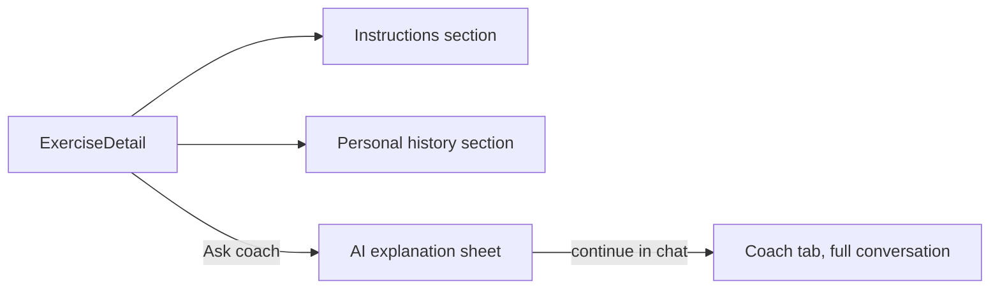

# Feature: Exercise Details

**Related documents:** [Exercise Library](exercise-library.md) · [AI Coaching Engine § 1](../09-ai-coaching-engine.md#1-ai-architecture) (FR-604 explanation on request) · [API Specification § 6.2](../05-api-specification.md#62-exercises) · [Workout History](workout-history.md)

## Release Phase

| Field | Value |
|---|---|
| **Status** | Phase 1 |
| **Priority** | High |
| **Estimated Sprint** | [Phase 1 · Sprint 3](../16-development-roadmap.md#phase-1--sprint-3--workout-engine--exercise-library) (screen) / [Phase 1 · Sprint 5](../16-development-roadmap.md#phase-1--sprint-5--ai-recommendations-analytics--notifications) (FR-604 AI explanation) |
| **Dependencies** | [Exercise Library](exercise-library.md); Claude API integration (Sprint 5) for the AI explanation sub-feature |

## Table of Contents
- [Overview](#overview)
- [Purpose](#purpose)
- [User Stories](#user-stories)
- [Functional Requirements](#functional-requirements)
- [Non-Functional Requirements](#non-functional-requirements)
- [UI Flow](#ui-flow)
- [Screen List](#screen-list)
- [Business Rules](#business-rules)
- [Validation Rules](#validation-rules)
- [APIs](#apis)
- [Database Tables](#database-tables)
- [Edge Cases](#edge-cases)
- [Error Handling](#error-handling)
- [Offline Behavior](#offline-behavior)
- [Acceptance Criteria](#acceptance-criteria)
- [Future Improvements](#future-improvements)

## Overview
The single-exercise detail view: instructions, muscle groups, equipment, the user's personal history for that exercise, and an "Ask your coach" entry point that grounds an AI explanation in the exercise library data (FR-604).

## Purpose
Answer "how do I do this correctly" and "how have I performed this before" from one screen, without forcing a context switch to the Coach tab for a quick question.

## User Stories
- As a user unfamiliar with an exercise, I want a clear explanation and, if I have a specific question, a way to ask the AI coach without losing my place.
- As a user, I want to see my personal-best and recent performance for this exercise inline.

## Functional Requirements
| ID | Requirement |
|---|---|
| F-EXDET-01 | Display instructions, primary/secondary muscle groups, equipment, difficulty |
| F-EXDET-02 | Display personal history summary (best set, last 3 sessions) — reuses [Workout History § F-WHIST-04](workout-history.md#functional-requirements) |
| FR-604 | "Explain this exercise" AI entry point |

## Non-Functional Requirements
The AI explanation entry point (FR-604) is a lightweight, single-turn request — not a full conversation — and may route to a smaller/cheaper model tier per [AI Coaching Engine § Cost Optimization](../09-ai-coaching-engine.md#8-cost-optimization) ("model-tier routing").

## UI Flow


## Screen List
Exercise Detail (modal/pushed route from [Exercise Library](exercise-library.md) or [Workout](../screens/workout.md)).

## Business Rules
AI explanations are grounded in the exercise's own `instructions`/metadata as context — the model is not asked to invent form cues unrelated to the stored data, keeping explanations consistent with what's shown on-screen.

## Validation Rules
Read-only screen; no user input beyond the optional free-text question to the AI explanation entry point (capped at 300 chars, consistent with chat input limits in [AI Coaching Engine § Safety Guardrails](../09-ai-coaching-engine.md#7-safety-guardrails)).

## APIs
`GET /exercises/{id}`, personal history via `GET /workouts?exerciseId=...` (filtered), AI explanation via a lightweight single-turn call through the same pipeline as [AI Coaching Engine § 1](../09-ai-coaching-engine.md#1-ai-architecture) (not a persisted `coach_conversations` thread unless the user taps "continue in chat").

## Database Tables
`exercises`, `workout_sets`/`workout_exercises` (history), no new tables.

## Edge Cases
- Exercise has no `video_url` and minimal `instructions` (thin custom exercise entry) → AI explanation entry point still works, clearly caveated as general guidance since it isn't grounded in exercise-specific instructions.
- User has no history for this exercise yet → history section shows "log this exercise to start tracking your progress" empty state, not a blank chart.

## Error Handling
AI explanation failure (provider error, rate limit) shows an inline retry within the sheet, doesn't block the rest of the exercise detail screen.

## Offline Behavior
Instructions/metadata and cached personal history render offline; the "Ask coach" entry point is disabled offline with the same messaging pattern as the rest of the AI surface ([Mobile Architecture § 4](../08-mobile-architecture.md#4-offline-first-strategy)).

## Acceptance Criteria
```gherkin
Feature: Exercise explanation
  Scenario: User asks the coach to explain an exercise
    Given the user is viewing the Bulgarian Split Squat detail screen
    When they tap "Ask your coach" with no additional question
    Then a grounded explanation referencing the stored instructions is streamed back
```

## Future Improvements
- Embedded video demonstrations.
- Common-mistakes section, sourced from aggregated (anonymized) AI-flagged form questions.
