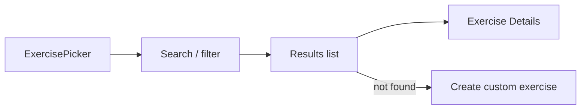

# Feature: Exercise Library

**Related documents:** [Database Design § 3.2](../04-database-design.md#32-exercise-library--workouts) · [API Specification § 6.2](../05-api-specification.md#62-exercises) · [Database Seeding](../database-seeding.md) · [Exercise Details](exercise-details.md) · [Workout Tracking](workout-tracking.md)

## Release Phase

| Field | Value |
|---|---|
| **Status** | Phase 1 |
| **Priority** | Critical |
| **Estimated Sprint** | [Phase 1 · Sprint 3](../16-development-roadmap.md#phase-1--sprint-3--workout-engine--exercise-library) |
| **Dependencies** | [Database Seeding](../database-seeding.md) |

## Table of Contents
- [Overview](#overview)
- [Purpose](#purpose)
- [User Stories](#user-stories)
- [Functional Requirements](#functional-requirements)
- [Non-Functional Requirements](#non-functional-requirements)
- [UI Flow](#ui-flow)
- [Screen List](#screen-list)
- [Business Rules](#business-rules)
- [Validation Rules](#validation-rules)
- [APIs](#apis)
- [Database Tables](#database-tables)
- [Edge Cases](#edge-cases)
- [Error Handling](#error-handling)
- [Offline Behavior](#offline-behavior)
- [Acceptance Criteria](#acceptance-criteria)
- [Future Improvements](#future-improvements)

## Overview
The searchable catalog of exercises (system-seeded plus user-created custom exercises) used throughout workout logging, templates, and AI-generated plans.

## Purpose
Give users a fast way to find the right exercise while logging, and give the AI Personal Trainer persona a closed, well-described vocabulary to generate templates from ([AI Coaching Engine § 5](../09-ai-coaching-engine.md#5-recommendation-engine)).

## User Stories
- As a user, I want to search exercises by name, muscle group, or equipment.
- As a user with limited equipment, I want to filter to only exercises I can actually do.
- As an advanced user, I want to add a custom exercise not in the library.

## Functional Requirements
| ID | Requirement |
|---|---|
| FR-201 | Search/browse (name, muscle group, equipment) |
| F-EXLIB-01 | Filter by difficulty and equipment |
| F-EXLIB-02 | Create a custom exercise (name, muscle group, equipment, instructions) |

## Non-Functional Requirements
Search p95 < 300ms (per [SRS FR-201 acceptance criteria](../02-srs.md#42-workout-tracking)); library is cached locally with background refresh so browsing works offline ([Mobile Architecture § 5](../08-mobile-architecture.md#5-local-storage)).

## UI Flow


## Screen List
Exercise Picker (modal, embedded in [Workout](../screens/workout.md) flow), [Exercise Details](exercise-details.md).

## Business Rules
Custom exercises (`is_custom=true`) are private to the creating user by default (not merged into the global library) — avoids uncurated/duplicate entries polluting search for all users; a curation path for promoting good custom entries into the global library is an Admin-tooling concern ([User Documentation § 6](../15-user-documentation.md#6-admin-documentation)).

## Validation Rules
| Field | Rule |
|---|---|
| `name` | 2–120 chars, required |
| `primaryMuscleGroup` | Required, from a fixed taxonomy |
| `equipment` | Required, from a fixed taxonomy |
| `instructions` | Optional, max 2000 chars |

## APIs
`GET /exercises`, `GET /exercises/{id}`, `POST /exercises` — [API Specification § 6.2](../05-api-specification.md#62-exercises).

## Database Tables
`exercises` — [Database Design § 3.2](../04-database-design.md#32-exercise-library--workouts). Seed data strategy in [Database Seeding](../database-seeding.md).

## Edge Cases
- Search term matches no exercises → empty state offers "create a custom exercise" pre-filled with the search term as the name.
- Two users create custom exercises with the same name → both persist independently (`is_custom` entries are user-scoped, no uniqueness constraint across users).

## Error Handling
Standard error envelope; custom-exercise creation validation errors shown inline per field.

## Offline Behavior
Full library (system + own custom exercises) is cached locally with a TTL-based background refresh; browsing and selecting exercises works fully offline. Creating a custom exercise while offline queues and syncs like other mutations.

## Acceptance Criteria
```gherkin
Feature: Exercise search
  Scenario: User searches by muscle group and equipment
    Given the library contains exercises tagged quads/barbell and quads/bodyweight
    When the user filters muscleGroup=quads and equipment=barbell
    Then only the barbell quad exercises are returned
```

## Future Improvements
- Community-curated promotion path for popular custom exercises.
- Exercise video demonstrations (currently `video_url` field exists in schema but MVP content is instructional text + optional external link only).
