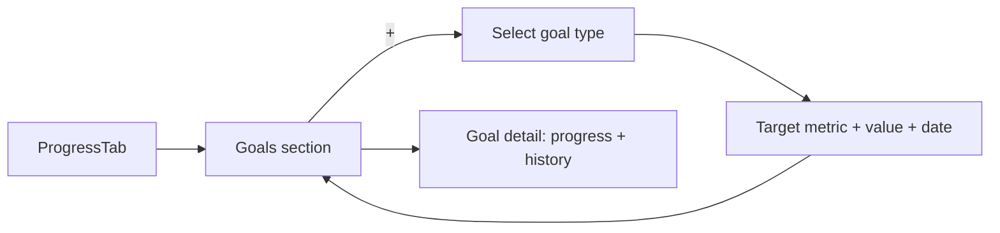

# Feature: Goals

**Related documents:** [SRS § 4.7](../02-srs.md#47-goals--daily-fitness-score) · [Database Design § 3.5](../04-database-design.md#35-habits--goals) · [API Specification § 6.8](../05-api-specification.md#68-goals) · [Calorie Tracker](calorie-tracker.md) · [Dashboard](dashboard.md) · [AI Coaching Engine § 10](../09-ai-coaching-engine.md#10-future-extensibility)

## Release Phase

| Field | Value |
|---|---|
| **Status** | Phase 1 (AI Goal Recommendation sub-capability remains Phase 2, see [AI Prompt — Goal Recommendation](../ai/goal-recommendation.md)) |
| **Priority** | Medium |
| **Estimated Sprint** | [Phase 1 · Sprint 4](../16-development-roadmap.md#phase-1--sprint-4--tracking-progress--habits) |
| **Dependencies** | Authentication |

## Table of Contents
- [Overview](#overview)
- [Purpose](#purpose)
- [User Stories](#user-stories)
- [Functional Requirements](#functional-requirements)
- [Non-Functional Requirements](#non-functional-requirements)
- [UI Flow](#ui-flow)
- [Screen List](#screen-list)
- [Business Rules](#business-rules)
- [Validation Rules](#validation-rules)
- [APIs](#apis)
- [Database Tables](#database-tables)
- [Edge Cases](#edge-cases)
- [Error Handling](#error-handling)
- [Offline Behavior](#offline-behavior)
- [Acceptance Criteria](#acceptance-criteria)
- [Future Improvements](#future-improvements)

## Overview
Structured goal-setting (strength, body composition, habit, or event-based) that seeds personalization elsewhere in the app — calorie targets, AI coaching context, and progress tracking all read from the user's active goal(s).

## Purpose
Give the AI coach and the deterministic scoring engine a concrete target to reason against, rather than tracking data in a vacuum.

## User Stories
- As a user, I want to set a goal with a target metric and, optionally, a target date.
- As a user, I want to see my progress toward each active goal.
- As a user whose priorities changed, I want to abandon or edit a goal without losing its history.

## Functional Requirements
Traces to [SRS FR-701](../02-srs.md#47-goals--daily-fitness-score).

| ID | Summary |
|---|---|
| FR-701 | Create goal (strength/body composition/habit/event), linked to a tracked metric |
| F-GOAL-01 | View progress toward each active goal (current value vs. target) |
| F-GOAL-02 | Edit or abandon a goal |

## Non-Functional Requirements
Goal progress computation reads existing tracked data (workouts for strength goals, body measurements for composition goals, habit logs for habit goals) — no separate goal-progress ledger to keep in sync.

## UI Flow


## Screen List
Goals section (within [Analytics](../screens/analytics.md)/Progress), Create/Edit Goal (bottom sheet), Goal Detail.

## Business Rules
`type=strength` goals require a `target_metric` matching an exercise (e.g., `bench_press_1rm`); `type=body_composition` goals require a `target_metric` matching a `body_measurements` field; `type=habit` goals link to a `habits` row; `type=event` goals require only a `target_date` (e.g., "be race-ready by..."). A goal's `status` transitions `active → achieved` automatically when the linked metric crosses `target_value` (checked as part of the same job that recomputes the Daily Fitness Score, [Backend Architecture § 6](../07-backend-architecture.md#6-scheduled-tasks-routesconsolephp--scheduler)), or manually to `abandoned` by the user.

## Validation Rules
| Field | Rule |
|---|---|
| `title` | 1–150 chars |
| `targetValue` | Required for strength/body_composition types, positive number |
| `targetDate` | Optional, must be in the future when set |

## APIs
`GET/POST /goals`, `GET/PATCH/DELETE /goals/{id}` — [API Specification § 6.8](../05-api-specification.md#68-goals).

## Database Tables
`goals` — [Database Design § 3.5](../04-database-design.md#35-habits--goals).

## Edge Cases
- User sets a `target_date` in the past by mistake → rejected at validation (422), not silently accepted then immediately shown as "overdue."
- Linked exercise/habit for a goal is deleted → goal remains but progress display shows "tracking target no longer available," prompting the user to edit the goal rather than silently breaking.
- Multiple active goals of the same type → all tracked independently; the AI Personal Trainer context ([AI Coaching Engine § 3](../09-ai-coaching-engine.md#3-context-management)) includes all active goals, not just one.

## Error Handling
Standard error envelope; goal-type-specific validation errors are field-scoped (e.g., missing `targetMetric` for a strength goal is a `details.targetMetric` validation error, not a generic failure).

## Offline Behavior
Goal CRUD queues and syncs like other mutations; progress display computes from locally cached tracked data.

## Acceptance Criteria
```gherkin
Feature: Goal auto-achievement
  Scenario: A strength goal's target is reached
    Given an active goal with type=strength, targetMetric=bench_press_1rm, targetValue=100kg
    When the user logs a set that establishes a new estimated 1RM of 102kg
    Then the goal's status transitions to achieved
    And the user is notified (see docs/features/notifications.md)
```

## Future Improvements
- AI-recommended goal adjustments (progress prediction, [PRD § 5.2](../01-prd.md#52-ai-coaching), Future) — architecturally anticipated in [AI Coaching Engine § 10](../09-ai-coaching-engine.md#10-future-extensibility).
- Multi-metric composite goals.
