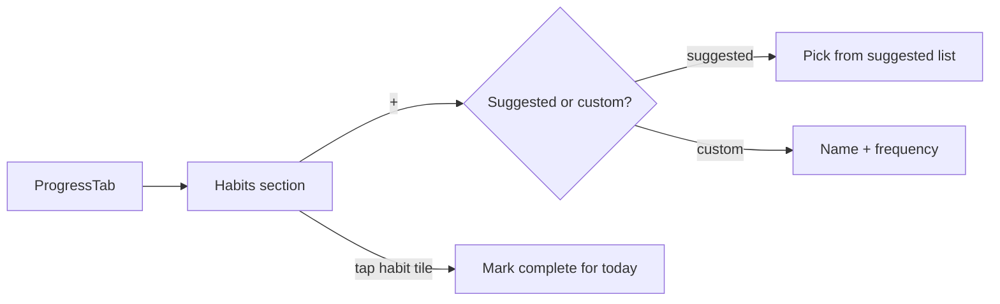

# Feature: Habits

**Related documents:** [SRS § 4.5](../02-srs.md#45-habits) · [Database Design § 3.5](../04-database-design.md#35-habits--goals) · [API Specification § 6.7](../05-api-specification.md#67-habits) · [Dashboard](dashboard.md) · [Achievements](achievements.md) · [Goals](goals.md)

## Release Phase

| Field | Value |
|---|---|
| **Status** | Phase 1 (Habit Coach AI persona is Phase 2, see [PHASE2_SCOPE.md § Habit Coach](../PHASE2_SCOPE.md#habit-coach)) |
| **Priority** | High |
| **Estimated Sprint** | [Phase 1 · Sprint 4](../16-development-roadmap.md#phase-1--sprint-4--tracking-progress--habits) |
| **Dependencies** | Authentication |

## Table of Contents
- [Overview](#overview)
- [Purpose](#purpose)
- [User Stories](#user-stories)
- [Functional Requirements](#functional-requirements)
- [Non-Functional Requirements](#non-functional-requirements)
- [UI Flow](#ui-flow)
- [Screen List](#screen-list)
- [Business Rules](#business-rules)
- [Validation Rules](#validation-rules)
- [APIs](#apis)
- [Database Tables](#database-tables)
- [Edge Cases](#edge-cases)
- [Error Handling](#error-handling)
- [Offline Behavior](#offline-behavior)
- [Acceptance Criteria](#acceptance-criteria)
- [Future Improvements](#future-improvements)

## Overview
Lightweight custom or suggested habit tracking with streaks, feeding the `habit` component of the Daily Fitness Score ([AI Coaching Engine § 5](../09-ai-coaching-engine.md#5-recommendation-engine)).

## Purpose
Extend tracking beyond workouts/nutrition to the small daily behaviors (sleep by a certain time, mobility work, protein-first meals) that compound into results.

## User Stories
- As a user, I want to create a custom habit with a frequency target.
- As a user, I want to check off a habit for today in one tap.
- As a user, I want to see my current streak and feel motivated, not shamed, by it.

## Functional Requirements
Traces to [SRS FR-501–FR-502](../02-srs.md#45-habits).

| ID | Summary |
|---|---|
| FR-501 | Create custom or adopt suggested habits, with frequency target |
| FR-502 | Mark habit complete for a day, streak updates |

## Non-Functional Requirements
Streak computation is O(1) per check-in (increment/reset), not a recomputation over full history on every read — backed by the `UNIQUE(habit_id, log_date)` upsert pattern ([Database Design § 3.5](../04-database-design.md#35-habits--goals)).

## UI Flow


## Screen List
Habits section (within [Analytics](../screens/analytics.md)/Progress and surfaced on [Dashboard](dashboard.md)); Create Habit (bottom sheet).

## Business Rules
BR-7: a streak resets to 0 if a scheduled day is missed (no automatic grace in MVP). `frequency_type=weekly_n` habits (e.g., "3x/week") track streak at the weekly-target level, not requiring every single day — the streak-break condition is "target not met by week's end," computed by the same scheduled job pattern as DFS recomputation.

## Validation Rules
| Field | Rule |
|---|---|
| `name` | 1–120 chars |
| `frequencyTarget` | 1–7 for `weekly_n`; irrelevant/ignored for `daily` |

## APIs
`GET/POST /habits`, `PATCH/DELETE /habits/{id}`, `POST /habits/{id}/logs` — [API Specification § 6.7](../05-api-specification.md#67-habits).

## Database Tables
`habits`, `habit_logs` — [Database Design § 3.5](../04-database-design.md#35-habits--goals).

## Edge Cases
- User marks a habit complete, then un-marks it same day → `habit_logs` row deleted (or a `completed_at` cleared), streak recalculated accordingly — this is an allowed correction, not a locked historical record.
- User backfills a missed day after the fact → allowed, but does **not** retroactively "repair" a broken streak (streak is a forward-looking motivational device, not a strict audit log); the day's completion is recorded for historical/analytics purposes only.
- User deactivates a habit (`is_active=false`) → excluded from the DFS habit component and from Dashboard streak display, but historical `habit_logs` are retained.

## Error Handling
Standard error envelope; check-in is optimistic UI (instant tile update), consistent with [Water Intake](water-intake.md#error-handling)'s low-friction pattern.

## Offline Behavior
Fully offline — check-ins queue and sync via the same upsert-by-date idempotency pattern as other date-keyed logs.

## Acceptance Criteria
```gherkin
Feature: Habit streak reset
  Scenario: Daily habit missed for one day
    Given a daily habit with a current streak of 12
    And the user did not log completion yesterday
    When the scheduled streak-evaluation job runs
    Then the streak resets to 0
```

## Future Improvements
- Habit reminders tuned by historical completion time-of-day (ties into [Notifications](notifications.md) and the Future Habit Coach persona, [AI Coaching Engine § 10](../09-ai-coaching-engine.md#10-future-extensibility)).
- Optional streak-grace ("miss one day without breaking streak") as a configurable habit setting.
