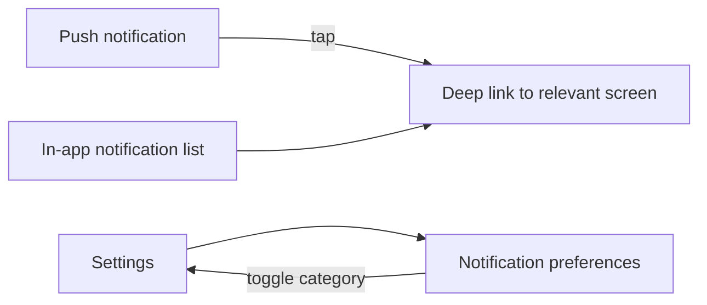

# Feature: Notifications

**Related documents:** [SRS § 4.8](../02-srs.md#48-notifications) · [Database Design § 3.7](../04-database-design.md#37-notifications) · [API Specification § 6.11](../05-api-specification.md#611-notifications) · [Backend Architecture § 7](../07-backend-architecture.md#7-notifications) · [Analytics & Events](../analytics-events.md)

## Release Phase

| Field | Value |
|---|---|
| **Status** | Phase 1 |
| **Priority** | High |
| **Estimated Sprint** | [Phase 1 · Sprint 5](../16-development-roadmap.md#phase-1--sprint-5--ai-recommendations-analytics--notifications) |
| **Dependencies** | FCM/APNs setup, tracking domains as trigger sources (Sprints 3–4) |

## Table of Contents
- [Overview](#overview)
- [Purpose](#purpose)
- [User Stories](#user-stories)
- [Functional Requirements](#functional-requirements)
- [Non-Functional Requirements](#non-functional-requirements)
- [UI Flow](#ui-flow)
- [Screen List](#screen-list)
- [Business Rules](#business-rules)
- [Validation Rules](#validation-rules)
- [APIs](#apis)
- [Database Tables](#database-tables)
- [Edge Cases](#edge-cases)
- [Error Handling](#error-handling)
- [Offline Behavior](#offline-behavior)
- [Acceptance Criteria](#acceptance-criteria)
- [Future Improvements](#future-improvements)

## Overview
Push notification delivery (reminders, streak risk, AI check-ins, weekly review ready) and the in-app notification center, plus per-category preference controls.

## Purpose
Bring users back into the app at meaningful moments without becoming noise — every category is individually toggleable per [UI/UX Design System § 9](../06-ui-ux-design-system.md#9-content--tone-guidelines) tone rules (never shaming, always specific).

## User Stories
- As a user, I want to be reminded before I lose a streak, not just alerted after.
- As a user, I want to control which notification categories I receive.
- As a user, I want a notification history I can review in-app even if I dismissed the push.

## Functional Requirements
Traces to [SRS FR-801–FR-802](../02-srs.md#48-notifications).

| ID | Summary |
|---|---|
| FR-801 | Push notifications for reminders, streak risk, AI check-ins |
| FR-802 | Per-category notification preferences |

## Non-Functional Requirements
Every dispatch checks `notification_preferences` before sending (Backend Architecture § 7) — preference enforcement happens server-side, not just as a client-side display filter, so disabled categories never reach the device.

## UI Flow


## Screen List
Notification Center (accessible from Home/Dashboard), Notification Preferences (within [Settings](../screens/settings.md)).

## Business Rules
Categories (non-exhaustive, extensible): `workout_reminder`, `streak_risk`, `weekly_review_ready`, `ai_checkin`, `goal_achieved`, `pr_detected`. Auth-critical notices (verification, password reset) always use email, bypassing category preferences entirely, since they're not engagement notifications ([Backend Architecture § 7](../07-backend-architecture.md#7-notifications)).

## Validation Rules
| Field | Rule |
|---|---|
| `channelPush`/`channelEmail` | Boolean per category |
| Push token | Registered per device via `POST /devices`, refreshed on token rotation events from the OS |

## APIs
`GET /notifications`, `PATCH /notifications/{id}`, `GET/PATCH /notification-preferences`, `POST /devices` — [API Specification § 6.11](../05-api-specification.md#611-notifications).

## Database Tables
`notifications`, `notification_preferences`, `devices` (push token) — [Database Design § 3.7](../04-database-design.md#37-notifications).

## Edge Cases
- Push token invalidated (app uninstalled/reinstalled) → delivery failure is caught by the push provider's response and the stale token is pruned from `devices`, not retried indefinitely.
- User disables a category after a notification of that type was already queued → in-flight sends are not retroactively cancelled (small race window, accepted rather than engineered around at MVP scale), but no *future* sends occur.
- Same logical event (e.g., streak risk) would fire multiple notifications in one day due to a job re-run → deduplicated via a per-user-per-category-per-day idempotency check before dispatch.

## Error Handling
Failed push dispatch is logged and retried per standard queue-job retry policy ([Backend Architecture § 4](../07-backend-architecture.md#4-queues)); in-app notification list is unaffected by push-delivery failure since it's written to `notifications` independently of the push send attempt.

## Offline Behavior
In-app notification list is readable offline from cache; naturally, push delivery itself requires the device to be online (OS-level, outside app control) — no special handling needed beyond standard OS push behavior.

## Acceptance Criteria
```gherkin
Feature: Category preference enforcement
  Scenario: User disables streak_risk notifications
    Given a user has set channelPush=false for category streak_risk
    When the streak-risk scheduled check would otherwise notify them
    Then no push notification is dispatched
    And no row is skipped from being logged as "suppressed" for audit purposes
```

## Future Improvements
- Smart send-time optimization based on historical open-rate per user.
- Rich push notifications with inline quick-actions (e.g., mark habit complete from the notification shade).
