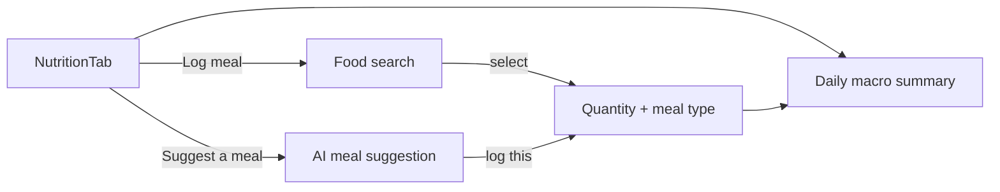

# Feature: Nutrition

**Related documents:** [SRS § 4.3](../02-srs.md#43-nutrition-tracking) · [Database Design § 3.3](../04-database-design.md#33-nutrition) · [API Specification § 6.5](../05-api-specification.md#65-nutrition) · [Calorie Tracker](calorie-tracker.md) · [Water Intake](water-intake.md) · [AI Coaching Engine](../09-ai-coaching-engine.md)

## Release Phase

| Field | Value |
|---|---|
| **Status** | Phase 1 (core tracking: FR-301–FR-303). **FR-304 AI meal suggestions is Phase 2**, deferred pending the Nutrition Coach persona — see [PHASE2_SCOPE.md § Nutrition Coach](../PHASE2_SCOPE.md#nutrition-coach) |
| **Priority** | High |
| **Estimated Sprint** | [Phase 1 · Sprint 4](../16-development-roadmap.md#phase-1--sprint-4--tracking-progress--habits) (core); [Phase 2 · Sprint 2](../16-development-roadmap.md#phase-2--sprint-2--nutrition-coach--recovery-coach) (FR-304) |
| **Dependencies** | Authentication |

## Table of Contents
- [Overview](#overview)
- [Purpose](#purpose)
- [User Stories](#user-stories)
- [Functional Requirements](#functional-requirements)
- [Non-Functional Requirements](#non-functional-requirements)
- [UI Flow](#ui-flow)
- [Screen List](#screen-list)
- [Business Rules](#business-rules)
- [Validation Rules](#validation-rules)
- [APIs](#apis)
- [Database Tables](#database-tables)
- [Edge Cases](#edge-cases)
- [Error Handling](#error-handling)
- [Offline Behavior](#offline-behavior)
- [Acceptance Criteria](#acceptance-criteria)
- [Future Improvements](#future-improvements)

## Overview
The umbrella feature covering meal logging, the food database, and AI meal suggestions — the Nutrition tab. [Calorie Tracker](calorie-tracker.md) and [Water Intake](water-intake.md) are the two sub-features documented separately since they have distinct UI surfaces and data shapes.

## Purpose
Make macro/calorie tracking fast enough to sustain daily, and pair it with AI suggestions so the user isn't left guessing what to eat to hit remaining targets.

## User Stories
- As a user, I want to log a meal by searching a food database rather than manual macro entry every time.
- As a user, I want to see my daily macro/calorie totals update as I log.
- As a user unsure what to eat, I want a suggestion that fits my remaining budget and dietary restrictions.

## Functional Requirements
Traces to [SRS FR-301–FR-304](../02-srs.md#43-nutrition-tracking) (FR-305 barcode scan is Future).

| ID | Summary |
|---|---|
| FR-301 | Log meals/foods with macros/calories |
| FR-303 | Daily macro/calorie totals vs. targets |
| FR-304 | AI meal suggestions respecting dietary restrictions |

## Non-Functional Requirements
Food search p95 < 300ms; macro snapshot on `meal_items` (per [Database Design § 3.3](../04-database-design.md#33-nutrition)) ensures historical logs never silently change if the underlying `foods` entry is edited later.

## UI Flow


## Screen List
[Nutrition](../screens/nutrition.md) (daily summary + meal list), Food Search (modal), Log Meal (bottom sheet).

## Business Rules
Meal suggestions (FR-304) are computed against *remaining* daily budget (target minus already-logged), not the full daily target, and always respect `users.dietary_restrictions` (BR — see [SRS § 6](../02-srs.md#6-business-rules) general validation principle applied here).

## Validation Rules
| Field | Rule |
|---|---|
| `quantity` | > 0, ≤ 50 (servings) |
| `mealType` | One of `breakfast`, `lunch`, `dinner`, `snack` |
| Custom food macros | Non-negative decimals, calories roughly consistent with macros (soft warning, not hard block, if far off — protein×4 + carbs×4 + fat×9 vs. stated calories) |

## APIs
`GET /foods`, `POST /foods`, `GET /meals`, `POST /meals`, `GET/PATCH/DELETE /meals/{id}`, `GET /nutrition/daily-summary` — [API Specification § 6.5](../05-api-specification.md#65-nutrition). AI suggestions via `POST /coach/conversations/{id}/messages` against the Nutrition Coach persona ([AI Coaching Engine § 3](../09-ai-coaching-engine.md#3-context-management)).

## Database Tables
`foods`, `meals`, `meal_items` — [Database Design § 3.3](../04-database-design.md#33-nutrition).

## Edge Cases
- Food search returns no result → offer "create custom food" pre-filled with the search term.
- User logs a meal for a past date (backfilling) → allowed; daily summary and DFS nutrition component for that past date are unaffected retroactively (same principle as [Workout History § Edge Cases](workout-history.md#edge-cases)) unless that day's score hasn't been computed yet.
- `foods` entry edited after being used in a logged meal → historical `meal_items` macros are unaffected (snapshot, not a live reference).

## Error Handling
Standard error envelope; AI suggestion failure falls back to a manual food-search prompt rather than a dead end.

## Offline Behavior
Meal logging is offline-capable following the same pattern as workouts ([Mobile Architecture § 4](../08-mobile-architecture.md#4-offline-first-strategy)); food database search uses the locally cached subset (most-used + previously searched foods) when offline, with a "reconnect for full search" affordance. AI meal suggestions require connectivity.

## Acceptance Criteria
```gherkin
Feature: Meal suggestion respects dietary restrictions
  Scenario: Vegetarian user requests a meal suggestion
    Given the user's profile has dietary_restrictions including "vegetarian"
    When they request a meal suggestion from the Nutrition Coach
    Then the suggested meal contains no meat or fish ingredients
```

## Future Improvements
- Barcode scanning (FR-305, Future).
- Recipe/multi-ingredient meal builder beyond single-food-item logging.
- Restaurant menu database integration.
