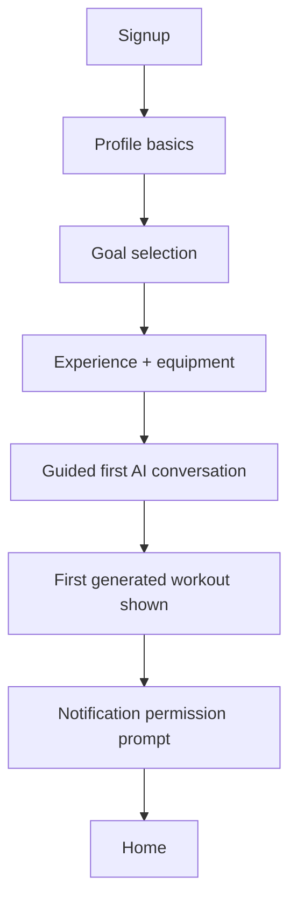

# Feature: Onboarding

**Related documents:** [PRD § 3.1](../01-prd.md#31-user-personas) · [User Documentation § 1](../15-user-documentation.md#1-user-onboarding) · [AI Coaching Engine](../09-ai-coaching-engine.md) · [Authentication](authentication.md) · [Goals](goals.md)

## Release Phase

| Field | Value |
|---|---|
| **Status** | Phase 1 — **simplified AI step**: the "Meet Your Coach" step ships as a single structured AI Workout Recommendation call + written welcome, not open-ended chat; see [PHASE1_SCOPE.md § AI Onboarding](../PHASE1_SCOPE.md#ai-onboarding). The full conversational onboarding experience is a Phase 2 enhancement. |
| **Priority** | Critical |
| **Estimated Sprint** | [Phase 1 · Sprint 2](../16-development-roadmap.md#phase-1--sprint-2--user-profile--ai-onboarding) (flow); AI-generation step activated [Phase 1 · Sprint 5](../16-development-roadmap.md#phase-1--sprint-5--ai-recommendations-analytics--notifications) |
| **Dependencies** | Authentication; Workout Engine ([Sprint 3](../16-development-roadmap.md#phase-1--sprint-3--workout-engine--exercise-library)) and AI Workout Recommendations ([Sprint 5](../16-development-roadmap.md#phase-1--sprint-5--ai-recommendations-analytics--notifications)) for the AI step specifically |

## Table of Contents
- [Overview](#overview)
- [Purpose](#purpose)
- [User Stories](#user-stories)
- [Functional Requirements](#functional-requirements)
- [Non-Functional Requirements](#non-functional-requirements)
- [UI Flow](#ui-flow)
- [Screen List](#screen-list)
- [Business Rules](#business-rules)
- [Validation Rules](#validation-rules)
- [APIs](#apis)
- [Database Tables](#database-tables)
- [Edge Cases](#edge-cases)
- [Error Handling](#error-handling)
- [Offline Behavior](#offline-behavior)
- [Acceptance Criteria](#acceptance-criteria)
- [Future Improvements](#future-improvements)

## Overview
The guided sequence between account creation and the Home screen that collects the minimum profile/goal data needed to personalize the app and produces the user's first AI-generated workout — implementing the flow already described narratively in [User Documentation § 1](../15-user-documentation.md#1-user-onboarding). This document adds the implementation-level detail (screens, APIs, validation) that document intentionally omits.

## Purpose
Convert a new registrant into an activated user within one session by front-loading value (a real first workout, a real first AI interaction) instead of a blank logging screen — directly serves [PRD Objective O2](../01-prd.md#2-objectives).

## User Stories
- As a new user, I want to tell the app my goal and experience level so my first plan isn't generic.
- As a beginner, I want the AI coach to lead the conversation rather than presenting me with an empty app.
- As any new user, I want to skip steps that don't apply to me and finish onboarding quickly.

## Functional Requirements
| ID | Requirement |
|---|---|
| F-ONB-01 | Collect unit preference, timezone (auto-detected, editable), optional DOB/sex/height |
| F-ONB-02 | Collect primary goal type, seeding a `goals` row (see [Goals](goals.md)) |
| F-ONB-03 | Collect experience level + equipment access, passed to adaptive template generation (FR-206) |
| F-ONB-04 | Run one guided AI conversation turn that ends in a generated first `workout_templates` row |
| F-ONB-05 | Request push notification permission with contextual copy before the OS prompt |
| F-ONB-06 | Onboarding is resumable/skippable except account creation and email verification gating (BR-2) |

## Non-Functional Requirements
- Onboarding completion (steps 2–5) targets < 90 seconds median for a user who doesn't linger.
- Step 5 (first AI conversation) must degrade gracefully to "we'll generate your first plan once you're back online" if offline — AI cannot function offline ([Mobile Architecture § Offline-First Strategy](../08-mobile-architecture.md#4-offline-first-strategy)).

## UI Flow


## Screen List
Profile Basics, Goal Selection, Experience Level, Meet Your Coach (AI conversation), Notification Permission — all modal/full-screen steps within a single onboarding route, not separate bottom-nav destinations ([UI/UX Design System § 4](../06-ui-ux-design-system.md#4-navigation)).

## Business Rules
Follows BR-2 (unverified email blocks AI features) — if email isn't verified by step 4, the "Meet Your Coach" step shows a verification-required state instead of blocking onboarding entirely; the user can finish onboarding and verify later, with the first-workout generation deferred.

## Validation Rules
| Field | Rule |
|---|---|
| Timezone | Valid IANA identifier, auto-detected default |
| Date of birth | Optional; if provided, user must be ≥ 18 (per [Production Hardening § Compliance](../14-production-hardening.md#9-compliance-considerations)) |
| Goal type | One of `strength`, `body_composition`, `habit`, `event` |
| Experience level | One of `beginner`, `intermediate`, `advanced` |

## APIs
`PATCH /me` (profile basics), `POST /goals` (goal seed), `POST /templates/ai-generate` (first workout, [API Specification § 6.3](../05-api-specification.md#63-workout-templates)), `POST /coach/conversations` + `POST /coach/conversations/{id}/messages` (guided conversation), `POST /devices` (push token registration).

## Database Tables
Writes to `users`, `goals`, `workout_templates`, `template_exercises`, `coach_conversations`, `coach_messages`, `devices` — see [Database Design](../04-database-design.md).

## Edge Cases
- User backgrounds the app mid-onboarding → resumes at the last completed step on relaunch (progress persisted server-side via the same `PATCH /me`/`POST /goals` calls, not a separate onboarding-state table).
- User denies notification permission → onboarding proceeds normally; re-prompt only via a later in-app settings nudge, never a forced re-ask.
- AI generation fails (provider error) during "Meet Your Coach" → user still reaches Home with a "your first plan is on its way" state and a retry affordance, rather than blocking on AI availability.
- User skips goal selection entirely → defaults to a `habit`-type goal ("build a consistent routine") so downstream AI context always has at least one goal to reference.

## Error Handling
Non-blocking by design: any single step's API failure surfaces an inline retry, never a full-flow restart. Standard error envelope per [API Specification § 4](../05-api-specification.md#4-error-response-format).

## Offline Behavior
Profile/goal steps queue like any other write ([Mobile Architecture § 4](../08-mobile-architecture.md#4-offline-first-strategy)); the AI-dependent "Meet Your Coach" step is the one step that explicitly requires connectivity and communicates that clearly rather than spinning indefinitely.

## Acceptance Criteria
```gherkin
Feature: Onboarding produces a first workout
  Scenario: A beginner completes onboarding online
    Given a newly registered, email-verified user
    When they complete profile, goal, and experience steps
    And they exchange at least one message with the guided AI conversation
    Then a workout_templates row exists for that user
    And the Home screen shows that template as "today's plan"
```

## Future Improvements
- Personalized onboarding branch for returning users re-onboarding after a long absence.
- A/B-testable step ordering once analytics from [Analytics & Events](../analytics-events.md) establish drop-off points.
