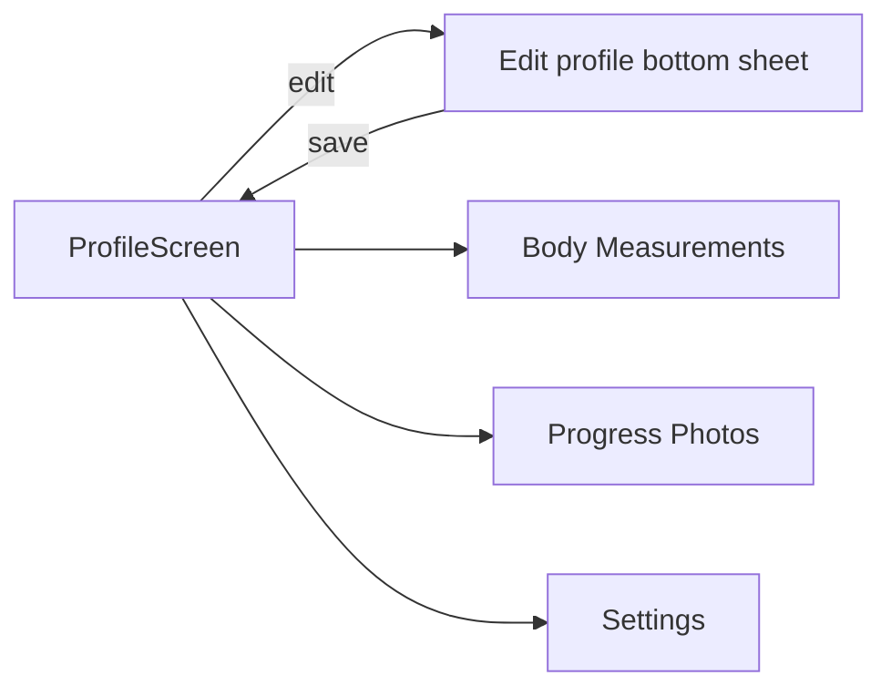

# Feature: Profile

**Related documents:** [SRS § 4.1](../02-srs.md#41-authentication--account-management) · [Database Design § 3.1](../04-database-design.md#31-identity--auth) · [API Specification § 6.1](../05-api-specification.md#61-users--profile) · [Settings](settings.md) · [Screens — Profile](../screens/profile.md)

## Release Phase

| Field | Value |
|---|---|
| **Status** | Phase 1 |
| **Priority** | High |
| **Estimated Sprint** | [Phase 1 · Sprint 2](../16-development-roadmap.md#phase-1--sprint-2--user-profile--ai-onboarding) |
| **Dependencies** | Authentication |

## Table of Contents
- [Overview](#overview)
- [Purpose](#purpose)
- [User Stories](#user-stories)
- [Functional Requirements](#functional-requirements)
- [Non-Functional Requirements](#non-functional-requirements)
- [UI Flow](#ui-flow)
- [Screen List](#screen-list)
- [Business Rules](#business-rules)
- [Validation Rules](#validation-rules)
- [APIs](#apis)
- [Database Tables](#database-tables)
- [Edge Cases](#edge-cases)
- [Error Handling](#error-handling)
- [Offline Behavior](#offline-behavior)
- [Acceptance Criteria](#acceptance-criteria)
- [Future Improvements](#future-improvements)

## Overview
The user's own profile: identity fields, physical stats used for nutrition/DFS personalization, dietary restrictions, and a summary view of their journey (join date, total workouts, current streaks). Distinct from [Settings](settings.md), which covers app configuration (notifications, units, account actions) rather than the user's personal data.

## Purpose
Give the user a single place to view and correct the personal data that powers personalization (nutrition targets, DFS baseline, AI context).

## User Stories
- As a user, I want to update my weight-adjacent stats without digging through settings menus.
- As a user, I want to see a summary of my activity (total workouts, streaks, member since).
- As a user, I want to correct my dietary restrictions if my nutrition suggestions feel wrong.

## Functional Requirements
| ID | Requirement |
|---|---|
| F-PROF-01 | View/edit name, timezone, unit preference, DOB, sex, height, dietary restrictions |
| F-PROF-02 | Display summary stats: member since, total workouts logged, current longest streak |
| F-PROF-03 | Entry point to progress photos and body measurement history (cross-links to [Body Measurements](body-measurements.md) and [Progress Photos](progress-photos.md)) |

## Non-Functional Requirements
Profile edits propagate to AI context on the *next* coaching request, not retroactively rewriting past conversation history ([AI Coaching Engine § 3](../09-ai-coaching-engine.md#3-context-management)).

## UI Flow


## Screen List
[Profile](../screens/profile.md), Edit Profile (bottom sheet, per [UI/UX Design System § 3](../06-ui-ux-design-system.md#3-core-components) Bottom Sheet Logger pattern).

## Business Rules
Dietary restrictions directly gate AI meal suggestions (FR-304) — changes here take effect for the Nutrition Coach persona's next response.

## Validation Rules
Same as onboarding profile-basics step ([Onboarding § Validation Rules](onboarding.md#validation-rules)); height/DOB optional but validated for plausible ranges when provided (height 50–250cm).

## APIs
`GET /me`, `PATCH /me` ([API Specification § 6.1](../05-api-specification.md#61-users--profile)).

## Database Tables
`users` (see [Database Design § 3.1](../04-database-design.md#31-identity--auth)); summary stats derived via aggregate queries over `workouts` and `habit_logs`, not stored redundantly.

## Edge Cases
- User clears all dietary restrictions → Nutrition Coach reverts to no-restriction suggestions on next request, no historical suggestions are retroactively flagged as wrong.
- User changes unit preference (metric ↔ imperial) → all *displayed* values convert; stored values remain metric/canonical per [Database Design § Naming Conventions](../04-database-design.md#1-naming-conventions) (no data migration needed, display-layer conversion only).

## Error Handling
Standard `422 validation_failed` on bad input; edits are optimistic-UI on mobile (applied locally immediately, rolled back with a toast if the server rejects).

## Offline Behavior
Profile is readable offline from cache; edits queue and sync per the standard write path ([Mobile Architecture § 4](../08-mobile-architecture.md#4-offline-first-strategy)) — profile is not part of the offline-critical logging domains but still benefits from the same queue mechanism for consistency.

## Acceptance Criteria
```gherkin
Feature: Profile edit propagates to AI context
  Scenario: User adds a dietary restriction
    Given a user updates dietary restrictions to include "vegetarian"
    When they next message the Nutrition Coach persona
    Then the context sent to the AI includes the updated restriction
```

## Future Improvements
- Public/shareable profile summary for the Future community layer ([PRD § 5.4](../01-prd.md#54-engagement)).
- Profile picture upload (currently out of scope — initials-based avatar only in MVP).
