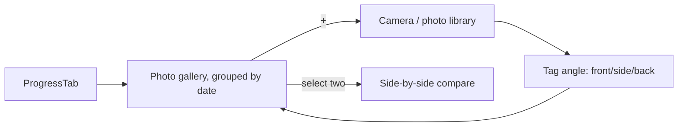

# Feature: Progress Photos

**Related documents:** [SRS § 4.4](../02-srs.md#44-body-measurements) · [Database Design § 3.4](../04-database-design.md#34-body-metrics) · [API Specification § 6.6](../05-api-specification.md#66-body-metrics) · [Production Hardening § 3](../14-production-hardening.md#3-encryption--secrets-management) · [Body Measurements](body-measurements.md)

## Release Phase

| Field | Value |
|---|---|
| **Status** | Phase 1 |
| **Priority** | Medium |
| **Estimated Sprint** | [Phase 1 · Sprint 4](../16-development-roadmap.md#phase-1--sprint-4--tracking-progress--habits) |
| **Dependencies** | Object storage infrastructure ([Deployment Guide](../12-deployment-guide.md)) |

## Table of Contents
- [Overview](#overview)
- [Purpose](#purpose)
- [User Stories](#user-stories)
- [Functional Requirements](#functional-requirements)
- [Non-Functional Requirements](#non-functional-requirements)
- [UI Flow](#ui-flow)
- [Screen List](#screen-list)
- [Business Rules](#business-rules)
- [Validation Rules](#validation-rules)
- [APIs](#apis)
- [Database Tables](#database-tables)
- [Edge Cases](#edge-cases)
- [Error Handling](#error-handling)
- [Offline Behavior](#offline-behavior)
- [Acceptance Criteria](#acceptance-criteria)
- [Future Improvements](#future-improvements)

## Overview
Private, dated progress photo capture and gallery, angle-tagged (front/side/back), for visual tracking alongside numeric body measurements.

## Purpose
Give users a visual record of change that numbers alone don't capture, with privacy as a first-class concern given the sensitivity of the content.

## User Stories
- As a user, I want to take or upload a progress photo tagged by angle and date.
- As a user, I want confidence that no one else can see my progress photos.
- As a user, I want to compare two photos side-by-side across time.

## Functional Requirements
Traces to [SRS FR-402](../02-srs.md#44-body-measurements).

| ID | Summary |
|---|---|
| FR-402 | Upload progress photos, stored privately, associated with a date |
| F-PPHOTO-01 | Side-by-side comparison view between two dates |

## Non-Functional Requirements
Photos are never included in AI coaching context (no multi-modal analysis in MVP, see [AI Coaching Engine § 10](../09-ai-coaching-engine.md#10-future-extensibility) for the Future multi-modal note) and never used for any purpose beyond display to the owning user.

## UI Flow


## Screen List
Progress Photos gallery (within [Analytics](../screens/analytics.md)/Progress), Capture flow, Compare view.

## Business Rules
Photos are stored with randomized, non-guessable storage paths and served only via short-lived pre-signed URLs — never a public/predictable path (per [Production Hardening § 6](../14-production-hardening.md#6-database-hardening) storage principles applied to media). Deleting a photo is immediate and permanent (not subject to the 30-day account-deletion grace period, since it's a discrete user action, not account closure).

## Validation Rules
| Field | Rule |
|---|---|
| Image file | JPEG/PNG/HEIC, max 15MB, validated server-side by content not just extension ([Production Hardening § 4](../14-production-hardening.md#4-input-validation)) |
| `angle` | One of `front`, `side`, `back` |
| `takenAt` | Cannot be in the future |

## APIs
`GET/POST /progress-photos` (multipart upload, [API Specification § 6.6](../05-api-specification.md#66-body-metrics)); reads return pre-signed, short-lived URLs, never permanent public links.

## Database Tables
`progress_photos` — [Database Design § 3.4](../04-database-design.md#34-body-metrics).

## Edge Cases
- User uploads a non-body photo by mistake → no automated content moderation in MVP; user can delete it themselves immediately, and deletion is the only remediation offered (no "report" flow needed for private single-user content).
- Very large image upload on a slow connection → client-side downscale/compress before upload to keep the offline-sync queue lightweight (progress photos are the one media type that isn't fully offline-loggable — see Offline Behavior).

## Error Handling
Upload failure (size/type rejected) shows inline error before attempting upload; network failure mid-upload offers retry.

## Offline Behavior
Unlike other tracking data, photo capture can happen offline (saved locally) but **upload requires connectivity** — the photo sits in a local-only pending state with a clear "will upload when online" indicator distinct from the standard sync-queue pattern, since large binary payloads aren't queued the same way as small JSON mutations ([Mobile Architecture § 6](../08-mobile-architecture.md#6-synchronization)).

## Acceptance Criteria
```gherkin
Feature: Progress photo privacy
  Scenario: Another user attempts to access a photo's storage URL directly
    Given user A has uploaded a progress photo
    When user B requests the raw storage path without a valid pre-signed URL
    Then access is denied
```

## Future Improvements
- Optional face-blurring tool before storage.
- Automated pose-alignment for cleaner side-by-side comparisons.
