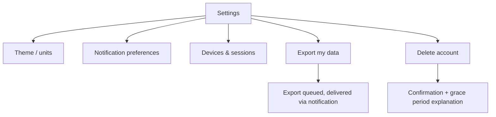

# Feature: Settings

**Related documents:** [SRS § 4.1](../02-srs.md#41-authentication--account-management) · [Production Hardening § 9](../14-production-hardening.md#9-compliance-considerations) · [Notifications](notifications.md) · [Profile](profile.md) · [Screens — Settings](../screens/settings.md)

## Release Phase

| Field | Value |
|---|---|
| **Status** | Phase 1 |
| **Priority** | Critical |
| **Estimated Sprint** | [Phase 1 · Sprint 2](../16-development-roadmap.md#phase-1--sprint-2--user-profile--ai-onboarding) (basic: theme, units) / [Phase 1 · Sprint 6](../16-development-roadmap.md#phase-1--sprint-6--testing-performance--security) (finalized: notification preferences, data export, account deletion) |
| **Dependencies** | Authentication, Notifications |

## Table of Contents
- [Overview](#overview)
- [Purpose](#purpose)
- [User Stories](#user-stories)
- [Functional Requirements](#functional-requirements)
- [Non-Functional Requirements](#non-functional-requirements)
- [UI Flow](#ui-flow)
- [Screen List](#screen-list)
- [Business Rules](#business-rules)
- [Validation Rules](#validation-rules)
- [APIs](#apis)
- [Database Tables](#database-tables)
- [Edge Cases](#edge-cases)
- [Error Handling](#error-handling)
- [Offline Behavior](#offline-behavior)
- [Acceptance Criteria](#acceptance-criteria)
- [Future Improvements](#future-improvements)

## Overview
App configuration and account-level actions: theme, units, notification preferences, device/session management, data export, and account deletion. Distinct from [Profile](profile.md), which is the user's personal data rather than app behavior/account controls.

## Purpose
Centralize every account-level and app-behavior control in one predictable place, including the two most consequential actions in the app (data export and account deletion) so they're never buried.

## User Stories
- As a user, I want to switch between light/dark/system theme.
- As a user, I want to manage which devices have access to my account.
- As a user, I want to export or delete all my data without contacting support.

## Functional Requirements
| ID | Requirement |
|---|---|
| F-SET-01 | Theme selection (light/dark/system) per [UI/UX Design System § 5](../06-ui-ux-design-system.md#5-dark-mode--light-mode) |
| F-SET-02 | Unit preference (metric/imperial) |
| F-SET-03 | Notification preferences (delegates to [Notifications](notifications.md)) |
| FR-106 | Session/device management (delegates to [Authentication](authentication.md)) |
| NFR-8 | Data export |
| FR-108 | Account deletion |

## Non-Functional Requirements
Account deletion and data export are always reachable within 3 taps from Settings root — no dark patterns, no burying destructive-to-the-business (but pro-user) actions ([Production Hardening § 9](../14-production-hardening.md#9-compliance-considerations)).

## UI Flow


## Screen List
[Settings](../screens/settings.md) (root + all sub-sections above, mostly single-screen with expandable sections rather than deep nesting, per [UI/UX Design System § 4](../06-ui-ux-design-system.md#4-navigation) shallow-navigation principle).

## Business Rules
BR-6 (30-day soft-delete grace period), NFR-8 (export delivered as a JSON bundle via pre-signed URL). Theme/unit preference are device-local display settings in MVP (not synced across devices via the server) — simpler and sufficient since the mobile app is the only client.

## Validation Rules
Theme/unit selections are enum-constrained (no free text); account deletion requires an explicit typed or double-tap confirmation, consistent with the destructive-action pattern in [Components — Dialog](../components/dialog.md).

## APIs
`PATCH /me` (unit preference), `POST /me/export`, `DELETE /me`, plus the Auth/Notification endpoints delegated to their respective features — [API Specification § 6.1 & § 6.11](../05-api-specification.md#61-users--profile).

## Database Tables
`users` (soft delete), export is a queued job reading across most tables — no dedicated settings table beyond `users` fields and `notification_preferences`.

## Edge Cases
- User requests export, then requests account deletion before the export completes → export job still completes and the download link remains valid through the 30-day grace period; deletion doesn't cancel an in-flight export.
- User toggles theme rapidly → purely local/instant, no network call, no risk of inconsistent state.

## Error Handling
Standard error envelope; deletion confirmation failure (e.g., network drop mid-request) leaves the account in its prior (non-deleted) state — deletion is not a multi-step process that could leave data half-purged from the user's perspective.

## Offline Behavior
Theme/unit changes apply instantly offline (local-only settings). Export and deletion requests require connectivity to submit but the confirmation UI is clear about that requirement.

## Acceptance Criteria
```gherkin
Feature: Account deletion grace period
  Scenario: User deletes their account
    Given an authenticated user confirms account deletion
    When the request succeeds
    Then the account is soft-deleted immediately (hidden, excluded from AI context)
    And a 30-day grace period begins before hard deletion
```

## Future Improvements
- Cross-device theme/unit sync via the server once a web client exists ([PRD § 5.6](../01-prd.md#56-platform)).
- Self-service account recovery within the grace period (currently requires... — flagged as a gap: the original docs don't specify a recovery UI, only the deletion/grace mechanics; recommend adding one).
