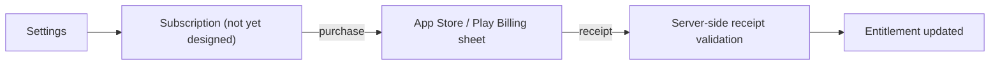

# Feature: Subscriptions

**Related documents:** [PRD](../01-prd.md) · [AI Coaching Engine § 9](../09-ai-coaching-engine.md#9-rate-limiting) (tier-aware token budgets, anticipated hook) · [Permissions Matrix](../permissions-matrix.md) · [PHASE1_SCOPE.md § Subscription Foundation](../PHASE1_SCOPE.md#subscription-foundation)

## Release Phase

| Field | Value |
|---|---|
| **Status** | Phase 1 (**Foundation only** — schema + entitlement-check scaffolding, defaulting every user to full access). Full monetization/billing/pricing remains Phase 2+ and **still not yet scoped by Product** — this phase allocation does not resolve that open question, it only avoids a schema surprise later. |
| **Priority** | Low |
| **Estimated Sprint** | [Phase 1 · Sprint 6](../16-development-roadmap.md#phase-1--sprint-6--testing-performance--security) |
| **Dependencies** | None — scaffolding only, no billing integration |

## Table of Contents
- [Overview](#overview)
- [Purpose](#purpose)
- [User Stories](#user-stories-directional-not-committed)
- [Functional Requirements](#functional-requirements)
- [Non-Functional Requirements](#non-functional-requirements)
- [UI Flow](#ui-flow)
- [Screen List](#screen-list)
- [Business Rules](#business-rules)
- [Validation Rules](#validation-rules)
- [APIs](#apis)
- [Database Tables](#database-tables)
- [Edge Cases](#edge-cases)
- [Error Handling](#error-handling)
- [Offline Behavior](#offline-behavior)
- [Acceptance Criteria](#acceptance-criteria)
- [Future Improvements](#future-improvements)

## Overview
**Important assumption/gap called out explicitly:** no monetization model appears anywhere in [PRD](../01-prd.md), [SRS](../02-srs.md), or the rest of this documentation set — the entire blueprint was written assuming a single, undifferentiated user tier. This document exists only because it was requested in this documentation-extension pass; it is a **placeholder sketch**, not an approved spec, and should not be built against until Product makes an explicit pricing/tiering decision. It is included so the architecture (particularly [AI Coaching Engine § 9 Rate Limiting](../09-ai-coaching-engine.md#9-rate-limiting), which already notes budgets are "tuned per subscription tier if/when monetization tiers exist") isn't caught flat-footed if/when that decision is made.

## Purpose
Sketch the shape a subscription/entitlement system would take, so that when Product defines pricing tiers, engineering has a starting architecture rather than a blank page.

## User Stories (directional, not committed)
- As a business, we want a free tier and a paid tier with differentiated AI coaching limits, so the product has a monetization path.
- As a user, I want to understand clearly what's free vs. paid before subscribing.
- As a subscriber, I want my entitlement to be honored consistently across devices.

## Functional Requirements
Not yet specified. Anticipated shape, pending Product decision: `GET /me/subscription` (current entitlement status), `POST /subscriptions/verify` (client submits App Store/Play Store receipt/purchase token, server validates with the platform and updates entitlement), webhook handlers for renewal/cancellation/refund events from both platforms.

## Non-Functional Requirements
Whatever tiering emerges must not compromise the core tracking loop (workout/nutrition/habit logging, Daily Fitness Score) — [PRD § Non-goals](../01-prd.md#32-non-goals-explicitly-out-of-scope-for-this-product) implies the product's core value should remain accessible; the most defensible gating point given the architecture is **AI coaching depth/volume** (token budgets already exist as a mechanism, [AI Coaching Engine § 9](../09-ai-coaching-engine.md#9-rate-limiting)), not core tracking features.

## UI Flow

## Screen List
Not yet designed.

## Business Rules
Not yet defined by Product. Anticipated technical constraint regardless of pricing decision: **entitlement must be verified server-side** (never trust a client-reported "I'm subscribed" flag) — receipts/purchase tokens validated against Apple/Google server APIs, consistent with the project's stance on never trusting client-asserted identity/state (same principle applied to OAuth verification in [System Architecture § 8](../03-system-architecture.md#8-security-architecture)).

## Validation Rules
Not yet defined.

## APIs
Not present in [API Specification](../05-api-specification.md) — would be a new `Subscriptions` module following the pattern in [Backend Architecture § 1](../07-backend-architecture.md#1-folder-structure) when scoped.

## Database Tables
Not present in [Database Design](../04-database-design.md). Anticipated shape: a `subscriptions` table (`user_id`, `platform` enum(`apple`,`google`), `product_id`, `status`, `current_period_end`, `original_transaction_id`) — sketched here only to inform future schema design, not to be migrated as-is without Product sign-off.

## Edge Cases
To be defined once real requirements exist. Known hard problems in this space worth flagging early: cross-platform entitlement (user subscribes on iOS, expects access on Android — requires account-linked, not device-linked, entitlement), grace periods on failed renewal, and refund/chargeback handling.

## Error Handling
Not yet defined.

## Offline Behavior
Entitlement should be cached locally with a reasonable grace TTL so a legitimately subscribed user isn't locked out of paid features by a brief connectivity gap — consistent with the offline-first principle applied elsewhere ([Mobile Architecture § 4](../08-mobile-architecture.md#4-offline-first-strategy)), though the specific TTL is a Product/Finance risk-tolerance decision, not an engineering one.

## Acceptance Criteria
Not applicable — no implementation committed.

## Future Improvements
The entire feature is future work. **Recommended next step:** a Product-led pricing/packaging decision, followed by promoting this document to a full spec (and correspondingly updating [PRD § 5](../01-prd.md#5-feature-roadmap), [Permissions Matrix](../permissions-matrix.md), and [AI Coaching Engine § 9](../09-ai-coaching-engine.md#9-rate-limiting) with concrete tier definitions) before any implementation begins.
