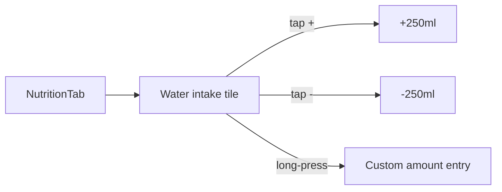

# Feature: Water Intake

**Related documents:** [Nutrition](nutrition.md) · [SRS FR-302](../02-srs.md#43-nutrition-tracking) · [Database Design § 3.3](../04-database-design.md#33-nutrition) · [API Specification § 6.5](../05-api-specification.md#65-nutrition)

## Release Phase

| Field | Value |
|---|---|
| **Status** | Phase 1 |
| **Priority** | Medium |
| **Estimated Sprint** | [Phase 1 · Sprint 4](../16-development-roadmap.md#phase-1--sprint-4--tracking-progress--habits) |
| **Dependencies** | [Nutrition](nutrition.md) (shared domain, upsert pattern) |

## Table of Contents
- [Overview](#overview)
- [Purpose](#purpose)
- [User Stories](#user-stories)
- [Functional Requirements](#functional-requirements)
- [Non-Functional Requirements](#non-functional-requirements)
- [UI Flow](#ui-flow)
- [Screen List](#screen-list)
- [Business Rules](#business-rules)
- [Validation Rules](#validation-rules)
- [APIs](#apis)
- [Database Tables](#database-tables)
- [Edge Cases](#edge-cases)
- [Error Handling](#error-handling)
- [Offline Behavior](#offline-behavior)
- [Acceptance Criteria](#acceptance-criteria)
- [Future Improvements](#future-improvements)

## Overview
The simplest logging surface in the app: a single daily water-intake counter, intentionally kept minimal per the "one glance, one action" principle ([UI/UX Design System § 1](../06-ui-ux-design-system.md#1-design-philosophy)).

## Purpose
Capture a habit-adjacent metric with near-zero logging friction.

## User Stories
- As a user, I want to log a glass/bottle of water in one tap.
- As a user, I want to see my progress toward a daily water goal.

## Functional Requirements
| ID | Requirement |
|---|---|
| FR-302 | Log water intake, increment/decrement UI |
| F-WATER-01 | Configurable daily water target (default suggested, editable) |

## Non-Functional Requirements
Single-tap interaction, no confirmation dialog — increments are cheap to undo (decrement), so no destructive-action friction is warranted.

## UI Flow


## Screen List
Embedded tile within [Nutrition](../screens/nutrition.md); no standalone screen.

## Business Rules
One `water_logs` row per `(user_id, logged_date)`, amount accumulated via upsert (per [Database Design § 3.3](../04-database-design.md#33-nutrition)) — not one row per tap, keeping the table small and queries trivial.

## Validation Rules
| Field | Rule |
|---|---|
| `amountMl` | Increment step 250ml default (configurable), total per day capped at a sanity bound (e.g., 10,000ml) with a confirm-this-is-correct prompt beyond that |

## APIs
`POST /water-logs` (increments today's total) — [API Specification § 6.5](../05-api-specification.md#65-nutrition).

## Database Tables
`water_logs` — [Database Design § 3.3](../04-database-design.md#33-nutrition).

## Edge Cases
- Decrement below zero → clamped to 0, not negative.
- User logs water across a timezone change (travel) → attributed to `logged_date` in the user's *current* profile timezone at time of logging, consistent with how DFS date-bucketing works ([AI Coaching Engine § 5](../09-ai-coaching-engine.md#5-recommendation-engine)).

## Error Handling
Optimistic UI update (tile increments instantly); failed sync retries silently in the background per standard offline-sync behavior, with no user-facing error unless sync fails persistently.

## Offline Behavior
Fully offline — same upsert-by-date pattern applies locally in Drift, synced on reconnect.

## Acceptance Criteria
```gherkin
Feature: Water intake logging
  Scenario: User logs three increments in a day
    Given the user has logged 0ml today
    When they tap +250ml three times
    Then today's water_logs total is 750ml
```

## Future Improvements
- Smart reminders based on time-since-last-log (ties into [Notifications](notifications.md)).
- Container-size presets (glass/bottle/large bottle) beyond a flat increment.
