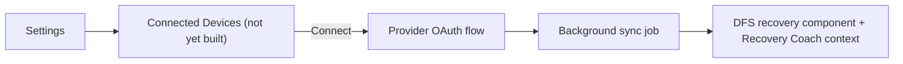

# Feature: Wearable Integrations

**Related documents:** [Future Integrations](../future-integrations.md) (technical detail per provider lives there — this document is the product-feature framing) · [AI Coaching Engine § 10](../09-ai-coaching-engine.md#10-future-extensibility) · [Body Measurements](body-measurements.md) · [PHASE2_SCOPE.md](../PHASE2_SCOPE.md)

## Release Phase

| Field | Value |
|---|---|
| **Status** | Phase 2 |
| **Priority** | High |
| **Estimated Sprint** | [Phase 2 · Sprint 2](../16-development-roadmap.md#phase-2--sprint-2--nutrition-coach--recovery-coach) (first wave: Apple Health, Health Connect, Smart Scales) / [Phase 2 · Sprint 5](../16-development-roadmap.md#phase-2--sprint-5--wearable-integrations-community-challenges--leaderboards) (Fitbit, Garmin, Strava, Calendar) |
| **Dependencies** | OAuth/webhook infrastructure; Recovery Coach is a downstream consumer, not a dependency |

## Table of Contents
- [Overview](#overview)
- [Purpose](#purpose)
- [User Stories](#user-stories)
- [Functional Requirements](#functional-requirements)
- [Non-Functional Requirements](#non-functional-requirements)
- [UI Flow](#ui-flow)
- [Screen List](#screen-list)
- [Business Rules](#business-rules)
- [Validation Rules](#validation-rules)
- [APIs](#apis)
- [Database Tables](#database-tables)
- [Edge Cases](#edge-cases)
- [Error Handling](#error-handling)
- [Offline Behavior](#offline-behavior)
- [Acceptance Criteria](#acceptance-criteria)
- [Future Improvements](#future-improvements)

## Overview
Read-only sync from wearables (Whoop, Oura, Garmin, Fitbit) and platform health stores (Apple Health, Health Connect) to replace/augment self-reported recovery input, unlocking the Recovery Coach persona named in [AI Coaching Engine § 10](../09-ai-coaching-engine.md#10-future-extensibility). Provider-level integration detail (auth, rate limits, sync mechanics) is documented once in [Future Integrations](../future-integrations.md) to avoid duplication; this document covers the product feature surface.

## Purpose
Make the `recovery` component of the Daily Fitness Score ([AI Coaching Engine § 5](../09-ai-coaching-engine.md#5-recommendation-engine)) real signal instead of self-report only, and give the AI coach richer context for training/recovery recommendations.

## User Stories
- As a wearable owner, I want to connect my device once and have recovery data flow in automatically.
- As a user, I want to see clearly which data came from a wearable vs. what I logged manually.
- As a user, I want to disconnect a wearable at any time without losing previously-synced history.

## Functional Requirements
Not yet at `FR-xxx` level (Future). Anticipated shape: OAuth-based connection flow per provider ([Future Integrations](../future-integrations.md)), scheduled or webhook-driven sync of sleep/HRV/activity data into a new recovery-data table, `recovery` DFS component formula updated to prefer wearable data over self-report when both are present for a given day.

## Non-Functional Requirements
Sync must not block or slow the core app experience — background/async only, never a blocking call on app foreground. Data minimization: only sync the fields actually used by the `recovery` component and Recovery Coach context, not a full raw data dump from the provider.

## UI Flow

## Screen List
Not yet designed — anticipated as a "Connected Devices" section within [Settings](../screens/settings.md).

## Business Rules
When implemented: self-reported recovery input ([Workout Tracking](workout-tracking.md) soreness notes) remains available as a fallback for users without a connected wearable — this feature augments, not replaces, the existing MVP recovery-input path.

## Validation Rules
Not yet defined — will depend on per-provider data shape.

## APIs
Not present in current [API Specification](../05-api-specification.md); each provider's own API is documented in [Future Integrations](../future-integrations.md).

## Database Tables
Not present in current [Database Design](../04-database-design.md) — anticipated new table (e.g., `wearable_connections`, `recovery_metrics`) at implementation time.

## Edge Cases
To be defined at implementation time; known concerns to design against: conflicting data from multiple connected sources for the same day, provider API rate limits/outages (see the per-provider Rate Limits row in [Future Integrations](../future-integrations.md#fitbit)), and user disconnecting mid-sync.

## Error Handling
Not yet defined — anticipated: sync failures degrade to "last successful sync" data with a visible staleness indicator, never a blocking error on the rest of the app.

## Offline Behavior
Sync inherently requires connectivity (server-to-provider, not device-to-provider in most cases); doesn't interact with the mobile offline-sync queue described in [Mobile Architecture § 4](../08-mobile-architecture.md#4-offline-first-strategy) since it's a backend-to-third-party integration, not a client-authored mutation.

## Acceptance Criteria
Not applicable — no implementation committed yet.

## Future Improvements
This entire feature is Phase 2 work — see [Development Roadmap § Phase 2 · Sprint 2](../16-development-roadmap.md#phase-2--sprint-2--nutrition-coach--recovery-coach) for sequencing relative to the Recovery Coach persona it unlocks.
