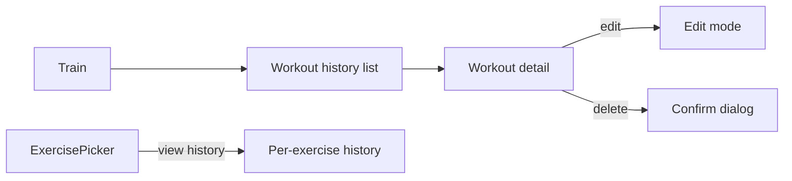

# Feature: Workout History

**Related documents:** [Workout Tracking](workout-tracking.md) · [API Specification § 6.4](../05-api-specification.md#64-workouts) · [Database Design § 4](../04-database-design.md#4-indexing-strategy) · [Screens — Workout](../screens/workout.md)

## Release Phase

| Field | Value |
|---|---|
| **Status** | Phase 1 |
| **Priority** | High |
| **Estimated Sprint** | [Phase 1 · Sprint 3](../16-development-roadmap.md#phase-1--sprint-3--workout-engine--exercise-library) |
| **Dependencies** | [Workout Tracking](workout-tracking.md) |

## Table of Contents
- [Overview](#overview)
- [Purpose](#purpose)
- [User Stories](#user-stories)
- [Functional Requirements](#functional-requirements)
- [Non-Functional Requirements](#non-functional-requirements)
- [UI Flow](#ui-flow)
- [Screen List](#screen-list)
- [Business Rules](#business-rules)
- [Validation Rules](#validation-rules)
- [APIs](#apis)
- [Database Tables](#database-tables)
- [Edge Cases](#edge-cases)
- [Error Handling](#error-handling)
- [Offline Behavior](#offline-behavior)
- [Acceptance Criteria](#acceptance-criteria)
- [Future Improvements](#future-improvements)

## Overview
The chronological, filterable list of past workouts, and the per-exercise history view used to inform "what did I lift last time" decisions — distinct from [Workout Tracking](workout-tracking.md), which covers the act of logging.

## Purpose
Let a user review, edit, and learn from past training without leaving the Train tab, and give the AI Personal Trainer persona a place the user can independently verify the same history the AI reasons over ([AI Coaching Engine § 3](../09-ai-coaching-engine.md#3-context-management)).

## User Stories
- As a user, I want to scroll my workout history, newest first, filtered by date range or status.
- As a user, I want to see, for a given exercise, my last several performances (weight × reps) before I start a new set.
- As a user, I want to edit or delete a mislogged past workout.

## Functional Requirements
| ID | Requirement |
|---|---|
| F-WHIST-01 | Paginated workout list, default sort `-startedAt`, filterable by date range/status |
| F-WHIST-02 | Workout detail view (all exercises/sets as logged) |
| F-WHIST-03 | Edit or delete a past workout |
| F-WHIST-04 | Per-exercise history view accessible from the exercise picker and exercise detail |

## Non-Functional Requirements
List uses cursor pagination ([API Specification § 5](../05-api-specification.md#5-pagination--filtering)) to stay performant for users with years of history; local Drift queries are indexed identically to the server (`user_id, started_at`).

## UI Flow


## Screen List
[Workout](../screens/workout.md) (history list + detail states), Per-Exercise History (modal/sheet).

## Business Rules
Editing a completed workout re-runs PR detection for affected sets (a corrected higher weight can newly qualify as a PR; a corrected lower weight can retract a previously-flagged PR).

## Validation Rules
Same as [Workout Tracking § Validation Rules](workout-tracking.md#validation-rules) for any edited fields.

## APIs
`GET /workouts`, `GET /workouts/{id}`, `PATCH /workouts/{id}`, `DELETE /workouts/{id}` — [API Specification § 6.4](../05-api-specification.md#64-workouts).

## Database Tables
`workouts`, `workout_exercises`, `workout_sets` — reads via the `(user_id, started_at DESC)` index ([Database Design § 4](../04-database-design.md#4-indexing-strategy)).

## Edge Cases
- Deleting a workout that contributed to today's already-computed Daily Fitness Score → score is not retroactively recomputed for past dates (BR-8 versioning implies historical scores are a snapshot); only affects future computations.
- Editing a workout's `startedAt` to a different day → moves it in the history list and affects that day's (if already computed) or a future recompute of the DFS training component.

## Error Handling
Standard error envelope; delete requires explicit confirmation dialog (see [Components — Dialog](../components/dialog.md)) since it's destructive and not undoable in MVP.

## Offline Behavior
List and detail views read from local Drift cache first ([Mobile Architecture § 4](../08-mobile-architecture.md#4-offline-first-strategy)); edits/deletes made offline queue like any other mutation and sync on reconnect.

## Acceptance Criteria
```gherkin
Feature: Per-exercise history
  Scenario: User views history for an exercise mid-workout
    Given the user has logged Bench Press in 3 previous workouts
    When they tap "view history" from the active Bench Press entry
    Then they see the 3 most recent sessions' top sets, newest first
```

## Future Improvements
- Volume/tonnage trend chart per exercise.
- Bulk export of workout history (distinct from the full account data export in [Settings](settings.md)).
