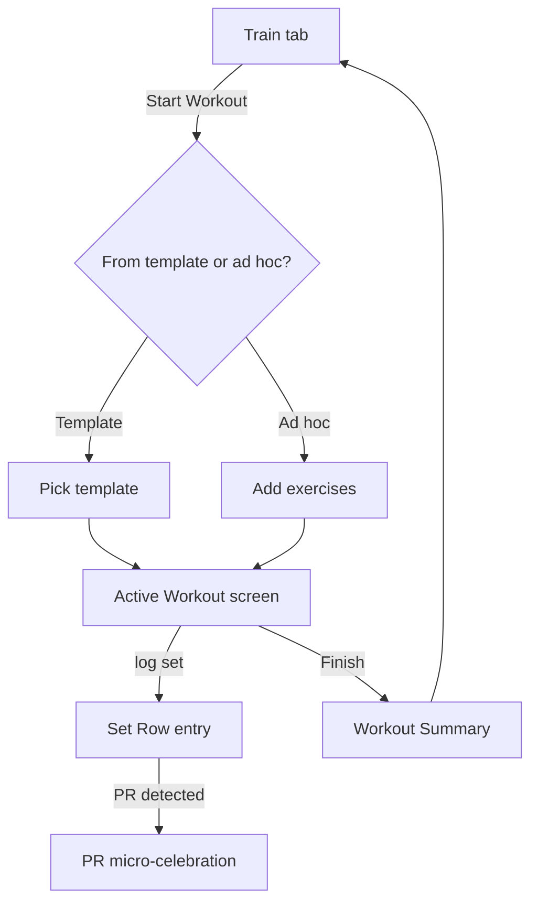

# Feature: Workout Tracking

**Related documents:** [SRS § 4.2](../02-srs.md#42-workout-tracking) · [Database Design § 3.2](../04-database-design.md#32-exercise-library--workouts) · [API Specification § 6.4](../05-api-specification.md#64-workouts) · [Mobile Architecture § 4](../08-mobile-architecture.md#4-offline-first-strategy) · [Components — Workout Tile](../components/workout-tile.md) · [Screens — Workout](../screens/workout.md) · [Workout History](workout-history.md) · [Exercise Library](exercise-library.md)

## Release Phase

| Field | Value |
|---|---|
| **Status** | Phase 1 (FR-206 AI Workout Recommendation generation is structured/one-shot in Phase 1; conversational Adaptive Plans adjustment is Phase 2, see [PHASE2_SCOPE.md § Adaptive Plans](../PHASE2_SCOPE.md#adaptive-plans)) |
| **Priority** | Critical |
| **Estimated Sprint** | [Phase 1 · Sprint 3](../16-development-roadmap.md#phase-1--sprint-3--workout-engine--exercise-library) (core logging); [Phase 1 · Sprint 5](../16-development-roadmap.md#phase-1--sprint-5--ai-recommendations-analytics--notifications) (FR-206 AI generation) |
| **Dependencies** | Authentication, Exercise Library |

## Table of Contents
- [Overview](#overview)
- [Purpose](#purpose)
- [User Stories](#user-stories)
- [Functional Requirements](#functional-requirements)
- [Non-Functional Requirements](#non-functional-requirements)
- [UI Flow](#ui-flow)
- [Screen List](#screen-list)
- [Business Rules](#business-rules)
- [Validation Rules](#validation-rules)
- [APIs](#apis)
- [Database Tables](#database-tables)
- [Edge Cases](#edge-cases)
- [Error Handling](#error-handling)
- [Offline Behavior](#offline-behavior)
- [Acceptance Criteria](#acceptance-criteria)
- [Future Improvements](#future-improvements)

## Overview
The core logging loop: starting a workout (from a template or ad hoc), recording sets/reps/weight/RPE per exercise, and completing it with automatic PR detection. This is the single most offline-critical feature in the app (NFR-5) — see [Mobile Architecture § 4](../08-mobile-architecture.md#4-offline-first-strategy) for the underlying sync architecture this feature depends on.

## Purpose
Make in-gym logging fast enough (< 30s per set, per [PRD Objective O2](../01-prd.md#2-objectives)) that it doesn't interrupt training, while capturing enough structured data to power PR detection, the Daily Fitness Score, and AI coaching context.

## User Stories
- As a lifter, I want to start today's planned workout with one tap and log sets quickly between exercises.
- As a lifter, I want to know immediately when I've hit a new PR.
- As a lifter training in a gym with poor signal, I want logging to just work regardless of connectivity.
- As a user without a plan, I want to log an ad hoc workout without first creating a template.

## Functional Requirements
Traces to [SRS FR-201–FR-206](../02-srs.md#42-workout-tracking).

| ID | Summary |
|---|---|
| FR-201 | Browse/search exercise library |
| FR-202 | Log workout: exercises, sets, reps, weight, RPE, supersets, rest timer |
| FR-203 | Start from template (own/AI/preset) |
| FR-204 | Automatic PR detection |
| FR-205 | Full offline logging |
| FR-206 | AI-generated adaptive template |

## Non-Functional Requirements
- Set-entry interaction optimized for one-handed, sweaty-hands use (48dp+ touch targets, [UI/UX Design System § 2.3](../06-ui-ux-design-system.md#23-spacing--layout)).
- Rest timer runs reliably even if the screen locks (local notification-backed countdown, not a foreground-only timer).

## UI Flow


## Screen List
[Workout](../screens/workout.md) (covers template pick, active logging, and summary states), Exercise Picker (modal).

## Business Rules
PR is defined per exercise as a new max `weight_kg` at a given or lower `reps`, or new max estimated 1RM — computed at save time by `PrDetectionService` ([Backend Architecture](../07-backend-architecture.md#1-folder-structure)). Warmup sets (`is_warmup=true`) are excluded from PR detection.

## Validation Rules
| Field | Rule |
|---|---|
| `weight_kg` | ≥ 0, ≤ 500, 2 decimal places |
| `reps` | ≥ 0, ≤ 999 integer |
| `rpe` | 1.0–10.0 in 0.5 increments, optional |
| `clientUuid` | Required UUIDv4, unique per user (idempotency) |

## APIs
`GET /exercises`, `GET /templates`, `POST /templates/ai-generate`, `POST /workouts`, `PATCH /workouts/{id}`, `POST /sync/workouts` — full detail in [API Specification § 6.3–6.4](../05-api-specification.md#63-workout-templates) and examples in [API Examples — Workouts](../api-examples/workouts.md).

## Database Tables
`workouts`, `workout_exercises`, `workout_sets`, `workout_templates`, `template_exercises`, `exercises` — [Database Design § 3.2](../04-database-design.md#32-exercise-library--workouts).

## Edge Cases
- User logs the same set twice due to a double-tap → mobile debounces the save action; server-side, a duplicate `clientUuid` for the parent workout is an idempotent upsert, not a duplicate row ([API Specification § 2](../05-api-specification.md#2-conventions)).
- User force-quits mid-workout → the in-progress workout (`status=in_progress`) persists locally and is resumed on relaunch, not lost.
- User logs a weight in the wrong unit (kg vs lb) → unit is taken from profile preference at entry time and converted to canonical `kg` storage; a jarringly implausible value (e.g., 500kg squat) is flagged with a confirm-this-is-correct prompt rather than silently accepted or blocked.
- Exercise deleted/deprecated from the library after being logged → historical `workout_exercises` rows retain the reference; the exercise detail view shows an "archived exercise" state rather than a broken link.

## Error Handling
Standard error envelope; sync failures follow [Mobile Architecture § Synchronization](../08-mobile-architecture.md#6-synchronization) (per-item retry, not whole-batch failure).

## Offline Behavior
Fully offline-capable per NFR-5/FR-205 — this is the reference implementation of the pattern described in [Mobile Architecture § 4](../08-mobile-architecture.md#4-offline-first-strategy): writes to Drift immediately, `pending_sync` flag shown subtly (not alarmingly) via the Offline Banner component, background sync on reconnect.

## Acceptance Criteria
See the Gherkin scenario in [SRS § 7](../02-srs.md#7-acceptance-criteria-format) (canonical offline-logging scenario) plus:
```gherkin
Feature: PR detection
  Scenario: User logs a new max weight
    Given the user's previous best Bench Press set was 60kg x 8 reps
    When they log a completed, non-warmup set of 62.5kg x 8 reps
    Then the set is flagged isPr: true
    And the workout response includes it in prsDetected
```

## Future Improvements
- Superset/circuit-specific UI beyond basic grouping.
- Voice-logged sets for hands-free entry.
- Plate-calculator helper for barbell exercises.
