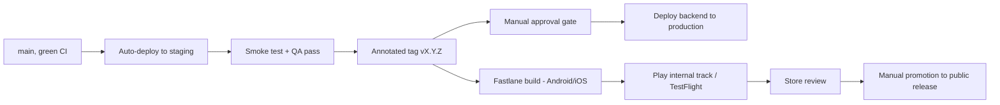

# Release Management

**Product:** Aesthetic Coach
**Related documents:** [CI/CD Pipeline § 5](11-cicd-pipeline.md#5-release-management--versioning) (foundational policy — this document adds process detail) · [Git Workflow](git-workflow.md) · [Deployment Guide § Rollback Procedures](12-deployment-guide.md#10-rollback-procedures) · [Database Design § Migration Strategy](04-database-design.md#6-migration-strategy)

## Table of Contents
- [Release Process](#release-process)
- [Semantic Versioning](#semantic-versioning)
- [Changelog Format](#changelog-format)
- [Rollback Strategy](#rollback-strategy)
- [Deployment Approvals](#deployment-approvals)
- [Database Migration Policy](#database-migration-policy)
- [Future Improvements](#future-improvements)

## Release Process



Backend and mobile share the same version tag but release on independent timelines once tagged — backend deploys same-day after approval; mobile is gated by app store review (see [CI/CD Pipeline § 5](11-cicd-pipeline.md#5-release-management--versioning)). A tag represents "this code is release-ready," not "this is live everywhere at the same moment."

## Semantic Versioning

`MAJOR.MINOR.PATCH`, computed from Conventional Commits merged since the last tag ([Git Workflow § Versioning](git-workflow.md#versioning)):

| Bump | Trigger |
|---|---|
| MAJOR | Breaking API contract change (new `/api/v2`, per [API Specification § 1](05-api-specification.md#1-versioning-strategy)), or a mobile release that drops support for an old backend contract |
| MINOR | New feature (`feat:` commits), new non-breaking API endpoint/field |
| PATCH | Bug fixes, chores, performance improvements, docs |

Backend and mobile version numbers are kept in lockstep at the contract level per [CI/CD Pipeline § 5](11-cicd-pipeline.md#5-release-management--versioning) — a mobile release depending on a new backend endpoint bumps mobile's MINOR to match, even if no mobile-side breaking change occurred.

## Changelog Format

Auto-generated from squashed PR titles (which are Conventional Commit-formatted per [Git Workflow](git-workflow.md#conventional-commits)) between the previous and current tag, grouped by type:

```markdown
## v1.5.0 - 2026-08-06

### Features
- feat(habits): add weekly-frequency habit type (#412)
- feat(coach): stream weekly review generation status (#418)

### Fixes
- fix(auth): correct refresh token reuse detection window (#415)

### Chores
- chore(deps): upgrade Laravel to 12.x (#409)
```
Entries link back to their PR number for full context; `docs:`/`test:`/`refactor:`-only commits are omitted from the user/stakeholder-facing changelog by default (still visible in `git log`) to keep it focused on what actually changed behavior.

## Rollback Strategy

Delegates to [Deployment Guide § Rollback Procedures](12-deployment-guide.md#10-rollback-procedures) for the mechanics (redeploy previous image tag, restore from pre-migration snapshot, etc.). This document adds the **decision process**: any release causing an elevated error rate or a failed smoke test triggers an immediate rollback-or-fix-forward decision by the on-call engineer within the first 15 minutes post-deploy — rollback is the default unless the fix is trivially small and already identified, per the "measure twice, cut once" bias toward the safer reversible action.

## Deployment Approvals

| Environment | Approval required |
|---|---|
| Staging | None — automatic on merge to `main` (per [CI/CD Pipeline § 7](11-cicd-pipeline.md#7-environments-summary)) |
| Production (backend) | One engineer other than the release-tag creator explicitly approves the deploy gate, after reviewing the staging smoke test results and changelog |
| Production (mobile, store promotion) | Same approval as backend, plus the inherent app-store-review gate; promotion from internal track to public release is a distinct, separately-approved manual step |
| Hotfix | Expedited single-approver gate per [Git Workflow § Hotfix Process](git-workflow.md#hotfix-process) |

## Database Migration Policy

Extends [Database Design § Migration Strategy](04-database-design.md#6-migration-strategy) with release-process-specific rules:
- Every release's migration set is reviewed as a unit before tagging — a release is not tagged with a migration whose lock behavior on production-sized tables hasn't been assessed.
- Migrations run automatically as a pre-traffic deploy step ([Deployment Guide § 8](12-deployment-guide.md#8-database-migrations-on-deploy)), never manually against production outside the pipeline.
- A release containing a destructive migration (column drop/rename) requires explicit sign-off in the PR per [Git Workflow § Pull Requests](git-workflow.md#pull-requests) and is never bundled in the same release as the feature that stops using the old column (expand/contract pattern spans at least two releases).

## Future Improvements
- Automated release notes posted to a team channel on tag creation.
- Canary/staged rollout (percentage-based traffic shift) for backend releases once infrastructure justifies it beyond the current rolling-deploy approach.
