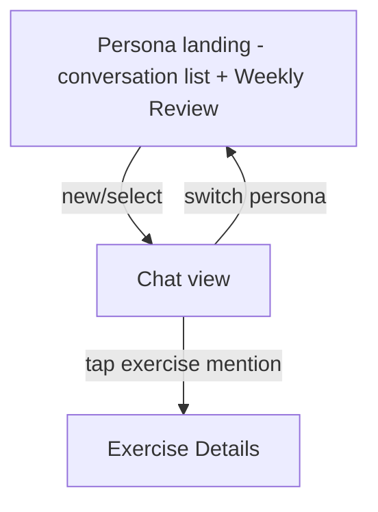

# Screen: AI Coach

**Related documents:** [AI Coach feature](../features/ai-coach.md) · [AI Coaching Engine](../09-ai-coaching-engine.md) · [Components — AI Chat Bubble](../components/ai-chat-bubble.md) · [API Examples — AI Coaching](../api-examples/ai-coaching.md)

## Table of Contents
- [Purpose](#purpose)
- [Layout](#layout)
- [Components](#components)
- [Navigation](#navigation)
- [API Calls](#api-calls)
- [Validation](#validation)
- [Empty States](#empty-states)
- [Error States](#error-states)
- [Loading States](#loading-states)
- [Offline Behavior](#offline-behavior)
- [Accessibility](#accessibility)
- [Animations](#animations)
- [Performance Considerations](#performance-considerations)

## Purpose
The Coach tab: persona-based conversational AI, per [AI Coach feature](../features/ai-coach.md).

## Layout
Top: horizontal [Persona Switcher](../06-ui-ux-design-system.md#3-core-components) chip row. Below: either the active conversation's message list (reverse-scrolling, input bar pinned to bottom) or, if no conversation is open, a conversation-list/Weekly-Review-card landing state for the selected persona.

## Components
Persona Switcher, [AI Chat Bubble](../components/ai-chat-bubble.md), [Text Field](../components/text-field.md) (chat input), [Card](../components/card.md) (Weekly Review card).

## Navigation

## API Calls
`GET/POST /coach/conversations`, `GET/POST /coach/conversations/{id}/messages` (SSE), `POST /coach/reviews/weekly` — [API Examples — AI Coaching](../api-examples/ai-coaching.md).

## Validation
Chat input: 1–2000 chars, send button disabled when empty or while a response is streaming (one in-flight message at a time per conversation).

## Empty States
New persona with no conversation yet → landing state explains what this persona helps with (per persona description copy) with a "Start a conversation" CTA instead of a bare empty list.

## Error States
Rate-limit (`429`) → dedicated "Daily coaching limit reached, resets at HH:MM" card, visually distinct from a generic error, per [AI Coach § Edge Cases](../features/ai-coach.md#edge-cases). Provider outage → "your coach is temporarily unavailable" state with retry. Both replace the input bar's send affordance with a disabled/explained state rather than allowing a doomed send attempt.

## Loading States
Streaming responses render token-by-token as they arrive (not a spinner-then-reveal) per [UI/UX Design System § 7](../06-ui-ux-design-system.md#7-motion); a typing-indicator-style state shows during the gap between send and first token.

## Offline Behavior
Explicit "reconnect to chat with your coach" state replaces the input bar when offline; past conversation history remains fully readable from cache — see [AI Coach § Offline Behavior](../features/ai-coach.md#offline-behavior).

## Accessibility
Streaming text updates are announced to screen readers in complete-sentence chunks, not per-token (per-token announcement would be unusable with VoiceOver/TalkBack) — an accessibility-specific implementation note for the streaming renderer.

## Animations
Token-by-token reveal at a natural reading cadence (not artificial typewriter delay, per [UI/UX Design System § 7](../06-ui-ux-design-system.md#7-motion)); persona-switch transitions are a simple crossfade.

## Performance Considerations
First-token latency is the screen's defining performance metric (NFR-2, < 2s p95) — the chat input remains responsive and interactive even while a previous message is still streaming in the background (non-blocking UI thread), consistent with [Mobile Architecture § 9](../08-mobile-architecture.md#9-networking-layer)'s dedicated SSE client.
