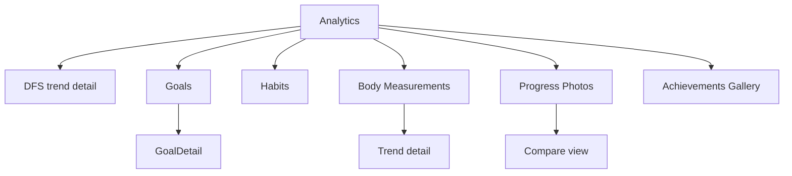

# Screen: Analytics (Progress Tab)

**Related documents:** [Body Measurements](../features/body-measurements.md) · [Progress Photos](../features/progress-photos.md) · [Goals](../features/goals.md) · [Habits](../features/habits.md) · [Achievements](../features/achievements.md) · [Components — Charts, Progress Bar](../components/charts.md)

## Table of Contents
- [Purpose](#purpose)
- [Layout](#layout)
- [Components](#components)
- [Navigation](#navigation)
- [API Calls](#api-calls)
- [Validation](#validation)
- [Empty States](#empty-states)
- [Error States](#error-states)
- [Loading States](#loading-states)
- [Offline Behavior](#offline-behavior)
- [Accessibility](#accessibility)
- [Animations](#animations)
- [Performance Considerations](#performance-considerations)

## Purpose
The Progress tab — the "everything else" analytics home per [UI/UX Design System § 4](../06-ui-ux-design-system.md#4-navigation), consolidating Body Measurements, Progress Photos, Goals, Habits, Achievements, and the historical DFS trend in one scrollable, sectioned screen.

## Layout
Sectioned vertical scroll: DFS Trend chart (top), Goals section, Habits section, Body Measurements section, Progress Photos section, Achievements gallery — each section independently expandable/collapsible and independently loading.

## Components
[Charts](../components/charts.md) (DFS trend, measurement trends), [Progress Bar](../components/progress-bar.md) (goal progress), [Badge](../components/badge.md) (achievements, streaks), [Card](../components/card.md) (section containers).

## Navigation

## API Calls
`GET /scores?from=&to=`, `GET /goals`, `GET /habits`, `GET /body-measurements/trends`, `GET /progress-photos`, `GET /achievements` — see respective feature docs for full detail: [Goals § APIs](../features/goals.md#apis), [Body Measurements § APIs](../features/body-measurements.md#apis), [Progress Photos § APIs](../features/progress-photos.md#apis).

## Validation
Not applicable at this screen level — creation/editing happens in each section's own sheet, validated per that feature's rules.

## Empty States
Each section has its own empty state (e.g., "Set your first goal", "No measurements logged yet") rather than one blanket empty state for the whole screen, since sections populate independently over time.

## Error States
Sections fail independently (same principle as [Dashboard § Error States](dashboard.md#error-states)) — a failed chart fetch never blocks the Goals or Habits sections from rendering.

## Loading States
Per-section skeletons; sections above the fold prioritize loading first (DFS trend, Goals) with lower sections loading as the user scrolls into view (lazy-loaded), for performance on long histories.

## Offline Behavior
All sections read from local cache first; chart data for ranges not yet synced locally shows a "sync to see full history" affordance rather than an empty chart.

## Accessibility
Charts expose text-summary alternatives per [UI/UX Design System § 8](../06-ui-ux-design-system.md#8-accessibility) ("Weight trend: down 1.2kg over 30 days") for screen reader users, and follow the `dataviz` skill's contrast/color guidance for any chart implementation.

## Animations
Chart line-draw animates on first render of a data range (`motion.slow`); progress bars animate fill on value change.

## Performance Considerations
The heaviest screen in the app for potential data volume (years of measurements/photos/scores) — lazy section loading and cursor-paginated/range-bounded queries (per [Database Design § 4](../04-database-design.md#4-indexing-strategy)) are required, not optional, for this screen to stay within performance budgets ([Performance Budget](../performance-budget.md)).
