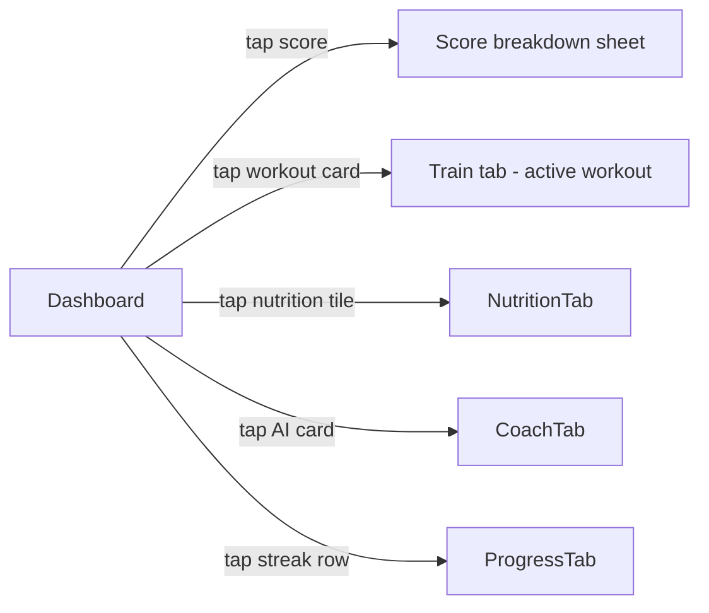

# Screen: Dashboard (Home)

**Related documents:** [Dashboard feature](../features/dashboard.md) · [Components — Progress Ring, Workout Tile, Badge](../components/progress-ring.md) · [UI/UX Design System § 4](../06-ui-ux-design-system.md#4-navigation)

## Table of Contents
- [Purpose](#purpose)
- [Layout](#layout)
- [Components](#components)
- [Navigation](#navigation)
- [API Calls](#api-calls)
- [Validation](#validation)
- [Empty States](#empty-states)
- [Error States](#error-states)
- [Loading States](#loading-states)
- [Offline Behavior](#offline-behavior)
- [Accessibility](#accessibility)
- [Animations](#animations)
- [Performance Considerations](#performance-considerations)

## Purpose
The Home tab landing screen — see [Dashboard feature](../features/dashboard.md) for the full functional spec; this document covers the screen's concrete layout and states.

## Layout
Vertically scrolling single column: Score Ring card (top, largest visual weight), "Today's Plan" workout card, Nutrition summary tile, AI Coach recommendation card, Habit streak row — order fixed in MVP (not user-customizable, see [Dashboard § Future Improvements](../features/dashboard.md#future-improvements)).

## Components
[Progress Ring](../components/progress-ring.md) (Score Ring), [Workout Tile](../components/workout-tile.md), [Stat Tile](../components/card.md) (nutrition summary), [Badge](../components/badge.md) (streak), [Card](../components/card.md) (AI recommendation).

## Navigation

## API Calls
`GET /scores/today`, `GET /templates` (active), `GET /nutrition/daily-summary`, `GET /habits` — see [Dashboard § APIs](../features/dashboard.md#apis).

## Validation
Not applicable — read-only screen.

## Empty States
New user with no score yet → Score Ring shows a "computing your first score" state instead of 0. No active template → workout card becomes a "Generate a plan" CTA. No habits created → streak row becomes a "Create your first habit" prompt.

## Error States
Each card fails independently with its own inline retry per [Dashboard § Error Handling](../features/dashboard.md#error-handling) — never a single full-screen error blocking the whole Home tab.

## Loading States
Skeleton-loading placeholders per card (matching each card's final layout dimensions to avoid layout shift) while first-load data resolves; subsequent loads use stale-while-revalidate (show cached data immediately, refresh in background).

## Offline Behavior
Renders entirely from local cache per [Dashboard § Offline Behavior](../features/dashboard.md#offline-behavior); [Offline Banner](../06-ui-ux-design-system.md#3-core-components) shown if any card's data is stale beyond a threshold.

## Accessibility
Score Ring exposes a text-equivalent summary ("Fitness score: 78, On Track") for screen readers, not just the visual ring, per [UI/UX Design System § 8](../06-ui-ux-design-system.md#8-accessibility).

## Animations
Score Ring fill animates on value change (`motion.base`); PR/streak-milestone cards trigger the restrained micro-celebration defined in [UI/UX Design System § 7](../06-ui-ux-design-system.md#7-motion).

## Performance Considerations
Must render meaningfully within 500ms from local cache even before network calls resolve (per [Dashboard § Non-Functional Requirements](../features/dashboard.md#non-functional-requirements)) — this is the screen most users see most often, so its perceived performance disproportionately shapes the app's overall performance reputation.
