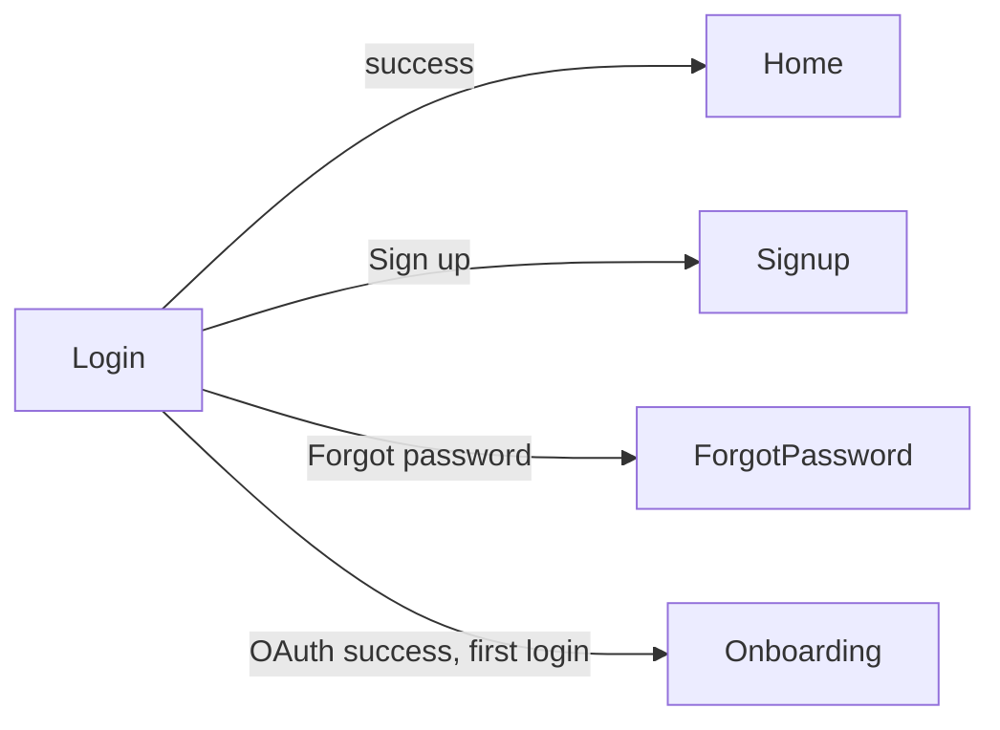

# Screen: Login

**Related documents:** [Authentication](../features/authentication.md) · [API Examples — Auth](../api-examples/auth.md) · [Components — Button, Text Field](../components/button.md) · [UI/UX Design System](../06-ui-ux-design-system.md)

## Table of Contents
- [Purpose](#purpose)
- [Layout](#layout)
- [Components](#components)
- [Navigation](#navigation)
- [API Calls](#api-calls)
- [Validation](#validation)
- [Empty States](#empty-states)
- [Error States](#error-states)
- [Loading States](#loading-states)
- [Offline Behavior](#offline-behavior)
- [Accessibility](#accessibility)
- [Animations](#animations)
- [Performance Considerations](#performance-considerations)

## Purpose
Authenticate a returning user via email/password, Google, or Apple.

## Layout
Vertically centered form: brand mark, email field, password field, primary "Log In" button, secondary Google/Apple buttons, "Forgot password?" and "Sign up" text links at the bottom.

## Components
[Text Field](../components/text-field.md) ×2, [Button](../components/button.md) (primary + two OAuth variants), inline validation error text.

## Navigation

## API Calls
`POST /auth/login`, `POST /auth/oauth/google`, `POST /auth/oauth/apple` — see [API Examples — Auth](../api-examples/auth.md) for full request/response/error payloads.

## Validation
Client-side: email format, password non-empty (full policy enforced server-side per [Authentication § Validation Rules](../features/authentication.md#validation-rules) — client validation is a UX nicety, not the source of truth). Submit button disabled until both fields are non-empty.

## Empty States
Not applicable — form always renders with its inputs.

## Error States
`401 unauthenticated` → inline "email or password is incorrect" message below the form (never specifies which field is wrong, to avoid user enumeration). `429 rate_limited` → inline message with retry time. Network failure → non-blocking banner, form remains editable and resubmittable.

## Loading States
Button shows an inline spinner replacing its label during submission; all fields and buttons disabled during the in-flight request to prevent double-submit.

## Offline Behavior
Login requires connectivity; if offline, the primary button is still tappable but immediately surfaces a "you're offline" inline message rather than issuing a doomed network call ([Authentication § Offline Behavior](../features/authentication.md#offline-behavior)).

## Accessibility
Each field has an explicit label (not placeholder-only text, which disappears on focus and hurts low-vision users); error messages are associated with their field via semantic linkage for screen readers; minimum 48dp touch targets throughout ([UI/UX Design System § 2.3](../06-ui-ux-design-system.md#23-spacing--layout)).

## Animations
Minimal — field focus/error states use the `motion.fast` token; no decorative animation on this screen.

## Performance Considerations
Screen itself is static/lightweight; performance-sensitive part is the auth API round trip, budgeted under the general API p95 target (NFR-1).
