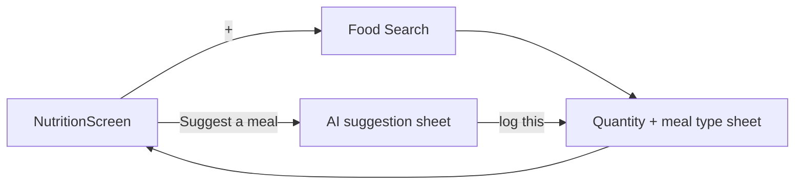

# Screen: Nutrition

**Related documents:** [Nutrition feature](../features/nutrition.md) · [Calorie Tracker](../features/calorie-tracker.md) · [Water Intake](../features/water-intake.md) · [Components — Progress Ring, Card](../components/progress-ring.md)

## Table of Contents
- [Purpose](#purpose)
- [Layout](#layout)
- [Components](#components)
- [Navigation](#navigation)
- [API Calls](#api-calls)
- [Validation](#validation)
- [Empty States](#empty-states)
- [Error States](#error-states)
- [Loading States](#loading-states)
- [Offline Behavior](#offline-behavior)
- [Accessibility](#accessibility)
- [Animations](#animations)
- [Performance Considerations](#performance-considerations)

## Purpose
The Nutrition tab — daily macro/calorie summary, meal log, and water intake, per [Nutrition feature](../features/nutrition.md).

## Layout
Top: calorie/macro summary card (ring + bars for protein/carb/fat remaining). Below: Water Intake tile. Below: chronological meal list grouped by meal type, each with a "+" to log. Floating "Suggest a meal" AI entry point.

## Components
[Progress Ring](../components/progress-ring.md) (calories), [Progress Bar](../components/progress-bar.md) (macros), [Card](../components/card.md) (meal entries), Water Intake tile (see [Water Intake feature](../features/water-intake.md)).

## Navigation

## API Calls
`GET /nutrition/daily-summary`, `GET /foods`, `POST /meals`, `POST /water-logs` — see [Nutrition § APIs](../features/nutrition.md#apis) and [API Examples — Nutrition](../api-examples/nutrition.md).

## Validation
Per [Nutrition feature § Validation Rules](../features/nutrition.md#validation-rules).

## Empty States
No meals logged yet today → meal list shows a per-meal-type "Log breakfast/lunch/dinner/snack" prompt instead of a blank list.

## Error States
Food search failure → inline retry within the search sheet; AI suggestion failure falls back to a manual-search prompt per [Nutrition feature § Error Handling](../features/nutrition.md#error-handling).

## Loading States
Summary card skeleton on first load; food search shows a lightweight per-keystroke loading indicator (debounced) rather than a full-screen spinner.

## Offline Behavior
Meal logging and water intake fully offline per [Nutrition feature § Offline Behavior](../features/nutrition.md#offline-behavior); food search degrades to the cached subset with a "reconnect for full search" note.

## Accessibility
Calorie ring and macro bars each have a text-equivalent summary; the "+" log affordance is a clearly labeled, large tap target on every meal-type row (not just an icon).

## Animations
Ring/bar fill animates on new entries (`motion.base`); consistent with the Score Ring pattern in [Dashboard](dashboard.md#animations).

## Performance Considerations
Food search must stay under 300ms p95 (per [Exercise Library](../features/exercise-library.md)'s equivalent target, mirrored here) — debounced client-side to avoid a network call per keystroke.
