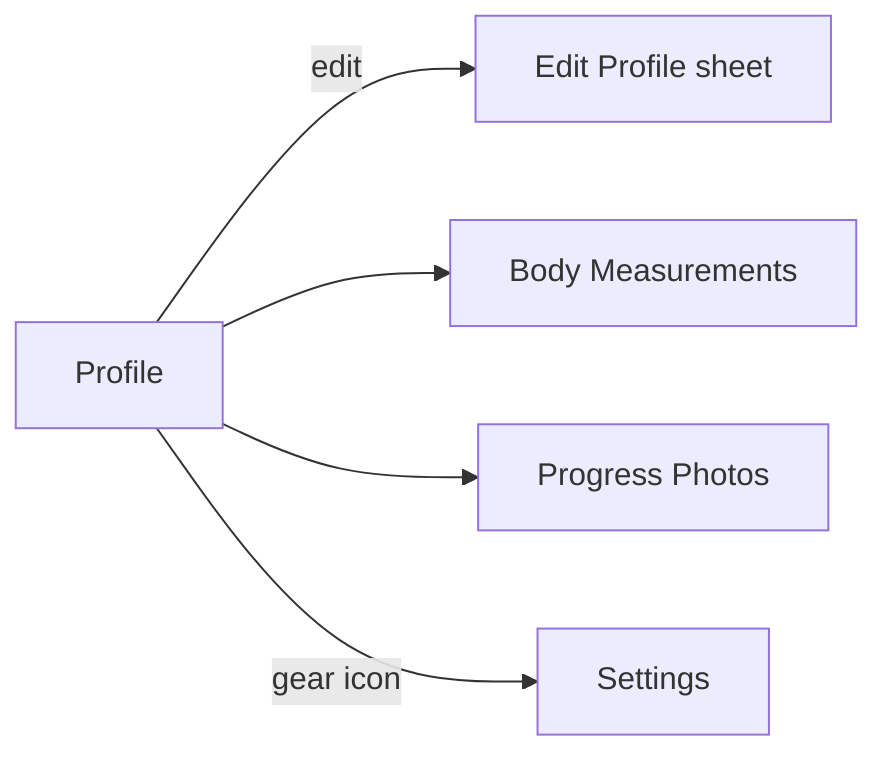

# Screen: Profile

**Related documents:** [Profile feature](../features/profile.md) · [Body Measurements](../features/body-measurements.md) · [Progress Photos](../features/progress-photos.md) · [Components — Card, Badge](../components/card.md)

## Table of Contents
- [Purpose](#purpose)
- [Layout](#layout)
- [Components](#components)
- [Navigation](#navigation)
- [API Calls](#api-calls)
- [Validation](#validation)
- [Empty States](#empty-states)
- [Error States](#error-states)
- [Loading States](#loading-states)
- [Offline Behavior](#offline-behavior)
- [Accessibility](#accessibility)
- [Animations](#animations)
- [Performance Considerations](#performance-considerations)

## Purpose
The user's own profile view — see [Profile feature](../features/profile.md) for functional scope.

## Layout
Header: initials avatar, name, member-since date. Summary stat row (total workouts, longest streak). Editable fields section (tap to open Edit Profile sheet). Entry points to Body Measurements and Progress Photos below.

## Components
[Card](../components/card.md) (summary stats), [Badge](../components/badge.md) (if any achievement is pinned), [Bottom Sheet](../components/bottom-sheet.md) (Edit Profile).

## Navigation

## API Calls
`GET /me`, `PATCH /me` — [Profile § APIs](../features/profile.md#apis).

## Validation
Per [Profile feature § Validation Rules](../features/profile.md#validation-rules), enforced within the Edit Profile sheet.

## Empty States
New user with no workouts yet → summary stat row shows "0 workouts — get started" linking into the Train tab, rather than a bare "0".

## Error States
Standard error envelope; edit failures shown inline within the Edit Profile sheet, not dismissing the sheet.

## Loading States
Skeleton for the header/stats on first load; edits are optimistic (§ [Profile feature § Error Handling](../features/profile.md#error-handling)).

## Offline Behavior
Fully readable offline from cache; edits queue per standard sync behavior.

## Accessibility
Summary stats have text labels alongside numbers (never number-only tiles), consistent with the "never color/number alone" principle in [UI/UX Design System § 8](../06-ui-ux-design-system.md#8-accessibility).

## Animations
Minimal; Edit Profile sheet uses the standard bottom-sheet transition ([Components — Bottom Sheet](../components/bottom-sheet.md)).

## Performance Considerations
Lightweight, mostly-static screen; no special performance concerns beyond standard cached-first rendering.
