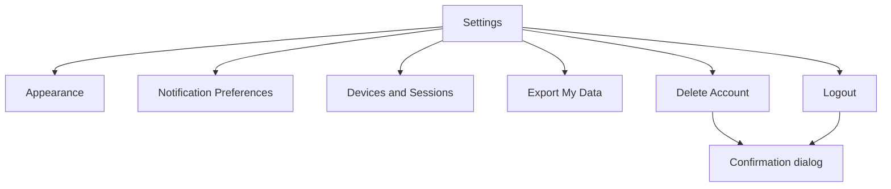

# Screen: Settings

**Related documents:** [Settings feature](../features/settings.md) · [Notifications](../features/notifications.md) · [Authentication § Session Management](../features/authentication.md#business-rules) · [Components — Dialog, Card](../components/dialog.md)

## Table of Contents
- [Purpose](#purpose)
- [Layout](#layout)
- [Components](#components)
- [Navigation](#navigation)
- [API Calls](#api-calls)
- [Validation](#validation)
- [Empty States](#empty-states)
- [Error States](#error-states)
- [Loading States](#loading-states)
- [Offline Behavior](#offline-behavior)
- [Accessibility](#accessibility)
- [Animations](#animations)
- [Performance Considerations](#performance-considerations)

## Purpose
App configuration and account actions, per [Settings feature](../features/settings.md).

## Layout
Grouped list (sectioned, per standard settings-screen convention): Appearance (theme, units), Notifications, Devices & Sessions, Privacy & Data (export, deletion), Account (logout), About/Help (links to [User Documentation](../15-user-documentation.md) help center).

## Components
[Card](../components/card.md) (grouped sections), [Dialog](../components/dialog.md) (destructive-action confirmations), toggle switches (theme/unit selectors).

## Navigation

## API Calls
`GET/PATCH /me`, `GET/PATCH /notification-preferences`, `GET /auth/sessions`, `DELETE /auth/sessions/{deviceId}`, `POST /me/export`, `DELETE /me`, `POST /auth/logout` — see [Settings § APIs](../features/settings.md#apis).

## Validation
Not applicable beyond the enum-constrained toggles described in [Settings feature § Validation Rules](../features/settings.md#validation-rules).

## Empty States
Devices & Sessions with only the current device → list shows just the one entry, no "no other devices" empty-state messaging needed (the current device is never itself an empty state).

## Error States
Session revoke failure → inline retry on that row; account deletion/export failures show a blocking dialog error (these are consequential actions worth an explicit stop, unlike lighter-weight settings toggles).

## Loading States
Sessions list shows a skeleton on load; toggles apply instantly (optimistic) with no loading state needed.

## Offline Behavior
Theme/unit toggles work fully offline (local-only); session management, export, and deletion require connectivity and communicate that clearly per [Settings feature § Offline Behavior](../features/settings.md#offline-behavior).

## Accessibility
Destructive actions (delete account, revoke session, logout) use both color and explicit confirmation text ("This will permanently delete...") — never relying on red color alone, per [UI/UX Design System § 8](../06-ui-ux-design-system.md#8-accessibility).

## Animations
Standard list/section transitions only; no decorative motion on a utility screen like this.

## Performance Considerations
Lightweight, mostly-static screen; sessions list is small (max 10 per BR-5) so no pagination is needed.
