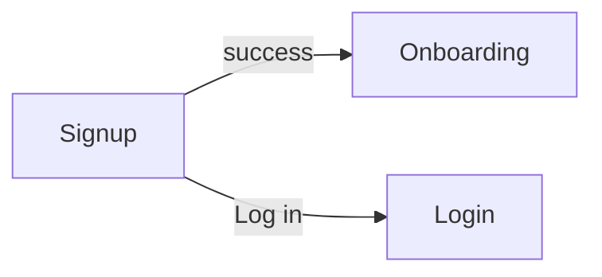

# Screen: Signup

**Related documents:** [Authentication](../features/authentication.md) · [Onboarding](../features/onboarding.md) · [API Examples — Auth](../api-examples/auth.md) · [Components — Text Field, Button](../components/text-field.md)

## Table of Contents
- [Purpose](#purpose)
- [Layout](#layout)
- [Components](#components)
- [Navigation](#navigation)
- [API Calls](#api-calls)
- [Validation](#validation)
- [Empty States](#empty-states)
- [Error States](#error-states)
- [Loading States](#loading-states)
- [Offline Behavior](#offline-behavior)
- [Accessibility](#accessibility)
- [Animations](#animations)
- [Performance Considerations](#performance-considerations)

## Purpose
Create a new account via email/password or OAuth, then hand off directly into [Onboarding](../features/onboarding.md).

## Layout
Same structural pattern as [Login](login.md): brand mark, name/email/password fields, primary "Create Account" button, Google/Apple options, "Already have an account? Log in" link. Password field shows a live strength/policy hint (BR-1: ≥10 chars, ≥1 letter + 1 number).

## Components
[Text Field](../components/text-field.md) ×3, [Button](../components/button.md), inline policy-hint text.

## Navigation

## API Calls
`POST /auth/register`, `POST /auth/oauth/google`, `POST /auth/oauth/apple` — [API Examples — Auth](../api-examples/auth.md).

## Validation
Name required (1–120 chars), email format + uniqueness (server-checked), password per BR-1 (client hint mirrors server enforcement but server is authoritative, per [Authentication § Validation Rules](../features/authentication.md#validation-rules)).

## Empty States
Not applicable.

## Error States
`422 validation_failed` with `details.email: ["already taken"]` → inline field error offering a "log in instead?" link. Other validation errors shown per-field. Network/rate-limit errors follow the same pattern as [Login § Error States](login.md#error-states).

## Loading States
Same disabled-fields-plus-spinner pattern as [Login § Loading States](login.md#loading-states).

## Offline Behavior
Requires connectivity, same messaging pattern as [Login § Offline Behavior](login.md#offline-behavior).

## Accessibility
Password policy hint is programmatically associated with the password field (not just visually adjacent) so screen readers announce requirements before an error occurs, not only after.

## Animations
Minimal, consistent with [Login § Animations](login.md#animations).

## Performance Considerations
Email-uniqueness check happens server-side on submit, not as a live-typing debounced check in MVP (keeps the form simple and avoids partial-email enumeration queries) — flagged as a possible future UX improvement, not a current requirement.
