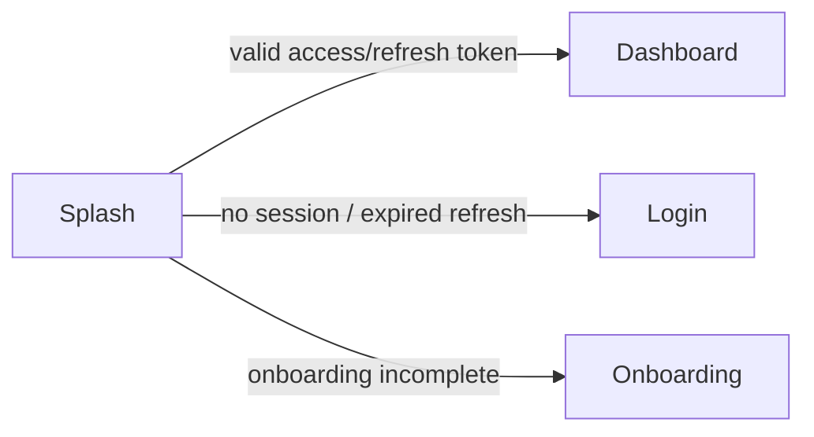

# Screen: Splash

**Related documents:** [Authentication](../features/authentication.md) · [Mobile Architecture § 9](../08-mobile-architecture.md#9-networking-layer) · [UI/UX Design System § 7](../06-ui-ux-design-system.md#7-motion)

## Table of Contents
- [Purpose](#purpose)
- [Layout](#layout)
- [Components](#components)
- [Navigation](#navigation)
- [API Calls](#api-calls)
- [Validation](#validation)
- [Empty States](#empty-states)
- [Error States](#error-states)
- [Loading States](#loading-states)
- [Offline Behavior](#offline-behavior)
- [Accessibility](#accessibility)
- [Animations](#animations)
- [Performance Considerations](#performance-considerations)

## Purpose
Bridge the native OS launch screen and the first meaningful app screen, while the app resolves whether a valid session exists.

## Layout
Full-bleed brand mark centered on `background.primary`, no navigation chrome. Single-purpose, transitional screen — never a place for content or ads.

## Components
App logo/wordmark only (no shared design-system components needed beyond the base theme).

## Navigation

Resolved by checking secure-stored refresh token validity ([Authentication](../features/authentication.md)) — no visible auth API call is required if the cached access token is still valid; a silent refresh call is made if only the refresh token is valid.

## API Calls
`POST /auth/refresh` (silent, only if access token expired but refresh token present) — see [Authentication § APIs](../features/authentication.md#apis).

## Validation
Not applicable — no user input.

## Empty States
Not applicable.

## Error States
Refresh call fails (revoked/expired refresh token) → routes to Login, not an error dialog; splash failures are never shown to the user as errors, only as a routing decision.

## Loading States
The splash screen itself *is* the loading state; it has a maximum display duration (e.g., 2 seconds) after which it proceeds to Login as a safe default even if the session check hasn't resolved, to avoid an indefinitely stuck screen.

## Offline Behavior
If offline and a locally-valid (non-expired) access token exists, proceeds directly to Home in an offline-aware state; if offline and only an expired access token exists, proceeds to Home anyway using cached data with sync deferred, rather than blocking on a refresh call that cannot succeed offline — consistent with [Mobile Architecture § 4](../08-mobile-architecture.md#4-offline-first-strategy).

## Accessibility
Brief enough that screen readers rarely announce it; if they do, the brand mark has a simple semantic label ("Aesthetic Coach, loading").

## Animations
Subtle logo fade-in only, respecting reduce-motion settings ([UI/UX Design System § 7](../06-ui-ux-design-system.md#7-motion)) — no elaborate splash animation that delays perceived startup.

## Performance Considerations
Counts directly against the < 2.5s cold-start target (NFR, [PRD § 7](../01-prd.md#7-non-functional-requirements-summary)) — kept to the minimum possible duration; session-check logic runs in parallel with first-frame render, not sequentially after it.
