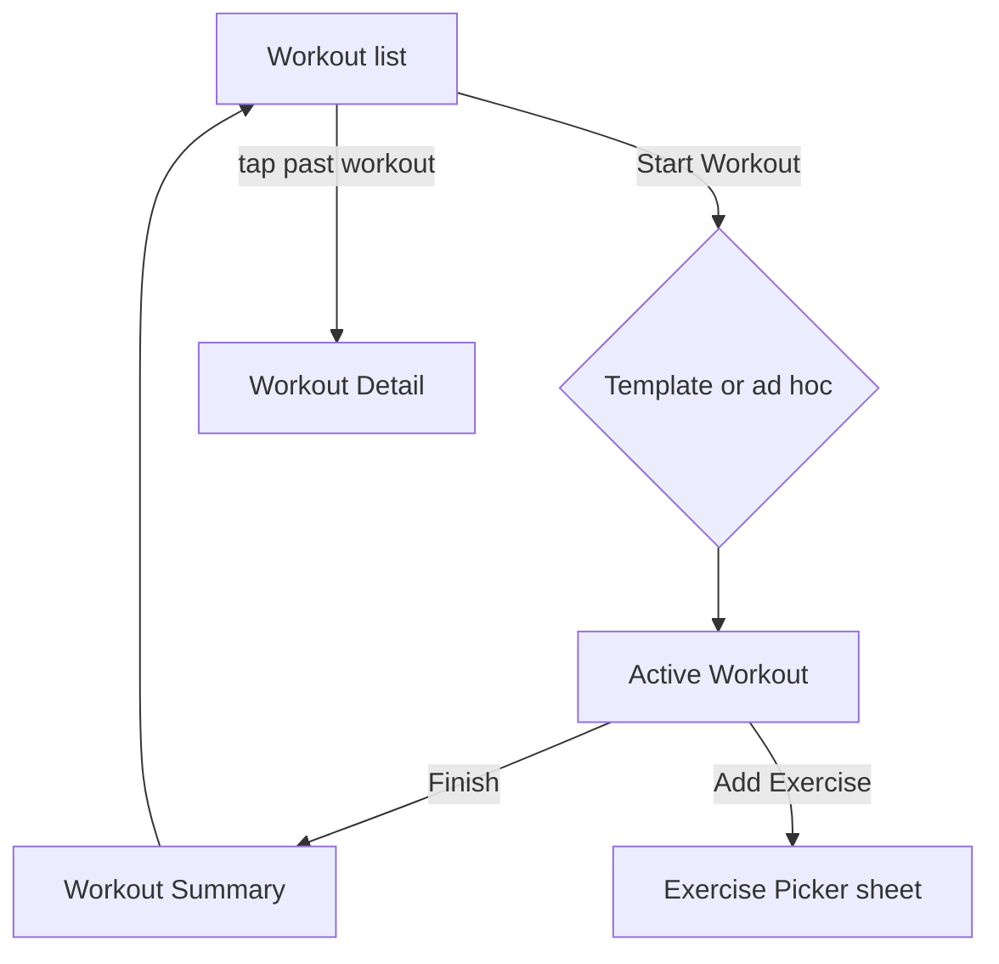

# Screen: Workout (Train Tab)

**Related documents:** [Workout Tracking](../features/workout-tracking.md) · [Workout History](../features/workout-history.md) · [Components — Workout Tile](../components/workout-tile.md) · [API Examples — Workouts](../api-examples/workouts.md)

## Table of Contents
- [Purpose](#purpose)
- [Layout](#layout)
- [Components](#components)
- [Navigation](#navigation)
- [API Calls](#api-calls)
- [Validation](#validation)
- [Empty States](#empty-states)
- [Error States](#error-states)
- [Loading States](#loading-states)
- [Offline Behavior](#offline-behavior)
- [Accessibility](#accessibility)
- [Animations](#animations)
- [Performance Considerations](#performance-considerations)

## Purpose
The Train tab covers three states of one flow: workout history list, active workout logging, and post-workout summary — documented together since they share a single route family and state machine.

## Layout
**List state:** vertically scrolling, reverse-chronological [Workout Tile](../components/workout-tile.md) cards, grouped by week, with a floating "Start Workout" action.
**Active state:** sticky header (elapsed time, finish button), scrolling list of exercises-in-progress, each with expandable [Set Row](../06-ui-ux-design-system.md#3-core-components) entries, "Add Exercise" at the bottom.
**Summary state:** modal-style recap — duration, total volume, PRs achieved, with a "Done" CTA back to the list.

## Components
[Workout Tile](../components/workout-tile.md), Set Row (see [UI/UX Design System § 3](../06-ui-ux-design-system.md#3-core-components)), [Button](../components/button.md), [Bottom Sheet](../components/bottom-sheet.md) (exercise picker), [Badge](../components/badge.md) (PR indicator).

## Navigation

## API Calls
`GET /workouts`, `GET /templates`, `POST /workouts`, `PATCH /workouts/{id}`, `POST /sync/workouts` — full examples in [API Examples — Workouts](../api-examples/workouts.md).

## Validation
Set entry validation per [Workout Tracking § Validation Rules](../features/workout-tracking.md#validation-rules) — inline, per-field, non-blocking (invalid values are flagged but don't prevent continuing to the next set).

## Empty States
No workout history yet → list shows an illustration + "Log your first workout" CTA per the Empty State component pattern ([UI/UX Design System § 3](../06-ui-ux-design-system.md#3-core-components)). Active workout with no exercises added yet → prompts "Add Exercise" prominently.

## Error States
Sync failure on a completed workout → shown as a subtle "pending sync" state on the tile, not a red error (offline is expected, not exceptional, per [Workout Tracking § Offline Behavior](../features/workout-tracking.md#offline-behavior)); persistent failure after several retries escalates to a visible retry action.

## Loading States
List uses skeleton tiles on first load; Active Workout screen has no meaningful loading state since it's constructed locally before any network call is needed.

## Offline Behavior
The screen's primary reference implementation of full offline capability — see [Workout Tracking § Offline Behavior](../features/workout-tracking.md#offline-behavior) for the complete behavior spec.

## Accessibility
Set Row inputs (weight/reps/RPE) are large, clearly labeled numeric fields with increment/decrement affordances alongside direct entry, for users who find precise typing difficult mid-workout; rest timer has both a visual countdown and a completion sound/vibration, not visual-only.

## Animations
Set-completion checkmark animates briefly (`motion.fast`); PR detection triggers the micro-celebration per [UI/UX Design System § 7](../06-ui-ux-design-system.md#7-motion).

## Performance Considerations
Active Workout screen must remain responsive (input latency imperceptible) even with a large number of exercises/sets in one session — all state is local (Riverpod + Drift) during the active session, with no network round-trip required per set logged ([Mobile Architecture § 4](../08-mobile-architecture.md#4-offline-first-strategy)).
